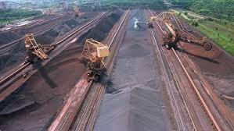
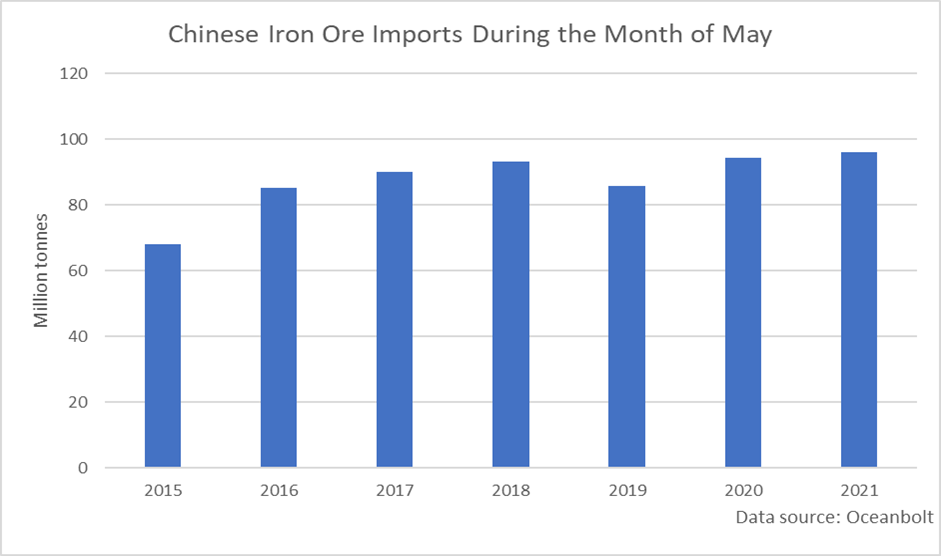
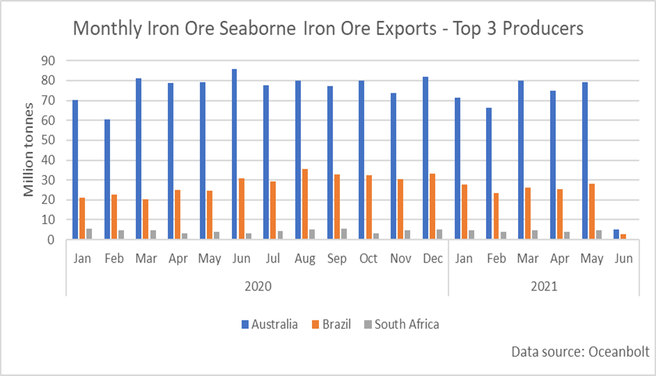
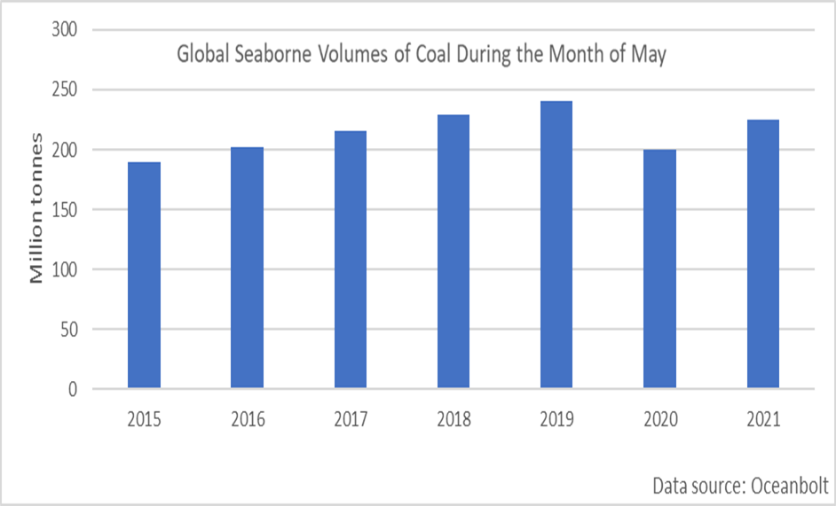

# Seaborne Volumes of Iron Ore and Coal on the Rise in May

**Date:** June 07, 2021  
**Publisher:** Breakwave Advisors | **Category:** Market Insights  
**Original URL:** [https://www.breakwaveadvisors.com/insights/2021/6/4/seaborne-volumes-of-iron-ore-and-coal-on-the-rise-in-may](https://www.breakwaveadvisors.com/insights/2021/6/4/seaborne-volumes-of-iron-ore-and-coal-on-the-rise-in-may)  

---

*By Ulf Bergman*

> **Figure 1: Vale Iron Ore**  
> [Local Asset](file:///C:/Users/Dell/Github/Shipping/corpus/03-breakwave/insights/2021/assets/2021-06-07_seaborne-volumes-of-iron-ore-and-coal-on-the-rise-in-may_img_valeironore_8df1d54c5aac.jpg)

The recent attempts by the Chinese authorities to control rising commodity prices have so far only resulted in limited lasting effects. Iron ore prices were singled out early on, following the spectacular gains in the last year. By making life more difficult for the steel producers with extended environmental controls and announcing a clampdown on speculation and hoarding, the Chinese leaderships hoped to reduce demand and by extension prices. The iron ore prices fell initially when the measures were announced, but have since recuperated some of the losses and are now approximately ten per cent below the highs recorded during the first half of May. Despite the efforts, the amount of iron ore discharged in Chinese ports increased in May to a new record for the month. Compared to the same month last year, the amount of iron ore arriving increased by two per cent and the volumes were five per cent higher than in April, according to data from Oceanbolt. It is worth bearing in mind that when using seaborne tracking statistics it is unlikely that it will correspond perfectly with official customs data, as there are differences concerning when cargoes are deemed as having been discharged.

> **Figure 2: Ulf 1 6.4**  
> [Local Asset](file:///C:/Users/Dell/Github/Shipping/corpus/03-breakwave/insights/2021/assets/2021-06-07_seaborne-volumes-of-iron-ore-and-coal-on-the-rise-in-may_img_ulf164_024df4f190ed.png)

While it may be too early to judge if the measures to control the prices through the demand side will eventually prevail, Beijing may get assistance in its quest from the supply side. Adverse weather conditions in Australia and coronavirus-related disruptions in Brazil have affected the iron ore output volumes in recent months. The Brazilian exports showed a healthy increase in May, compared to the preceding month, but the volumes were still lower than what can be achieved. The second half of last year saw iron ore shipments of between 30 million and 35 million tonnes per month, which suggest that there is potential for even more supplies once the disruptions have dissipated. Additionally, Australian mining giant, BHP, commenced production in its South Flank mine in Western Australia during the latter part of May. The new site is expected to produce 80 million tonnes per annum and is set to eventually replace the Yandi mine, which is nearing the end of its productive life.

> **Figure 3: Ulf 2 6.4**  
> [Local Asset](file:///C:/Users/Dell/Github/Shipping/corpus/03-breakwave/insights/2021/assets/2021-06-07_seaborne-volumes-of-iron-ore-and-coal-on-the-rise-in-may_img_ulf264_f89cd9bcf9a6.png)

While increasing exports from both Brazil and Australia are likely to be welcome news for the Chinese leadership, the resurgent economic activity in the rest of the world will add to the global demand for iron ore and claim parts of the increased volumes. A Brazilian iron ore industry operation closer to full potential could add around five per cent to the total seaborne volumes and push past the records set before the pandemic.

It is not only iron ore that is recovering globally, demand for coal is also rebounding. While still not back at pre-pandemic levels, global seaborne export volumes grew by thirteen per cent in May, compared to the same month last year. Coal prices have also recently benefited from increasing demand as high temperatures across North Asia have increased the use of air conditioning and driven the electricity consumption higher. The heatwave is adding to the already strong growth in demand with the industrial recovery from the pandemic is spreading beyond China.

> **Figure 4: Ulf 3 6.4**  
> [Local Asset](file:///C:/Users/Dell/Github/Shipping/corpus/03-breakwave/insights/2021/assets/2021-06-07_seaborne-volumes-of-iron-ore-and-coal-on-the-rise-in-may_img_ulf364_581746207975.png)

It can be argued that the current drive to decarbonize will put the demand for coal under pressure, but with Chinese peak demand some years off and many other Asian nations still very dependent on the commodity, the seaborne volumes are likely to keep growing for some time. The Chinese ban on imports of Australian coal has led to it being substituted to a large extent by lower-grade Indonesian coal, reducing the distance travelled but increasing the volumes required. However, the recent pick up in global demand for the black stuff has seen Australian coal futures surging. Buyers from Japan, South Korea and Taiwan pushed spot prices for high-quality thermal coal in the Australian port of Newcastle to the highest level since 2011 this week. Coal prices have also benefited from a tightening supply situation, as ongoing mine safety issues in China, adverse weather conditions in Indonesia and labour disruptions in Colombia have reduced output.

---

**Tags:** Coal, China  
