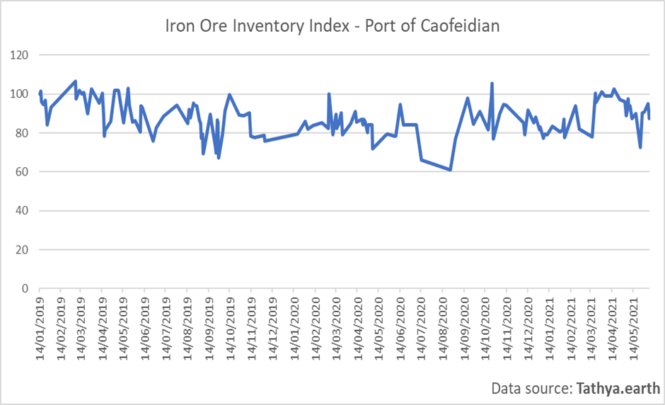
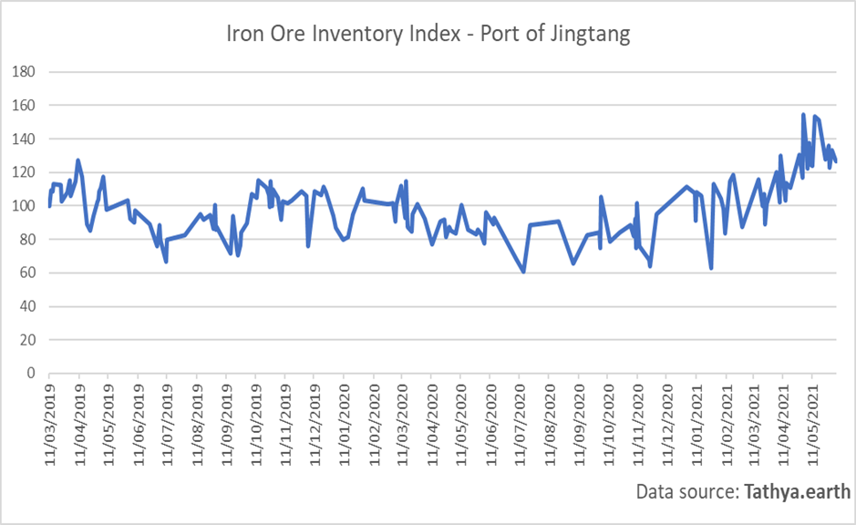
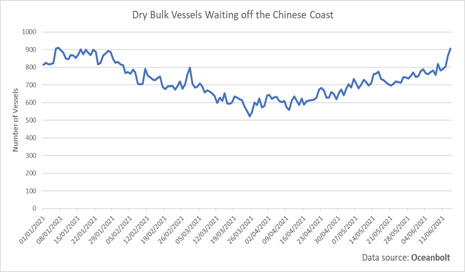

# Iron Ore: Prices Heading Higher Amid Continued Healthy Demand and Concerns Over Supply

**Date:** June 14, 2021  
**Publisher:** Breakwave Advisors | **Category:** Market Insights  
**Original URL:** [https://www.breakwaveadvisors.com/insights/2021/6/14/iron-ore-prices-heading-higher-amid-continued-healthy-demand-and-concerns-over-supply](https://www.breakwaveadvisors.com/insights/2021/6/14/iron-ore-prices-heading-higher-amid-continued-healthy-demand-and-concerns-over-supply)  

---

*By Ulf Bergman*

> **Figure 1: Simandou**  
> [Local Asset](file:///C:/Users/Dell/Github/Shipping/corpus/03-breakwave/insights/2021/assets/2021-06-14_iron-ore-prices-heading-higher-amid-continued-healthy-demand-and-concerns-over-s_img_simandou_92431aef2043.jpg)

Iron ore prices are on the rise yet again, with much of the losses incurred following China’s announcement that it intended to impose controls on the surging commodity prices erased. The July iron ore futures trading on the SGX are now approximately four per cent below the high recorded in the middle of May. Prices have recovered to just shy of 212 dollars per tonne in the past few days, after shedding a quarter of the market value during the second half of May. Despite last week’s release of weaker than expected Chinese trade data for May, which put some additional pressure on prices, the upward trajectory has been maintained since late May. The continued strong global demand and concerns over the supply outlook have all but negated Beijing’s efforts to keep the prices under control and maintain healthy profit margins among its manufacturers.

According to the official data, the world's second-largest economy imported 90 million tonnes of iron ore last month. This was below the volumes imported during both of the preceding months, with 99 million tonnes recorded in April and 102 million tonnes in March. However, with the midpoint of June only a day off, cargo tracking data from Oceanbolt suggest that some 46 million tonnes of iron ore have been discharged in Chinese ports month-to-date, potentially putting the month on track for breaking the downward trend of previous months. It is worth highlighting that comparing official data with cargo tracking data may provide somewhat different narratives, as there is a timing issue. It may take some time for discharged cargoes to clear the customs and until that has happened it will not be recorded in the official import data.

> **Figure 2: Ulf 1 6.14**  
> [Local Asset](file:///C:/Users/Dell/Github/Shipping/corpus/03-breakwave/insights/2021/assets/2021-06-14_iron-ore-prices-heading-higher-amid-continued-healthy-demand-and-concerns-over-s_img_ulf1614_97a1e0551fa9.png)

Inventories in many Chinese ports have also been declining in recent weeks, which can be seen as a bullish sign with the high season for construction works in full swing. Data from Tathya.earth suggest a recent softening of the inventory situation in two of the largest ports for iron ore imports, Caofeidian and Jingtang. A reduction in inventories suggests that the Chinese steel industry maintains its strong demand for iron ore, despite declining official import numbers, and should provide support for healthy levels of seaborne imports in the near term.

> **Figure 3: Ulf 2 6.14**  
> [Local Asset](file:///C:/Users/Dell/Github/Shipping/corpus/03-breakwave/insights/2021/assets/2021-06-14_iron-ore-prices-heading-higher-amid-continued-healthy-demand-and-concerns-over-s_img_ulf2614_2550366012fb.png)

The recent outbreak of Covid-19 in South China have led to a well-published extensive backlog of container vessels awaiting berth space, as cargo operations have been restricted due to a shortage of staff. However, while the container vessels have grabbed the headlines the sector is not the only one affected. After having declined during the first quarter of the year, there has been a gradual increase in the number of dry bulk vessels waiting off the Chinese coast during the first half of the second quarter. However, as the infection rates have increased around the ports in southern China there has been an acceleration in the number of bulk carriers waiting in the area, according to data from Oceanbolt.

> **Figure 4: Ulf 3 6.14**  
> [Local Asset](file:///C:/Users/Dell/Github/Shipping/corpus/03-breakwave/insights/2021/assets/2021-06-14_iron-ore-prices-heading-higher-amid-continued-healthy-demand-and-concerns-over-s_img_ulf3614_33acb6f8b1a1.png)

While the increasing number of coronavirus cases have contributed to the increasing congestion in and around many Chinese ports, it not the only reason for the increasing number of vessels waiting. The extensive imports of agricultural commodities have also seen many dry bulk carriers facing extended waiting times before they could discharge their cargoes. Regardless of the reason for the expanding congestion, it does nevertheless tie up an increasing amount of tonnage and contribute to a tighter supply situation and support higher freight rates. If the congestion persists or gets worse, it could also contribute to a further decline in iron ore inventories in some ports.

The current dry weather that Brazil is experiencing is certainly bad news for the country’s farmers as it threatens to reduce the output, but, in theory, it should be positive for the mining industry. Despite this, iron ore production in Brazil is struggling to get back to the levels seen before the major dam accident a few years ago. Brazilian mining giant Vale is also facing new restrictions, as authorities have ordered the evacuation of the area around another dam which is deemed to be at risk for a rupture. The restrictions are affecting around 33,000 tonnes of daily output, which is also contributing to the recovering iron ore prices.

---

**Tags:** Capesize, Dry Bulk  
