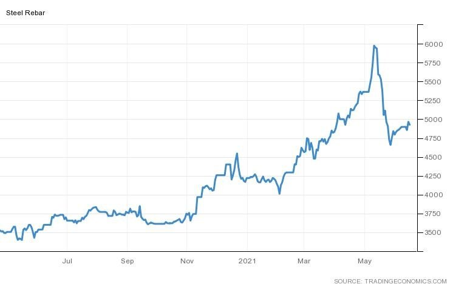
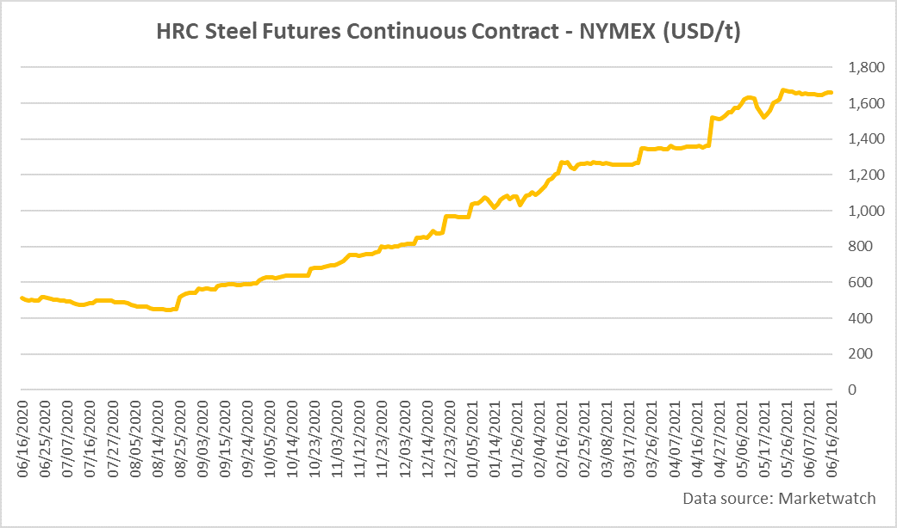

# No Signs of Weakening Steel Demand

**Date:** June 18, 2021  
**Publisher:** Breakwave Advisors | **Category:** Market Insights  
**Original URL:** [https://www.breakwaveadvisors.com/insights/2021/6/18/no-signs-of-weakening-steel-demand](https://www.breakwaveadvisors.com/insights/2021/6/18/no-signs-of-weakening-steel-demand)  

---

*By Ulf Bergman*

Chinese steel prices are staging a modest comeback after performing a nose dive during the second half of May. Steel rebar futures traded in Shanghai dropped by more than twenty per cent following Beijing’s announcement that it intended to clamp down on surging commodity prices. Following the drop, Chinese steel prices have recovered by six per cent and are up by seventeen per cent year-to-date. Steel, like many other raw materials, also saw some limited downward pressure on prices following the news that China intended to release some of its strategic commodity reserves to try to control the rising markets.

### Shanghai Steel Rebar Futures – Cny/tonne

> **Figure 1: A1**  
> [Local Asset](file:///C:/Users/Dell/Github/Shipping/corpus/03-breakwave/insights/2021/assets/2021-06-18_no-signs-of-weakening-steel-demand_img_a1_57d5a3b6c173.jpg)

With the news that China will not release iron ore or steel as part of the initiative, the effect on the Chinese domestic steel prices faded. Despite the efforts by Chinese authorities to temper the nation’s steel output, production grew by 6.6 per cent year-on-year in May to 99.5 million tonnes. One of China’s economic planning agencies, the National Development and Reform Commission, is also expecting the country’s steel demand to remain resilient, despite the government’s ambitions to reduce excess steel production in order to ease the appetite for iron ore and to meet its carbon emission targets. The agency also suggested that there is room for additional growth in demand for crude steel before the end of the fourteenth five-year plan, as the nation’s economic development continues. Hence, while the continued growth in iron ore imports may not be quite as spectacular as in the past year, volumes look set to remain on the rise for the foreseeable future.

On the other side of the Pacific, the return to pre-pandemic levels of output in the US steel industry has, contrary to many analysts’ expectations, failed to put an end to the rally in US steel prices that began in August last year. According to the American Iron and Steel Institute, the capacity utilisation rate in the US steel industry has remained at, or above, pre-pandemic levels of 80 per cent for the past three weeks. Rising US demand for steel has so far offset the increasing output and supported the prices, which have almost quadrupled in ten months.

> **Figure 2: A2**  
> [Local Asset](file:///C:/Users/Dell/Github/Shipping/corpus/03-breakwave/insights/2021/assets/2021-06-18_no-signs-of-weakening-steel-demand_img_a2_09d24f76eac6.png)

There are also reports suggesting that steel inventories in the US are low, which in combination with limited additional production capacity would suggest that prices could move higher as the US invests in infrastructure as part of the proposed stimulus programme. The potentially tight supply situation could also see US steel imports rising when demand grows. The previous US administration put a considerable number of tariffs and other measures in place to protect the domestic steel industry, which could reduce the attractiveness of imported steel. However, the current administration is taking tentative steps to remove some of the obstacles, with the trade with Europe likely to be an initial beneficiary.

Data from Eurostat released on Thursday showed a strong recovery in the Euro Area construction activity, with output growing by over 40 per cent year-on-year in April. While much of the impressive growth is due to the base effect, it also highlights the continued recovery for the European economy. Like in the US, much of the continued economic recovery is expected to come from stimulus-funded investments in infrastructure and construction. Hence, the global steel demand, and by extension iron ore, can be expected to remain strong, with efforts to control rising prices unlikely to pay any significant dividend.

For dry bulk shipping, the continued robust demand for steel is good news. Chinese steel and iron ore demand remaining firm, with support from Europe and the US, implies continued healthy seaborne volumes going forward. Seaborne transportation of steel is not only reserved for dry bulk shipping, the duties are shared with the container and Ro/Ro shipping sectors. However, given the record high freight rates and extensive congestion for the container sector, it is conceivable that a higher portion of the seaborne steel will not see the inside of a container and will be shipped by a bulk carrier instead.

The high steel price and demand could also affect the tonnage supply and not just the demand. The rising steel prices have seen many shipyards raising the prices for newbuild projects, which in combination with uncertainty about future environmental regulations, could further reduce shipowners’ appetite for new tonnage. Additionally, the high steel and iron ore prices are fueling the demand for scrap steel and pushing up the prices. China has also made it more advantageous to use scrap steel in the manufacturing process recently, by altering the taxation. The rising scrap steel prices could see an increasing number of vintage dry bulk vessels heading for the beaches, which would further tighten the tonnage supply situations and support higher freight rates.

---

**Tags:** Steel, Commodities, Shipping  
