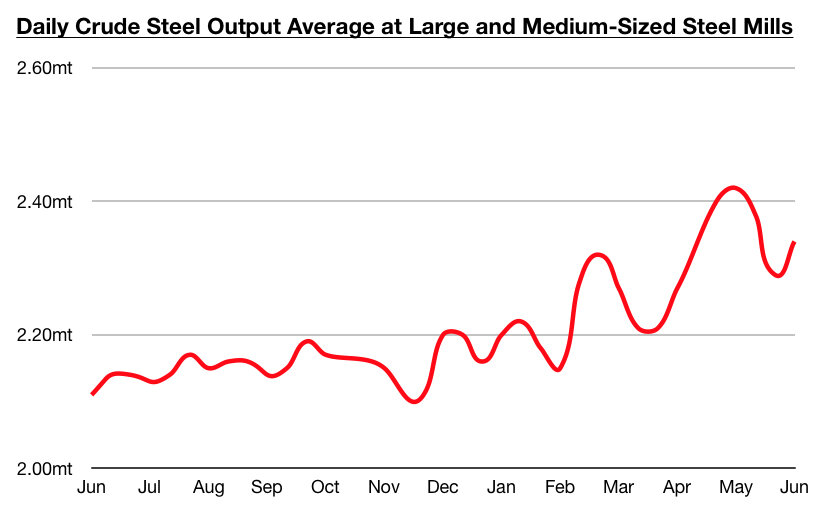
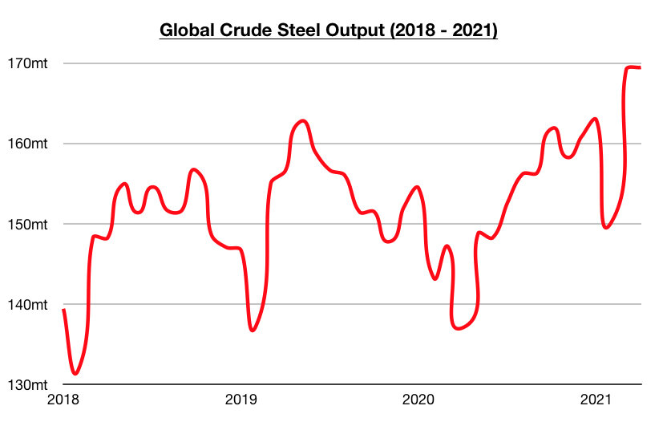

# World Remains Hungry for Iron Ore

**Date:** June 21, 2021  
**Publisher:** Breakwave Advisors | **Category:** Market Insights  
**Original URL:** [https://www.breakwaveadvisors.com/insights/2021/6/20/world-remains-hungry-for-iron-ore](https://www.breakwaveadvisors.com/insights/2021/6/20/world-remains-hungry-for-iron-ore)  

---

*By*[*Jeffrey Landsberg*](mailto:jeffrey@commodore-research.com)

Iron ore consumption has continued to fare very well both in and outside of China, as steel output has remained robust. The most recent data from China shows daily crude steel output at large and medium-sized mills averaged 2.34 million tons during June 1 - June 10. This is up by 2% from late May and is up year-on-year by 11%. China remains the world's largest producer of steel and largest consumer of iron ore.

> **Figure 1: Comm 1 6.20**  
> [Local Asset](file:///C:/Users/Dell/Github/Shipping/corpus/03-breakwave/insights/2021/assets/2021-06-21_world-remains-hungry-for-iron-ore_img_comm1620_177d971944fd.jpg)

As we have long been stressing in our Weekly Dry Bulk Reports and Weekly China Reports, China’s steel output has been poised to stay strong even as the government has been working to place limitations on heavy polluting mills near Beijing. Also of note in China is that steel prices have remained at strong levels. The average price of hot rolled coil, for example, ended last week at 5,640 yuan/ton which is just 70 yuan (-1%) less than a week ago. It remains positive that prices have continued to maintain strength even as a large amount of steel continues to be produced. In addition, steel stockpiles have stayed at a moderate level. Stockpiles of flat and construction steel products at warehouses in major cities in China ended last week at approximately 15.1 million tons. This is 300,000 tons (1%) more than a week ago and is just 600,000 tons (4%) more than was stockpiled at this time last year.

In addition to steel production in China continuing to surge and most recently growing year-on-year by 11%, of note is that steel output in other major producing nations has also stayed strong. May production data is still pending, but of note is that April's data showed significant growth. Crude steel output in India totaled approximately 8.3 million tons, which marked year-on-year growth of 165%. Crude steel output in the Middle East/Africa totaled 4.8 million tons, which marked year-on-year growth of 52%. Crude steel output in the United States totaled 6.9 million tons, which marked year-on-year growth of 39%. Crude steel output in Russia totaled 6.5 million tons, which marked year-on-year growth of 38%. Crude steel output in the European Union totaled 12.9 million tons, which marked year-on-year growth of 20%. Crude steel output in Japan totaled 7.8 million tons, which marked year-on-year growth of 18%.

> **Figure 2: Comm2 6.20**  
> [Local Asset](file:///C:/Users/Dell/Github/Shipping/corpus/03-breakwave/insights/2021/assets/2021-06-21_world-remains-hungry-for-iron-ore_img_comm2620_3c4d5649ce2a.jpg)

Overall, the global economy’s ongoing recovery from last year’s coronavirus-induced slowdown remains yet another positive issue in the dry bulk market. Steel output both in and outside of China has continued to fare well and iron ore consumption continues to increase. Global iron ore exports are very seasonal (with production highest during the second half of every year), and fortunately for the dry bulk market the world remains very hungry for iron ore. Capesize rates stand to benefit the most from what will likely be even stronger global iron ore trade during the next several months.

---

**Tags:** Dry Bulk, Commodities  
