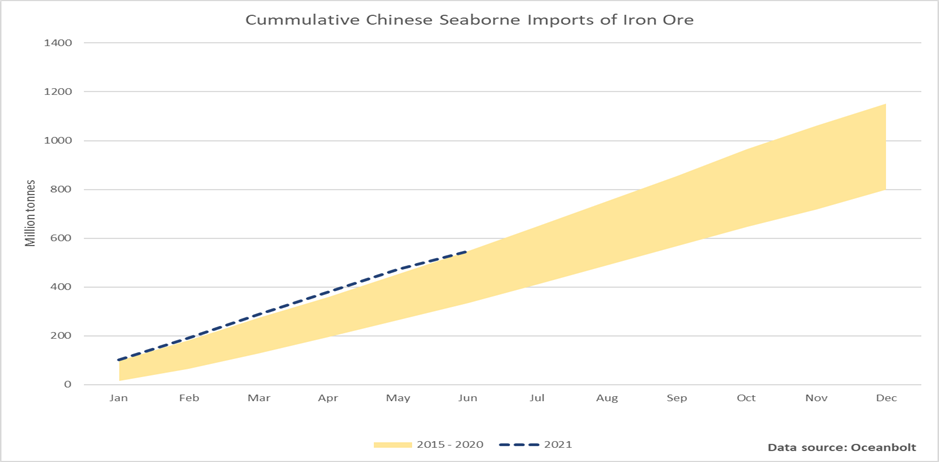
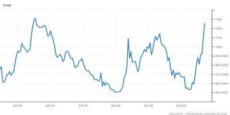
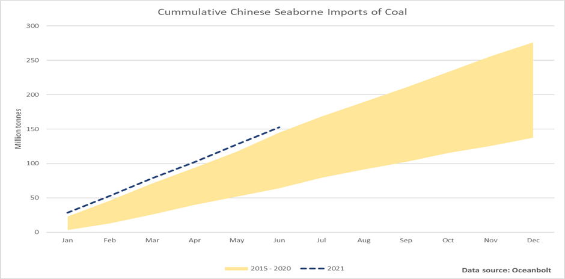

# Iron Ore and Coal: A Continued Strong Demand Offsets Attempts to Control the Prices

**Date:** June 25, 2021  
**Publisher:** Breakwave Advisors | **Category:** Market Insights  
**Original URL:** [https://www.breakwaveadvisors.com/insights/2021/6/25/iron-ore-and-coal-a-continued-strong-demand-offsets-attempts-to-control-the-prices](https://www.breakwaveadvisors.com/insights/2021/6/25/iron-ore-and-coal-a-continued-strong-demand-offsets-attempts-to-control-the-prices)  

---

*By Ulf Bergman*

> **Figure 1: Unsplash Image Ib7jwp7m0ia**  
> [Local Asset](file:///C:/Users/Dell/Github/Shipping/corpus/03-breakwave/insights/2021/assets/2021-06-25_iron-ore-and-coal-a-continued-strong-demand-offsets-attempts-to-control-the-pric_img_unsplash-image-ib7jwp7m0ia_f5edd8adff46.jpg)

That the Chinese leadership has a desire to bring commodity prices under control is by now well documented, with various measures implemented to bring this about. If the attempts are successful in the long run remain to be seen. Some observers are sceptical about any lasting effects, with Glencore’s outgoing Chief Executive Officer, Ivan Glasenberg, saying earlier in the week that the Chinese efforts to cool rising commodity prices cannot be sustained for long. He suggested that any effects are likely to be short-lived, as the fundamentals are supportive of the current high price levels.

From a Chinese perspective, grains and soybeans have behaved as they should, with current prices approximately fifteen to twenty per cent below their early-May peaks. It is debatable, however, if the Chinese measures are the only reason for the retreating prices, as other news items look more likely to be the real culprits. The US Department of Agriculture has recently reported higher than expected inventories, suggesting that the demand for agricultural commodities is easing. At the same time, the production in the Black Sea region is expected to increase. The wheat exports from Ukraine, Russia and Kazakhstan are anticipated to expand by five per cent during the 2021/22 marketing year.

While the agricultural commodities have been obliging, industrial commodities have seen their prices edging up following earlier losses. Copper is still ten per cent below the all-time high recorded in May, despite a recent recovery. Iron ore, on the other hand, has recovered to within five per cent of the peak during the previous month. A continued strong global demand, in combination with reports of a possible easing of blast furnace restrictions in China’s Tangshan province, has improved the sentiment in the iron ore trade. The steel production in China’s top hub has been curtailed since March, as local authorities sought to control pollution levels. A reduction, or removal, of output restrictions, would support further growth in Chinese iron ore demand and likely counter the current price control efforts.

Despite the output restrictions and the ongoing political tensions, preliminary trade data from Australia show that iron ore sales to China surged by a respectable twenty per cent during May. This represents the third consecutive month of record exports, despite Beijing’s efforts to reduce the country’s dependence on imports from Australia. The iron ore exports from Australia are also continuing to show strength in June, reportedly increasing to 19.4 million tonnes during last week. Cargo tracking data from Oceanbolt for Chinese seaborne imports of iron ore also suggest that the Chinese appetite for the commodity remains strong, with volumes for the first half of the year already marginally above last year’s and that is with six days still remaining of June. Iron ore inventories in the two largest import ports also remain under pressure, according to data from Tathya.earth, suggesting Chinese demand will remain firm.

> **Figure 2: Ulf 1 6.25**  
> [Local Asset](file:///C:/Users/Dell/Github/Shipping/corpus/03-breakwave/insights/2021/assets/2021-06-25_iron-ore-and-coal-a-continued-strong-demand-offsets-attempts-to-control-the-pric_img_ulf1625_49a1a36269a4.png)

If iron ore price developments failed to meet Beijing’s expectations of a larger decline, coal prices must be seen as an outright disappointment. While domestic prices may have shown some restraint, international coal prices have steadily risen and are now trading at levels not seen since the early parts of 2011. While the commodity rapidly is earning a public reputation as the world’s least wanted energy source, ongoing supply constraints and higher demand have more than offset China’s efforts to curb the surging prices. The rising temperatures in the Northern Hemisphere have increased demand from Japan and South Korea, while demand from the Chinese steel industry remains strong.

### Coal Usd/tonne

> **Figure 3: Ulf 2 6.25**  
> [Local Asset](file:///C:/Users/Dell/Github/Shipping/corpus/03-breakwave/insights/2021/assets/2021-06-25_iron-ore-and-coal-a-continued-strong-demand-offsets-attempts-to-control-the-pric_img_ulf2625_4607217f6290.jpg)

The ongoing restrictions on coal production in numerous Chinese mines, either due to safety inspections or environmental curbs, could force the country to increase its imports of the commodity. There are already indications of below-average inventories for this time of the year and, with last winter’s shortages in mind, China’s state planning agency, the National Development and Reform Commission, has urged the coal industry to build infrastructure to store reserves of coal. China’s position as the triple crown holder for coal (i.e. largest producer, largest importer and largest consumer) could prove beneficial for dry bulk shipping should the domestic production continue to suffer from safety and environmental curbs. Given that a large part of the coal consumed in China is domestically produced at the moment, even a modest increase in the proportion of overseas sourced coal could have a considerable positive impact on the tonnage demand. According to cargo tracking data from Oceanbolt, Chinese seaborne imports of coal year-to-date are already above of previous years.

> **Figure 4: Ulf 3 6.25**  
> [Local Asset](file:///C:/Users/Dell/Github/Shipping/corpus/03-breakwave/insights/2021/assets/2021-06-25_iron-ore-and-coal-a-continued-strong-demand-offsets-attempts-to-control-the-pric_img_ulf3625_9633f1ec263c.png)

It is worth bearing in mind that the data set only covers seaborne imports and any volumes coming overland from Mongolia are not included. The periodic closures of the Mongolian border due to Covid-19 outbreaks may also have affected the flows of imported coal, with more arriving by sea. Any initiatives by the Chinese authorities to rebuild the coal inventories ahead of the winter, while domestic mining capacity remains curtailed, will further increase imports and should benefit the Panamax and Capesize segments.

---

**Tags:** Coal, Iron Ore, China  
