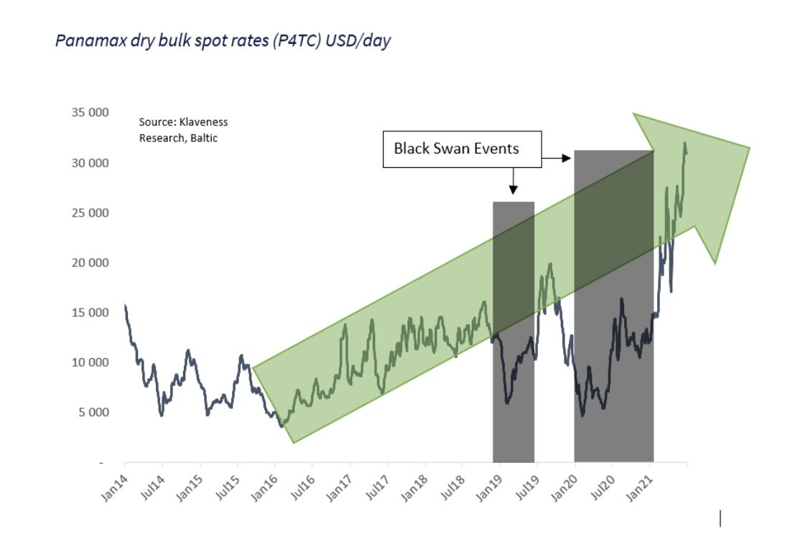
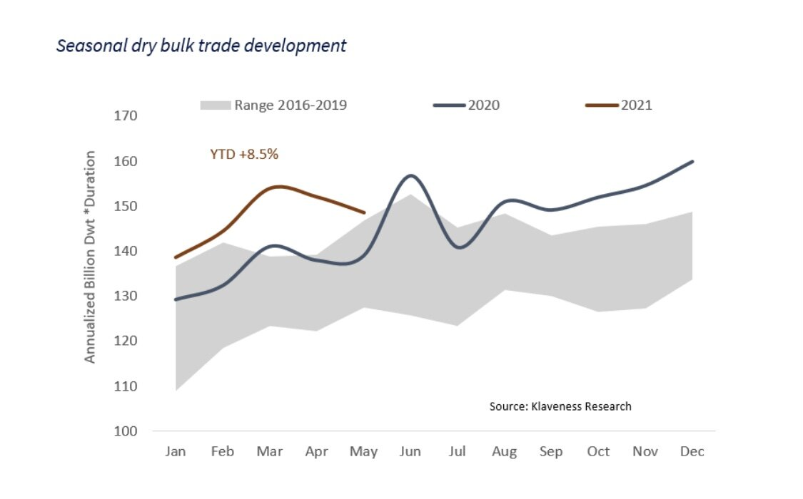
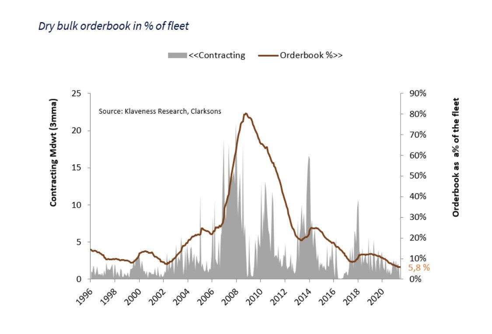

# Higher earnings in dry bulk is not a false dawn, it's only the predawn!

**Date:** June 26, 2021  
**Publisher:** Breakwave Advisors | **Category:** Market Insights  
**Original URL:** [https://www.breakwaveadvisors.com/insights/2021/6/25/higher-earnings-in-dry-bulk-is-not-a-false-dawn-its-only-the-predawn](https://www.breakwaveadvisors.com/insights/2021/6/25/higher-earnings-in-dry-bulk-is-not-a-false-dawn-its-only-the-predawn)  

---

> **Figure 1: Peter Lindstrom**  
> [Local Asset](file:///C:/Users/Dell/Github/Shipping/corpus/03-breakwave/insights/2021/assets/2021-06-26_higher-earnings-in-dry-bulk-is-not-a-false-dawn-its-only-the-predawn_img_peterlindstrom_997354675a15.jpg)

Peter Lindström, Head of Klaveness Research, held a presentation this week for key clients of the company with the all-encompassing title “Dry Bulk Market to remain strong? But for how long… are the surging rates just the predawn, or will new builds spawn, resulting in another false dawn..?”

### 1) 2021 Dry Bulk Earnings in a Historic Perspective

He argued that while freight rates this year have improved at a very rapid pace, the earnings of today are within a trend starting in 2016 when freight rates bottomed out after many years with abyssal earnings. However, the underlying positive trend has been masked by two black swan events: the Brumadinho dam disaster in 2019 and the Covid-19 epidemic hitting the world economy in 2020.

> **Figure 2: A1**  
> [Local Asset](file:///C:/Users/Dell/Github/Shipping/corpus/03-breakwave/insights/2021/assets/2021-06-26_higher-earnings-in-dry-bulk-is-not-a-false-dawn-its-only-the-predawn_img_a1_e056571cb9ab.jpg)

### 2) Trade Development Main Dry Bulk Commodities

In the first five months of 2021, the total demand* for dry bulk vessels is up 8.5% as global industrial production is recovering at a rapid pace. Global steel production was only down 0.9% in 2020 as Chinese growth almost offset the negative growth in the rest of the world. China’s rapid growth in steel production has continued in 2021 (up 13.9% in Jan-May) and is now accompanied with strong growth in the rest of the world as well (up 13.5% in Jan-May). This neck breaking growth in global steel production will, according to Lindström, moderate in the second half of this year and into next year, but raw material demand will remain overall supportive. Further, Lindström argues that what happens on the demand side in the coming months is not that important for Dry Bulk freight. The reason is that today’s prices of commodities, such as iron ore and coal, are way above the costs of the exporters with the highest marginal costs so today it’s the supply of raw materials that are the restrictive factor for trade - not demand. As an example, we currently have an iron ore price of more than 200$/ton for China delivery. Those seaborne exporters with the highest marginal production cost have a delivered cost in China of about 100$/ton given today’s freight rates. We see the same picture on coal and within the minor bulks. The growth levels in the seaborne trade will depend on how fast the exporters are able to ramp up production. With commodity prices well above the delivered cost of the marginal producers, the exporting companies are incentivized to ramp up export as much as possible.

> **Figure 3: A2**  
> [Local Asset](file:///C:/Users/Dell/Github/Shipping/corpus/03-breakwave/insights/2021/assets/2021-06-26_higher-earnings-in-dry-bulk-is-not-a-false-dawn-its-only-the-predawn_img_a2_8d0a9e97946a.jpg)

On the grain side of things, demand for commodities continues to grow as the global population increases and as developing economies switch to a more protein rich diet. On top of these generally supportive trends, the trade in 2020 and 2021 has been boosted by rapid growth in Chinese demand of commodities as the pig herd in the country recovered after the African Swine Flu.

The long-term trend in thermal coal demand is more questionable, but Lindström argues that the rumor of coal’s death is greatly exaggerated in the medium term. Global seaborne trade of coal is expected to remain firm up until at least 2025 as increasing demand of coal in emerging Asian economies more than offsets lower demand in developed economies. In the short term, the deficit of coal is evident as coal prices are at elevated levels well above the production cost of marginal producers. Similarly, to iron ore, the decisive factor in the short term for the seaborne trade will be how fast the seaborne exporters are able to ramp up production. As it looks today, Indonesia is the only exporter with the ability to increase exports substantially in the short-term.

### 3) Dry Bulk Market Outlook

Thus, dry bulk demand growth is expected to remain healthy in the foreseeable future. What then about supply.? Will newbuildings spawn… and result in another false dawn?” Lindström argues that if we walk down the memory lane we see**that any uptick in freight rates in the past 20 years have triggered big waves of new build orders. Is there any reason not to expect a big wave of newbuilding orders this time around?**The average lead time between orders and delivery in recent years has been more than 24 months and the order-book of the yards are being filled up with container orders - time is running out for orders with delivery in 2023. Based on the current level of the order-book we can, with a high level of certainty, predict that fleet growth will be at historically low levels in the next couple of years.**We certainly believe that higher freight markets will trigger more newbuild orders in the coming years. However, we also believe that fleet growth in the next 3-4 years is likely to be at relatively low levels due to uncertainties around the choice of fuel and propulsion systems.**

### 4) Conclusion

Lindström is confident that the supply growth up until 2023 will be at historically low levels. In the absence of new black swan events of a similar magnitude as the Brumadinho disaster and the Covid-19 pandemic, he firmly believes that the coming years will deliver demand growth of vessels that exceeds the fleet growth. This will increase freight rates further. While he does believe that higher freight will trigger more newbuild orders, he expects supply growth to trail demand growth of vessels in the coming 3-4 years due to the uncertainty around the choice of fuel and propulsion systems.

> **Figure 4: A3**  
> [Local Asset](file:///C:/Users/Dell/Github/Shipping/corpus/03-breakwave/insights/2021/assets/2021-06-26_higher-earnings-in-dry-bulk-is-not-a-false-dawn-its-only-the-predawn_img_a3_03ba6a3d23dc.jpg)

---

**Tags:** Dry Bulk, Shipping, Outlook  
