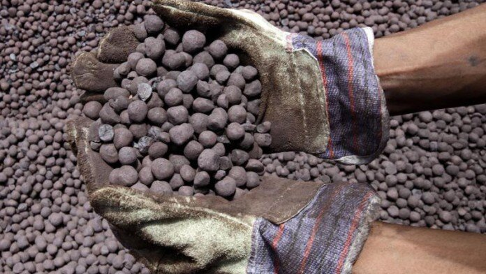
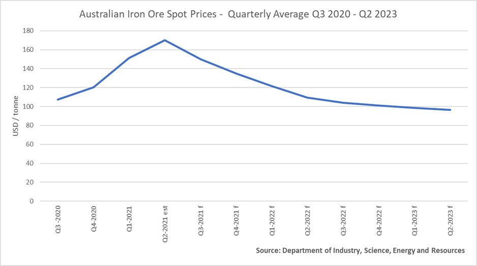
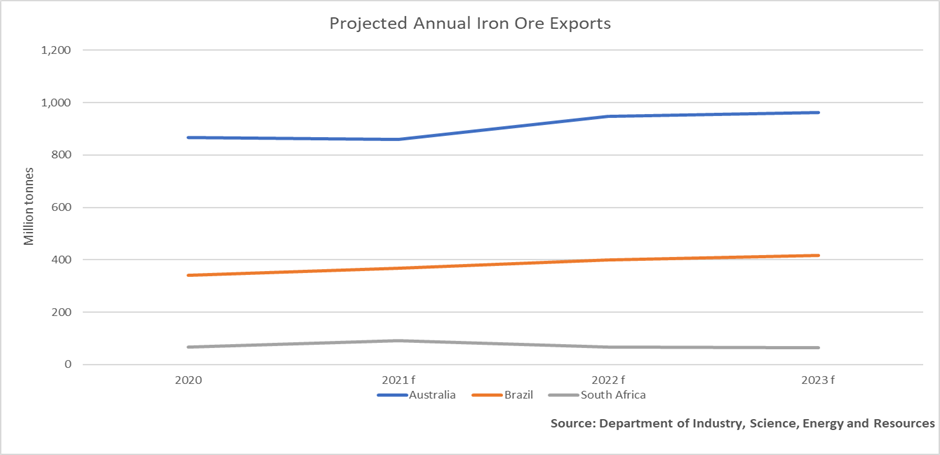

# Iron Ore: The Australian Government Expects Softer Prices but with Continued Growth in Global Trade Volumes

**Date:** June 29, 2021  
**Publisher:** Breakwave Advisors | **Category:** Market Insights  
**Original URL:** [https://www.breakwaveadvisors.com/insights/2021/6/29/iron-ore-the-australian-government-expects-softer-prices-but-with-continued-growth-in-global-trade-volumes](https://www.breakwaveadvisors.com/insights/2021/6/29/iron-ore-the-australian-government-expects-softer-prices-but-with-continued-growth-in-global-trade-volumes)  

---

*By Ulf Bergman*

> **Figure 1: Iron Ore Pellets**  
> [Local Asset](file:///C:/Users/Dell/Github/Shipping/corpus/03-breakwave/insights/2021/assets/2021-06-29_iron-ore-the-australian-government-expects-softer-prices-but-with-continued-grow_img_ironorepellets_4b0e8ee8bb20.jpg)

As the Baltic Dry Index hit the highest levels since June 2010 on Monday, China upped the ante in its ongoing diplomatic spat with Australia. In what is widely seen as a break from its traditional approach, Beijing has lodged a complaint against some Australian anti-dumping duties at the World Trade Organization (WTO). There are also suggestions that a longer list of Chinese grievances against Australian trade policies will find its way to the WTO very soon. The move is the latest instalment in the long-running saga of tit-for-tat escalations between the two nations and comes after Canberra’s recent complaint regarding Beijing’s recent move to impose anti-dumping duties on Australian wine and barley. The complaint to the WTO by China took many observers by surprise, with some suggesting the move was wholly politically motivated as the Australian duties the Chinese leadership has chosen to dispute were imposed several years ago. The latest escalation, in combination with the extended time it usually takes for disputes to be resolved through the WTO, suggests that the Sino-Australian relationship is set to remain in the deep freeze for quite some time.

While the stimulus-driven economic recovery is the principal reason for the dry bulk shipping sector’s spectacular recovery from the depths of despair seen some fifteen months ago, the sub-optimal trade flows generated by the deepening diplomatic tensions have also contributed to a tighter tonnage supply. While coal and grains have been sourced elsewhere, and often involving greater distances, iron ore has been immune to the deteriorating bilateral relations. In contrast to many other Australian exports to China, iron ore volumes have even continued to grow. Against this background, the Australian government has released its updated assessment of the coming years’ trade. The revised outlook for the global commodity trade and Australian exports are in some respects more positive than the outlook three months ago, but perhaps not entirely. It very much depends on one’s point of view.

From a miner’s or trader’s perspective, the Australian government’s latest projections may prove to be sobering reading. While the projections now point to a softer landing for the iron ore prices, compared to three months ago, the Australian government nevertheless do not see much more upside. Prices are expected to start to soften during the second half of the year and continue the process during the following two years. This is perhaps somewhat in contrast to the expectations among many analysts and traders, but such a development would no doubt please Beijing as it would match their desire for lower commodity prices. The anticipation of softer prices is a function of increasing production in Brazil and Australia, but also due to an expectation of a decrease in demand from China due to government interventions and tighter control of Chinese steel exports.

> **Figure 2: Ulf1629**  
> [Local Asset](file:///C:/Users/Dell/Github/Shipping/corpus/03-breakwave/insights/2021/assets/2021-06-29_iron-ore-the-australian-government-expects-softer-prices-but-with-continued-grow_img_ulf1629_77a0239d97fc.png)

The projections may not be what most miners would like to hear, but profitability is likely to be maintained for most miners albeit at less spectacular levels than at present. While profit margins for the miners may shrink, the seaborne volumes are expected to keep growing and support the tonnage demand. Despite a downgrade of the Australian export volumes, due to a weaker than expected first quarter and the potential for supply disruptions during the second half of the year, the global export volumes are projected to grow by almost six per cent this year. Increasing production in South Africa, Brazil, Canada and India will primarily be responsible for the global growth.

> **Figure 3: Ulf2629**  
> [Local Asset](file:///C:/Users/Dell/Github/Shipping/corpus/03-breakwave/insights/2021/assets/2021-06-29_iron-ore-the-australian-government-expects-softer-prices-but-with-continued-grow_img_ulf2629_315d945d67d8.png)

Though global iron ore production is set to continue to increase, a degree of supply tightness will remain and prices are likely to be susceptible to any output disruptions. Also, there may be a temptation from the Chinese leadership to impose some form of restrictions on Australian iron ore imports, given the current state of the relationship between the two countries. However, such a move is likely to drive iron ore prices higher yet again, as Australia remains the dominant exporter of the commodity. The recovery in Brazilian output is likely to reduce Australia’s dominance in the global seaborne iron ore market somewhat, with new African mining projects adding to the process later in the decade. However, it is unrealistic to expect that any major shift will take place any time soon. As long as China remains the world’s preeminent consumer of iron ore, the growing importance of initially Brazilian exports and subsequently African supplies will add to the tonne-mile demand. With only a limited number of new vessels due for delivery in the coming years, the tonnage supply situation could tighten further.

---

**Tags:** China  
