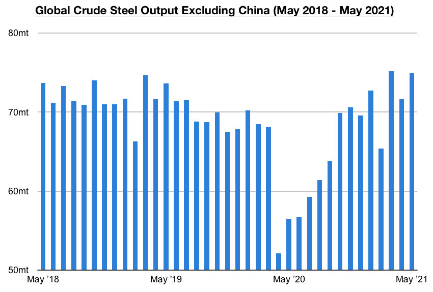
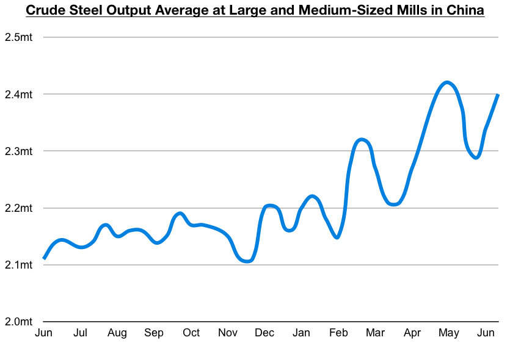

# Even Stronger Steel Production Both In and Outside of China

**Date:** July 01, 2021  
**Publisher:** Breakwave Advisors | **Category:** Market Insights  
**Original URL:** [https://www.breakwaveadvisors.com/insights/2021/6/30/even-stronger-steel-production-both-in-and-outside-of-china](https://www.breakwaveadvisors.com/insights/2021/6/30/even-stronger-steel-production-both-in-and-outside-of-china)  

---

*By Jeffrey Landsberg*

As we discussed last week, iron ore consumption has been faring very well both in and outside of China as global steel production has remained robust. Notable is that while April's global steel production data was very encouraging, new is that May's data has been released and shows steel production has climbed even further. Global crude steel production totaled a record 174.4 million tons last month. This is up month-on-month by 4.9 million tons (3%) and is 25.6 million tons (17%) more than was reported last year for May 2020's production. Production has now set a record for two consecutive months and is poised to climb even further as the global economy continues to recover from last year’s coronavirus-induced slowdown.

Global crude steel production outside of China totaled a very robust 74.9 million tons last month. This is just below the all-time high of 75.2 million tons produced in March. It is also 3.3 million tons (5%) more than was produced in April and is 18.4 million tons (33%) more than was reported last year for May 2020's production. Of particular note is crude steel production last month experienced extremely large year-on-year increases in Europe, India, and Japan in addition to very solid month-on-month increases. Europe produced approximately 13.5 million tons of crude steel last month. This is 600,000 tons (5%) more than was produced in April and is 3 million tons (29%) more than was reported last year for May 2020's production. India produced approximately 9.2 million tons of crude steel last month. This is 800,000 tons (10%) more than was produced in April and is 3.4 million tons (59%) more than was reported last year for May 2020's production. Japan produced approximately 8.4 million tons of crude steel last month. This is 600,000 tons (8%) more than was produced in April and is 2.5 million tons (42%) more than was reported last year for May 2020's production.

> **Figure 1: Comm 1 6.30**  
> [Local Asset](file:///C:/Users/Dell/Github/Shipping/corpus/03-breakwave/insights/2021/assets/2021-07-01_even-stronger-steel-production-both-in-and-outside-of-china_img_comm1630_8b2815e3bd55.jpg)

Even more recent data from China has also been made available and shows that China's steel production has continued to gain strength as well. Daily crude steel production at large and medium-sized mills in China averaged 2.4 million tons during June 11 - June 20. This is up by 3% from early June and is up year-on-year by 12%. As we have long been stressing in our Weekly Dry Bulk Reports and Weekly China Reports, China’s steel production has been poised to stay strong even as the central government has been working to place limitations on heavy polluting steel mills. Overall, the world's major economies continuing to strengthen remains yet another positive issue in the dry bulk shipping market, as this continues to lead to more steel being produced and more iron ore being consumed. Global iron ore exports remain seasonal and are poised to continue to increase much further as key iron ore producers continue to ramp up their production. Fortunately for the dry bulk market, there remains strong demand for imported iron ore both in and outside of China.

> **Figure 2: Comm2 6.30**  
> [Local Asset](file:///C:/Users/Dell/Github/Shipping/corpus/03-breakwave/insights/2021/assets/2021-07-01_even-stronger-steel-production-both-in-and-outside-of-china_img_comm2630_5dada754e70b.jpg)

---

**Tags:** Steel  
