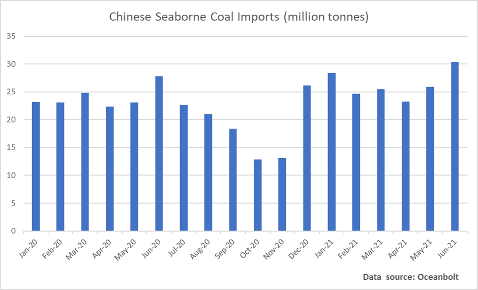

# China: Increasing Headwinds for the Economy Could Keep Stimulus in Place for Longer

**Date:** July 05, 2021  
**Publisher:** Breakwave Advisors | **Category:** Market Insights  
**Original URL:** [https://www.breakwaveadvisors.com/insights/2021/7/2/china-increasing-headwinds-for-the-economy-could-keep-stimulus-in-place-for-longer](https://www.breakwaveadvisors.com/insights/2021/7/2/china-increasing-headwinds-for-the-economy-could-keep-stimulus-in-place-for-longer)  

---

*By Ulf Bergman*

> **Figure 1: Unsplash Image Bafphvdh9ik**  
> [Local Asset](file:///C:/Users/Dell/Github/Shipping/corpus/03-breakwave/insights/2021/assets/2021-07-05_china-increasing-headwinds-for-the-economy-could-keep-stimulus-in-place-for-long_img_unsplash-image-bafphvdh9ik_58c2abc73488.jpg)

The Chinese economy has provided a considerable number of spectacular data releases in the last fifteen months, as it recovered from the initial effects of the COVID19 outbreak. However, the most recent release of the official purchasing managers’ index (PMI) is pointing towards increasing headwinds for the economy in the months to come. While the manufacturing sector is remaining stable with only a marginal shave compared to May and broadly in line with economists’ anticipations at 50.9, the non-manufacturing gauge failed to meet expectations with a reading of 53.5, compared to 55.2 previously.

How one chooses to view the PMI readings for June is very much a question of the glass being half-full versus half-empty. From a positive perspective. both indicators are still in expansionary territory and suggest that the Chinese economy is still in good health, albeit showing signs of plateauing, and will continue to provide support to the ongoing global economic recovery. On the other hand, the disappointing reading for the non-manufacturing sectors highlights the uneven recovery that the Chinese economy is, and has been, facing. The early parts of the post-COVID19 recovery were driven by the export industry, while the service and construction sectors were lagging. Hence, resulting in a two-speed rebound and a need for the domestic economic activity to play catch up. The disappointing PMI for the non-manufacturing sectors potentially highlights a domestic weakness in the Chinese economy, which could prove problematic as many parts of the world are emerging from the restrictions imposed by the pandemic. This development is likely to shift demand and spending away from goods and towards services, which could reduce the demand for Chinese exports. The pressure exports are facing were also highlighted by the subindex measuring new export orders in the manufacturing sector, which registered its third consecutive decline and remains in contraction territory.

The continued perception of a domestic Chinese economy still not firing on all cylinders is likely to be a source of concern for the leaders in Beijing, as developing a greater degree of economic autonomy is a key pillar of the current five-year plan. While the recent COVID19 outbreak in the southern parts of the country and the centenary celebrations of the Chinese Communist Party may have weighed somewhat on the consumer activities in June, the softening outlook for the economy is nevertheless leaving less room for the leadership to taper the stimulus programmes introduced during the pandemic. Hence, maintaining a continued strong demand for commodities.

The Chinese National Bureau of Statistics also highlighted supply chain problems as contributing factors to the weaker numbers, with semiconductor, coal and power shortages affecting output in some sectors. A surge in electricity demand following hot weather, alongside continued high steel production, has seen the nation’s coal inventories dwindling despite rising seaborne imports during the last few months. According to cargo tracking data from Oceanbolt, June also saw a record level of coal being discharged in Chinese ports.

> **Figure 2: Ulf 7.2**  
> [Local Asset](file:///C:/Users/Dell/Github/Shipping/corpus/03-breakwave/insights/2021/assets/2021-07-05_china-increasing-headwinds-for-the-economy-could-keep-stimulus-in-place-for-long_img_ulf72_c7b5c379ece9.png)

The Chinese coal production has been hampered in recent months by safety inspections, following a series of accidents, and increasing environmental restrictions. The CCP anniversary celebrations have also seen many coal mines halting their operations to allow for the miners to participate in the commemorations, which will further reduce domestic output. However, in light of the tight supply situation and rising prices some mines have been permitted to expand their operations in recent days, but there will likely be a time lag before those additional volumes will alleviate the situation. Also, the additional output is unlikely to make a serious dent in the imported volumes. Hence, with last winter’s coal shortages in recent memory and low inventories, it is unlikely that China can reduce the flow of imported coal any time soon.

---

**Tags:** China  
