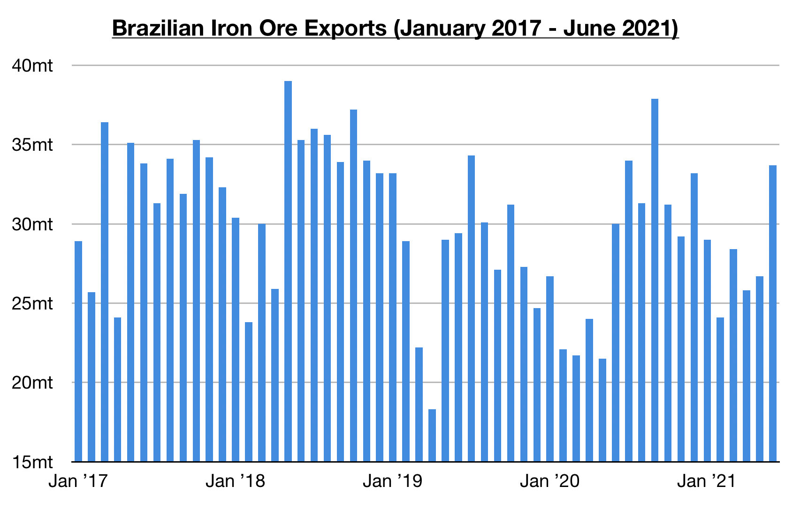

# Tightness in Panamax (Not Capesize) Atlantic Basin; Chinese Coal and Brazilian Iron Ore Prospects Remain Encouraging

**Date:** July 05, 2021  
**Publisher:** Breakwave Advisors | **Category:** Market Insights  
**Original URL:** [https://www.breakwaveadvisors.com/insights/2021/7/5/tightness-in-panamax-not-capesize-atlantic-basin-chinese-coal-and-brazilian-iron-ore-prospects-remain-encouraging](https://www.breakwaveadvisors.com/insights/2021/7/5/tightness-in-panamax-not-capesize-atlantic-basin-chinese-coal-and-brazilian-iron-ore-prospects-remain-encouraging)  

---

*By Jeffrey Landsberg*

Dry bulk freight rates were mixed last week, with capesize rates declining while rates in the rest of the market increased. Earlier, capesize rates appeared likely to begin another rally soon — but this has not occurred as expected. However, we are bullish for capesize prospects for the second half of the year, and already rates are at firm levels even as capesize Atlantic basin availability has not yet significantly tightened. As long as Brazilian iron ore export volume continues to enjoy similar year-on-year growth as has been seen during the last several months, then sporadic periods of significant tightening in the capesize Atlantic basin remain likely to occur.

Of note is that Brazil’s iron ore exports have continued to enjoy significant strength. As we discussed in this week's Weekly Dry Bulk Report, exports have now increased on a year-on-year basis for eight consecutive months which marks a feat never before seen in the last ten years. Brazil’s iron ore exports totaled 33.7 million tons last month. This is up month-on-month by 7 million tons (26%) and up year-on-year by 3.7 million tons (12%). All signs going forward are that the year-on-year strength and normal seasonality will continue. If exports do maintain their current strength and normal seasonality, then sporadic periods of significant tightening in the capesize Atlantic basin remain likely to occur at various times this year.

> **Figure 1: Comm 7.5**  
> [Local Asset](file:///C:/Users/Dell/Github/Shipping/corpus/03-breakwave/insights/2021/assets/2021-07-05_tightness-in-panamax-not-capesize-atlantic-basin-chinese-coal-and-brazilian-iron_img_comm75_e560b6318d49.jpg)

While the capesize Atlantic basin has not tightened recently, ironically it has been the panamax Atlantic basin that has tightened significantly. This remains very supportive to panamax rates and is also helpful for the entire dry bulk market. It also remains encouraging that panamax rates (and rates for the smaller vessel classes) have continued to rise even as China’s coal import demand has not yet experienced sustained strength. As highlighted in our Weekly Dry Bulk Report and Weekly China Report this week, China’s coal import demand improved last week, but import demand is likely to intensify further as the nation’s coal consumption remains likely to continue to outpace domestic coal production.

The fact that Chinese power plant stockpiles are down year-on-year by about 25% while coal-derived electricity production this quarter has been rising year-on-year by 10% remains extremely encouraging, and concerns of both summer and winter coal shortages continue to mount. Also very encouraging was last week’s announcement from the National Development and Reform Commission that China plans to build around 100 million tons of national coal reserves during this year alone. As the weeks progress, we expect that China’s coal-derived electricity generation will continue to outperform domestic coal production and that much more coal will be imported in order to help meet summer demand. In addition, it now appears likely that an increase in imports will occur to also help build state reserves to meet future demand.

---

**Tags:** Panamax, Coal  
