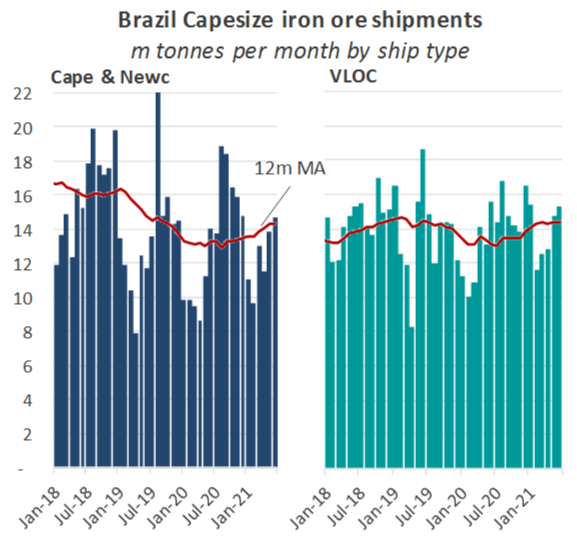
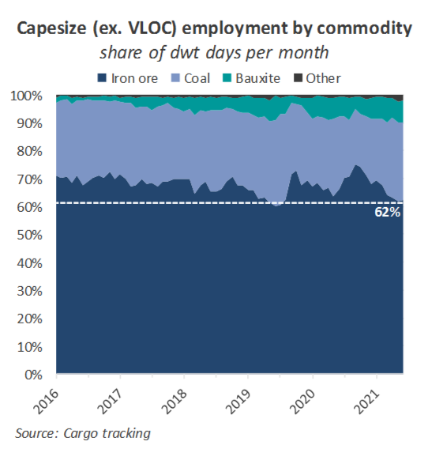
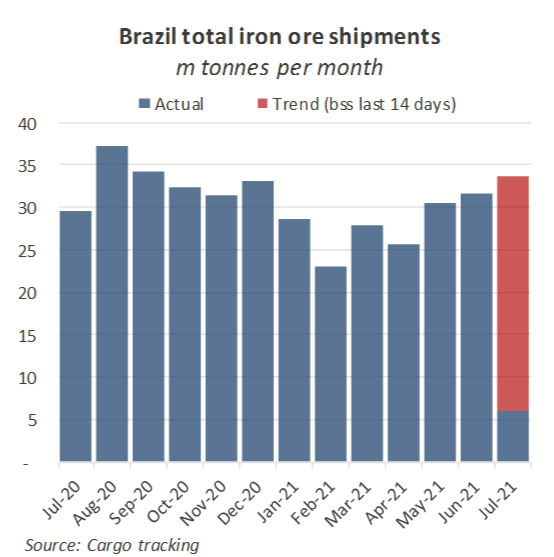
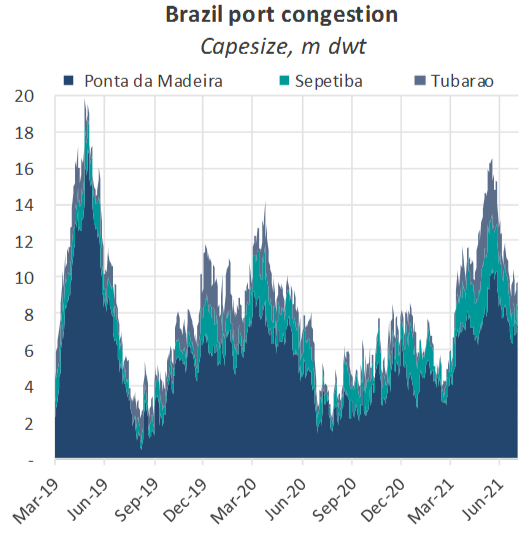
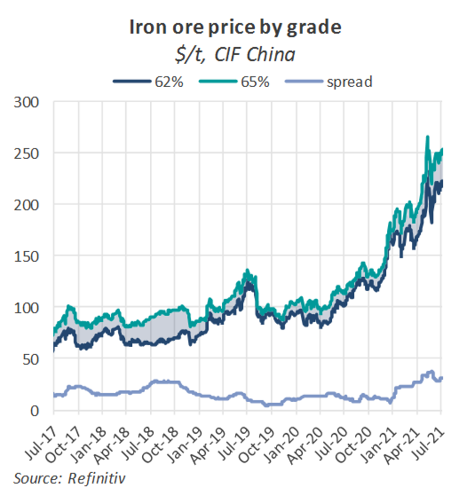

# The Big Picture: Brazilian iron ore exports

**Date:** July 09, 2021  
**Publisher:** Breakwave Advisors | **Category:** Market Insights  
**Original URL:** [https://www.breakwaveadvisors.com/insights/2021/7/8/y4z1ig2986de56e4ou5sy45yrpcaf1](https://www.breakwaveadvisors.com/insights/2021/7/8/y4z1ig2986de56e4ou5sy45yrpcaf1)  

---

*By Nick Ristic*

Shipments from the second-largest iron ore producer are recovering. This should help to prop up Cape demand over Q3, but disruptions to the circulation of tonnage could keep volatility elevated.

### Disappointing Volumes

After another disappointing first half of the year, Brazilian iron ore export volumes are finally showing signs of improvement. Total shipments from the world’s second-largest iron ore exporter over the first half of the year stand at 167.7m tonnes, according to our tracking of vessel movements. While this represents a 13% increase on shipments over the same period in 2020, and a 2% increase on those in 2019, these two years were themselves very poor reference points. The former saw exports slashed by poor weather and COVID-19 related disruptions, while during the latter, the Brumadinho disaster temporarily restricted output and severely throttled the flow of cargoes to the water. Compared to the first six months of 2018, YTD shipments from Brazil come in 8% lower.

For Capes and Newcastlemaxes only, which we can broadly assume represent the Capesize spot market, the fall from 2018’s ‘pre-disruption’ levels have been even greater. Volumes on these ships over 1H 2021 reached 73.7m tonnes, 13% lower versus the same period in 2018. VLOC’s meanwhile, which serve as dedicated tonnage for the iron ore shippers, have naturally been used more efficiently, with volumes so far this year falling only 1% relative to the 2018 baseline. With exports from Australia, the largest exporter, relatively flat, growth in total iron ore trade has been poor compared to other commodities shipped on Capes (e.g. Bauxite) that iron ore’s share of demand has actually fallen close to where it was during 1H 2019.

> **Figure 1: Based on Our Tracking of Cape Voyages and Ballasting Patterns**  
> *Based on our tracking of Cape voyages and ballasting patterns, iron ore has accounted for around 64% of demand for Capes (excluding VLOCs) so far this year, down from an average of 69% over 2015-18. In June, this figure reached as low as 62%. This also partially reflects a recent boost in demand from coal trade caused by China’s ban on Australian coal (see last week’sBig Picture).*  
> [Local Asset](file:///C:/Users/Dell/Github/Shipping/corpus/03-breakwave/insights/2021/assets/2021-07-09_y4z1ig2986de56e4ou5sy45yrpcaf1_img_bmr178_b23f4919b0be.png)

> **Figure 2: Bmr 2 7.8**  
> [Local Asset](file:///C:/Users/Dell/Github/Shipping/corpus/03-breakwave/insights/2021/assets/2021-07-09_y4z1ig2986de56e4ou5sy45yrpcaf1_img_bmr278_229dce4e71b3.png)

Over the past few weeks however, loading rates at Brazil’s major ports have jumped, aided by the completion of repairs and maintenance work in Ponta da Madeira. The pace of total shipments over July so far has averaged almost 1.2m tonnes per day, 30% higher YoY and 3% greater than June’s average. Based on a 14-day moving average, Brazil’s shipments are on track to surpass 33.6m tonnes this month, a 6% improvement MoM and 14% gain YoY.

> **Figure 3: Bmr 3 7.8**  
> [Local Asset](file:///C:/Users/Dell/Github/Shipping/corpus/03-breakwave/insights/2021/assets/2021-07-09_y4z1ig2986de56e4ou5sy45yrpcaf1_img_bmr378_48cc3480b08a.png)

With the conditions in Brazil reportedly very dry, the maintenance schedule clear, and extremely high iron ore prices incentivising greater output, shipments are likely to accelerate further this month. The current line-up for ships waiting to load suggests July volumes could surpass 34.7m tonnes, which represents a jump of 10% MoM and 18% YoY.

The ramping up of exports has helped to chew through the congestion outside Brazilian ports, which built up over Q2 to the highest levels since 2019 while liftings were depressed. Queues of ships larger than 100k dwt have eased by 42% from their peak of 16.7m dwt in May to 9.6m dwt this week.

> **Figure 4: Bmr 4 7.8**  
> [Local Asset](file:///C:/Users/Dell/Github/Shipping/corpus/03-breakwave/insights/2021/assets/2021-07-09_y4z1ig2986de56e4ou5sy45yrpcaf1_img_bmr478_d25d8fae5e7c.png)

This unwinding has translated to a reduction in supply in this basin, but it has also disrupted the regular flow of dedicated tonnage performing consecutive Brazil - Far East voyages. Over May and June, as congestion was building up, we recorded an average of 2.8m dwt per week of these ships ballasting into the Indian Ocean towards Brazil, down by 44% over the previous two month period. Average weekly ballaster figures for Capes and Newcastlemaxes over this period increased by 6% to 4.2m dwt.

As we saw in 2019, this ‘bunching up’ effect can have a significant effect on shippers’ requirements for spot ships, and it adds another layer of unpredictability to an already-volatile market. With this in mind, we expect the improving supply and demand picture to support Cape rates going forward, but these additional dynamics mean we cannot rule out more wild swings in freight.

### Iron Ore Prices

Recovery in Brazilian miners’ output also has implications for the iron ore price, which is still trading near record highs. This has been a product of the aforementioned weak growth in seaborne supply, but also a surge in Chinese steel prices and production over the first half of this year. Extremely strong steel margins during this period were particularly supportive to prices of higher grade ores, of which Brazil is a key supplier. This has been evident in the spread between 62% and 65% Fe content ore prices, which widened to a record $38 per tonne in April.

> **Figure 5: Bmr 5 7.8**  
> [Local Asset](file:///C:/Users/Dell/Github/Shipping/corpus/03-breakwave/insights/2021/assets/2021-07-09_y4z1ig2986de56e4ou5sy45yrpcaf1_img_bmr578_c57023898f5a.png)

Over the remainder of this year, we expect the combination of growing cargo supply from Brazil and increasingly aggressive policies in China aimed at cutting steel output to pull prices down from these extreme highs. So far, China’s economic planners have had little success in this fight, but the rhetoric and measures taken to cool markets have been gradually ratchetting up over the past few months. These may begin to have an effect on underlying raw material demand in the coming weeks.

---

**Tags:** Brazil, Capesize  
