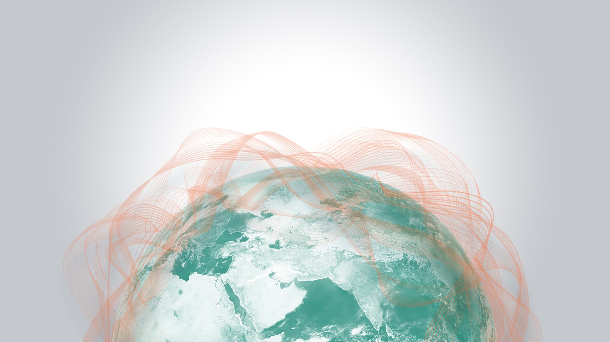
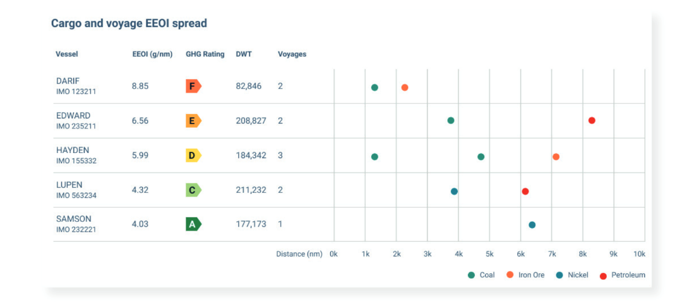
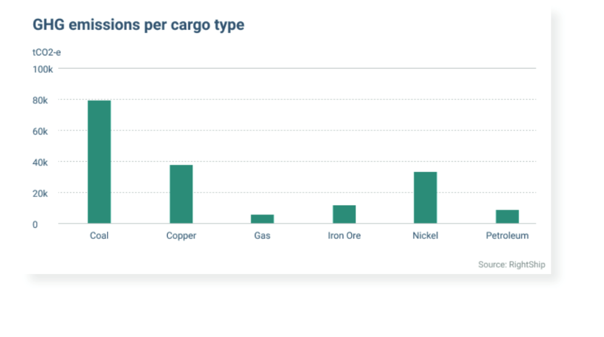
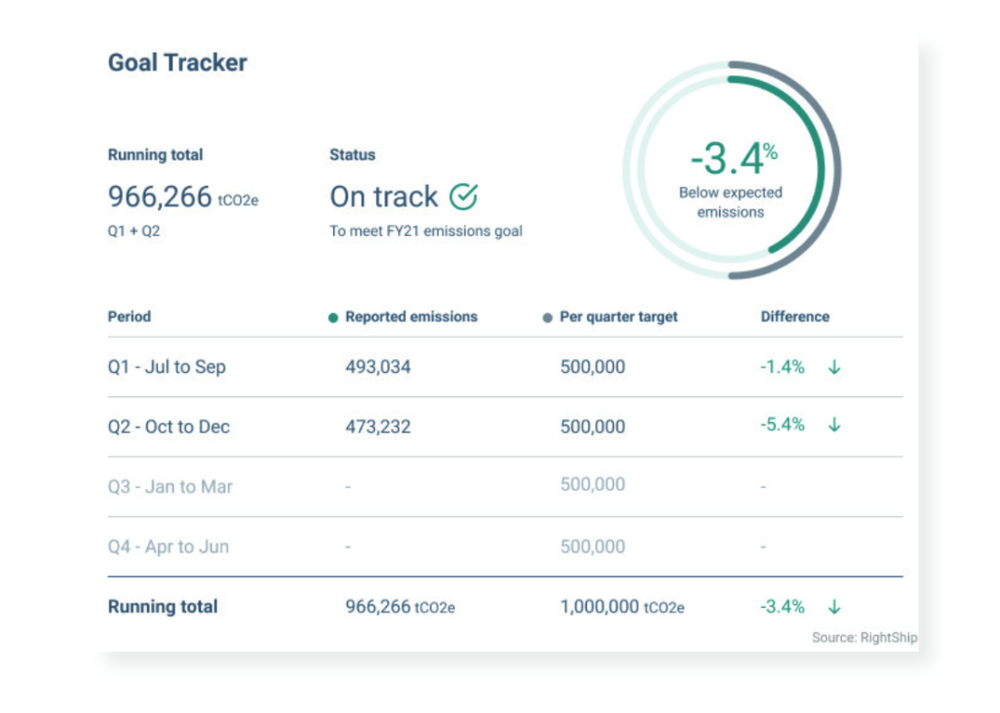
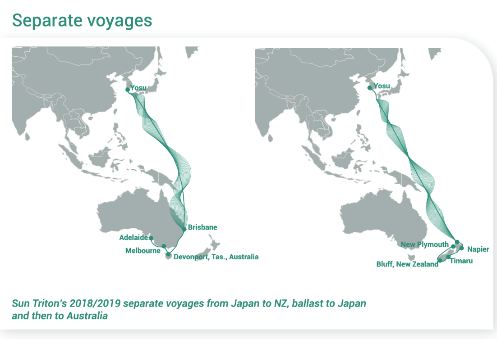
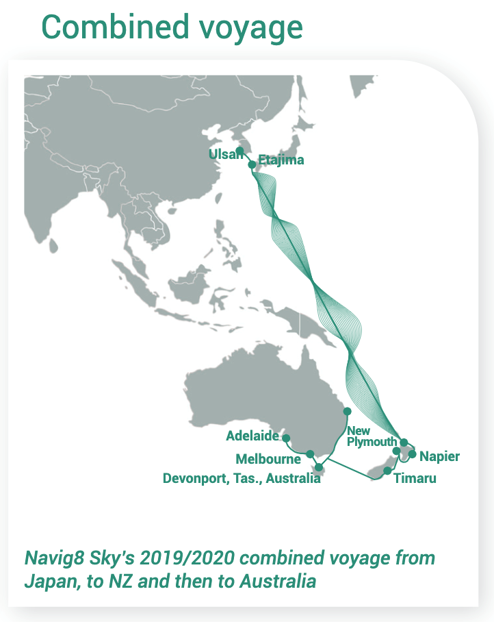

# Breakwave talks to RightShip about their Carbon Accounting White Paper: A Sustainable Road Map

**Date:** July 10, 2021  
**Publisher:** Breakwave Advisors | **Category:** Market Insights  
**Original URL:** [https://www.breakwaveadvisors.com/insights/2021/7/10/breakwave-talks-to-rightship-about-their-carbon-accounting-white-paper-a-sustainable-road-map](https://www.breakwaveadvisors.com/insights/2021/7/10/breakwave-talks-to-rightship-about-their-carbon-accounting-white-paper-a-sustainable-road-map)  

---

**As we continue to focus on a feasible transition to a zero-carbon maritime economy, Breakwave Advisors spoke with RightShip to learn about their Carbon Accounting product and recent research that underpins their objectives**

*By Thanos Sofios*

> **Figure 1: Leading Maritime Risk and Due Diligence Firm Rightship Has Been**  
> *Leading maritime risk and due diligence firm RightShip has been looking closely at the tools required for the industry to meet IMO emissions reductions targets. It recently completed research into the potential impact of Carbon Accounting. The many insights can be found in the company’s white paper:A Sustainable Road Map.*  
> **Interactive Data & Source:** [Explore Rightship](https://explore.rightship.com/A_Sustainable_Roadmap) | [Local Asset](file:///C:/Users/Dell/Github/Shipping/corpus/03-breakwave/insights/2021/assets/2021-07-10_breakwave-talks-to-rightship-about-their-carbon-accounting-white-paper-a-sustain_img_rightship_a64f85dd57c6.jpg)

There is much industry discussion taking place regarding the feasibility of meeting IMO 2030 and 2050 emissions reduction targets.

In the white paper, RightShip first explores 2030 environmental targets and the urgent need to plan now to meet and exceed industry goals. RightShip is well placed to explore industry pain points such as knowing where to begin, what data is required and what strategies must be in place before a business can look to reduce its impact.

### Challenges in Emissions Assessment

The white paper explains that companies have historically focused on greenhouse gas (GHG) emissions from their own operations under scope 1 and scope 2 emissions.

And yet, GHG emissions produced along their supply chain (scope 3) often represent the largest source of a company’s GHG emissions. That’s why RightShip sees value in working with companies to assess emissions across their entire operations. Ultimately measuring them now, so that a roadmap for reduction can be implemented.

RightShip established its Carbon Accounting tool in 2016, which enables customers to use several efficiency filters to calculate a charterer’s present position and provide practical steps to reduce impact over time.

Carbon Accounting insights include Cargo and voyage EEOI spread, emissions per cargo type, goal tracker, supplier comparisons, sophisticated reporting and goal setting.

> **Figure 2: A1.jpg**  
> **Interactive Data & Source:** [Explore Rightship](https://explore.rightship.com/A_Sustainable_Roadmap) | [Local Asset](file:///C:/Users/Dell/Github/Shipping/corpus/03-breakwave/insights/2021/assets/2021-07-10_breakwave-talks-to-rightship-about-their-carbon-accounting-white-paper-a-sustain_img_a1jpg_409eb9ee54a4.png)

> **Figure 3: A2**  
> **Interactive Data & Source:** [Explore Rightship](https://explore.rightship.com/A_Sustainable_Roadmap) | [Local Asset](file:///C:/Users/Dell/Github/Shipping/corpus/03-breakwave/insights/2021/assets/2021-07-10_breakwave-talks-to-rightship-about-their-carbon-accounting-white-paper-a-sustain_img_a2_2c1ef9810170.png)

> **Figure 4: A3**  
> **Interactive Data & Source:** [Explore Rightship](https://explore.rightship.com/A_Sustainable_Roadmap) | [Local Asset](file:///C:/Users/Dell/Github/Shipping/corpus/03-breakwave/insights/2021/assets/2021-07-10_breakwave-talks-to-rightship-about-their-carbon-accounting-white-paper-a-sustain_img_a3_b918a23586ad.png)

Within the white paper, RightShip also considers world events and their impact on shipping, these include Covid-19 disruption, the rise of responsible lending and stakeholder expectations.

A key component of the white paper is a case study from RightShip customer Ixom Operations Pty Ltd, which highlights the exploration of two of the company’s trade lanes operating from Asia, Australia and New Zealand. Through trade lane efficiency analysis, it was found that a great deal of efficiency could be achieved by combining the routes for maximum impact.

> **Figure 5: A4**  
> **Interactive Data & Source:** [Explore Rightship](https://explore.rightship.com/A_Sustainable_Roadmap) | [Local Asset](file:///C:/Users/Dell/Github/Shipping/corpus/03-breakwave/insights/2021/assets/2021-07-10_breakwave-talks-to-rightship-about-their-carbon-accounting-white-paper-a-sustain_img_a4_12617c81d57b.png)

> **Figure 6: Download Rightship’s White Papera Sustainable Road Map**  
> *Download RightShip’s white paperA Sustainable Road Map*  
> **Interactive Data & Source:** [Explore Rightship](https://explore.rightship.com/A_Sustainable_Roadmap) | [Local Asset](file:///C:/Users/Dell/Github/Shipping/corpus/03-breakwave/insights/2021/assets/2021-07-10_breakwave-talks-to-rightship-about-their-carbon-accounting-white-paper-a-sustain_img_a5_63465fd11979.png)

RightShip points out that this is a clear example of how companies can reduce their emissions through strategic data assessment and accounting, while also improving operational efficiency, and therefore, the company’s bottom line.

### Data Collection

In the report, RightShip’s research indicated that an ongoing challenge for many customers seeking to improve their sustainability measures is the collection of reliable data. However, RightShip has a methodology in place that helps customers easily understand what’s required in terms of data, and the calculations used to deliver a trusted outcome.

The white paper reveals many of RightShip’s long-term aspirations and suggests that its accounting model can help customers to establish clear actions to take, starting now, to achieve 2030 and 2050 goals.

---

**Tags:** Rightship, Shipping, Zerocarbon  
