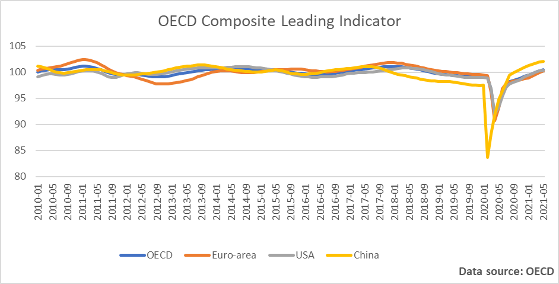
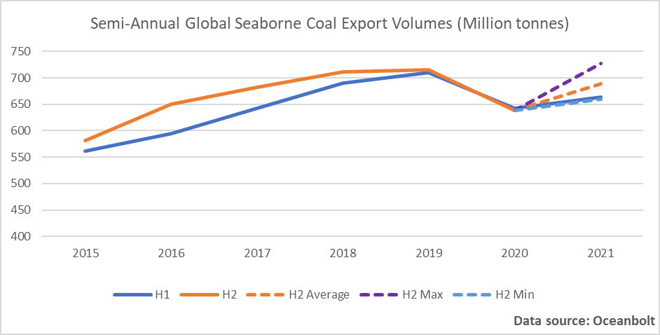
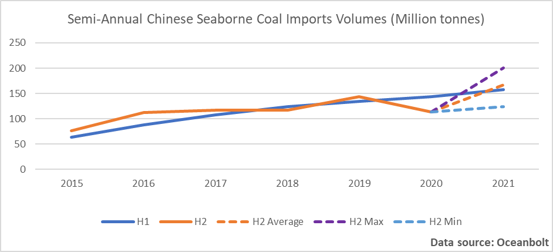

# Global Economy: The Recovery Is Still On Track

**Date:** July 14, 2021  
**Publisher:** Breakwave Advisors | **Category:** Market Insights  
**Original URL:** [https://www.breakwaveadvisors.com/insights/2021/7/13/global-economy-the-recovery-is-still-on-track](https://www.breakwaveadvisors.com/insights/2021/7/13/global-economy-the-recovery-is-still-on-track)  

---

*By Ulf Bergman*

The world’s developed economies are showing a continued vigour as they are emerging from the grip of the pandemic, according to the OECD. The Paris-based organisation’s Composite Leading Indicators, which typically are predicting the strength of the economic growth cycle six months to nine months into the future, continue to expand for the group’s 38 members on aggregate and in some larger emerging-market economies as well. At the same time as the organisation’s leading indicators are pointing towards a continued global economic recovery that will carry on into next year at least, the threat of new coronavirus outbreaks and variants should not be underestimated according to the OECD. Supporting the bullish outlook, the French government upgraded its growth projection for the year from five to six per cent on Monday, as the economy is rebounding faster than expected following the end of most restrictions.

> **Figure 1: A1.pnj**  
> [Local Asset](file:///C:/Users/Dell/Github/Shipping/corpus/03-breakwave/insights/2021/assets/2021-07-14_global-economy-the-recovery-is-still-on-track_img_a1pnj_af3241a9756b.png)

While the OECD’s indicators are pointing towards a continued healthy recovery for large parts of the global economy, the headwinds in the Chinese economy have been picking up and prompted the authorities to lower the reserve requirement ratio (RRR) in the banking system by half a percentage point. The move, which surprised most analysts, will release approximately one trillion yuan, USD 155 billion, of liquidity into the interbank markets. The initiative is aimed at providing credit to small and mid-sized companies, which are struggling as a result of the weak domestic market and high commodity prices. However, the change to the RRR has also left some economists cautious of the nation’s continued economic outlook, with some downgrading their growth expectations for the second half of the year. The lowering of the reserve requirements also saw iron ore prices rising, as demand is expected to strengthen as Beijing is attempting to reinvigorate the economic growth following the recent soft data releases.

Perhaps somewhat ironic, the combination of increasing economic headwinds in China and accelerating recovery in many other parts of the world could prove to be an attractive combination for the commodity markets. Under normal circumstances, the length and strength of the post-pandemic economic recovery in China would have led to a tightening of the expansionary economic policies to avoid overheating the economy, potentially reducing the demand for commodities. However, the uneven character of the rebound may force the Chinese leadership to refrain from any major tapering of the stimulus programmes. The continued strong economic growth and meeting the goals of the current five-year plan are likely to be seen as vital to preserving the domestic political stability, which will continue to support the robust demand for commodities.

A return to more stimulus-driven growth in China and a continued rebound in the developed economies of the world would support a seasonal increase in seaborne iron ore volumes during the second half of the year, as outlined in Ocean Analytics’ previous contribution. For the other major commodity, coal, the picture may be somewhat more complex. According to cargo tracking data from Oceanbolt, the seasonal increase in seaborne coal during the second half of the year has largely disappeared during recent years. Volumes have become evenly matched between the two halves of the year.

> **Figure 2: A2.pnj**  
> [Local Asset](file:///C:/Users/Dell/Github/Shipping/corpus/03-breakwave/insights/2021/assets/2021-07-14_global-economy-the-recovery-is-still-on-track_img_a2pnj_6a275a8742cd.png)

The disappearance of the seasonal effect on the seaborne coal flows is likely to be a function of the trade becoming increasingly China-centric, as many developed nations reduce their use of it in power generation. Increasing imports overland from Mongolia and political measures are likely to have had an impact on the trade patterns as well. Despite the recent loss of seasonality in the seaborne coal trade, volumes are likely to remain firm during the rest of the year. It is also worth remembering that many parts of the world are not covered by any emissions trading programmes and coal remain the cheapest source of energy for developing economies emerging from the pandemic.

Chinese seaborne coal imports have over the last few years not shown any coherent seasonal effects between the two halves of the year. Last year even showed a considerable drop in imported volumes during the second half, as the diplomatic tensions with Australia developed and new sources were sought.

> **Figure 3: A3.pnj**  
> [Local Asset](file:///C:/Users/Dell/Github/Shipping/corpus/03-breakwave/insights/2021/assets/2021-07-14_global-economy-the-recovery-is-still-on-track_img_a3pnj_01846577c28e.png)

Nevertheless, last year’s drop in seaborne volumes during the second half looks unlikely to be repeated this year. Following last winter’s shortage, the National Development and Reform Commission has announced that it intends to build up considerable stockpiles to avoid a repeat. With domestic Chinese coal production facing occasional restrictions, due to environmental concerns and safety inspection, the ambition to build up considerable inventories will require imports to increase. Hence, the seasonality of yesteryears may return, with higher volumes during the second half of the year.

---

**Tags:** Global Economy, Commodities, Shipping  
