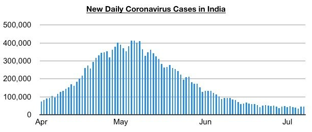
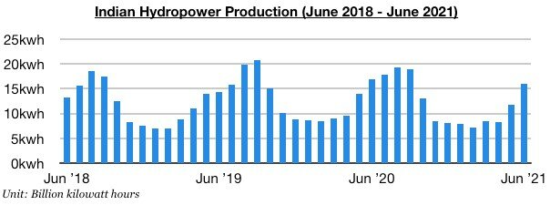
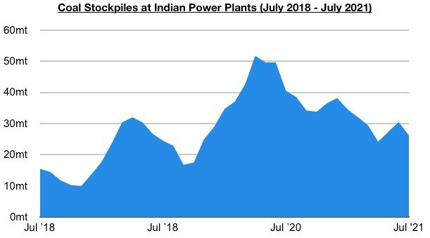
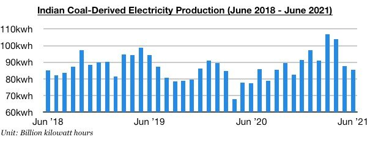

# Indian Coal Import Prospects Remain Encouraging

**Date:** July 15, 2021  
**Publisher:** Breakwave Advisors | **Category:** Market Insights  
**Original URL:** [https://www.breakwaveadvisors.com/insights/2021/7/15/indian-coal-import-prospects-remain-encouraging](https://www.breakwaveadvisors.com/insights/2021/7/15/indian-coal-import-prospects-remain-encouraging)  

---

*By Jeffrey Landsberg*

New daily coronavirus cases in India have continued to decline, with new cases last week reaching as low as 34,067 cases on Monday. This is a far cry from May 6’s peak of 414,433 cases. Overall, India continuing to recover from its recent tragic coronavirus surge will continue to lessen the chance of new widespread lockdowns in India. The Indian economy appears poised to continue to dramatically improve, and both Indian coal production and electricity production are also likely to increase in the near term. Fortunately for the dry bulk market, it is India's electricity production (including coal-derived electricity generation) that is likely to continue to fare much better than domestic coal production.

> **Figure 1: A1.png**  
> [Local Asset](file:///C:/Users/Dell/Github/Shipping/corpus/03-breakwave/insights/2021/assets/2021-07-15_indian-coal-import-prospects-remain-encouraging_img_a1png_36258c2af624.jpg)

Most recently, India produced approximately 106.4 billion kilowatt hours of electricity in June. This has marked a month-on-month increase of 2.4 billion kilowatt hours (2%) and is up year-on-year by 6.9 billion kilowatt hours (7%). Notable is that India’s coal-derived electricity generation totaled approximately 85.4 billion kilowatt hours last month. This has marked a month-on-month decline of 2.2 billion kilowatt hours (-3%) but is up year-on-year by 8 billion kilowatt hours (10%). Overall, it is normal for India’s coal-derived electricity generation to fall on a month-on-month basis in June, as this is when hydropower production starts to find significant seasonal support. More significant to us is the fact that coal-derived electricity generation has continued to increase on a year-on-year basis while hydropower production has continued to contract on a year-on-year basis.

> **Figure 2: A2**  
> [Local Asset](file:///C:/Users/Dell/Github/Shipping/corpus/03-breakwave/insights/2021/assets/2021-07-15_indian-coal-import-prospects-remain-encouraging_img_a2_95bf3133b99c.jpg)

India’s hydropower production totaled approximately 16 billion kilowatt hours last month, This has marked a month-on-month increase of 4.2 billion kilowatt hours (36%) but is down year-on-year by 1.1 billion kilowatt hours (-6%). India's hydropower production has now contracted on a year-on-year basis for eleven consecutive months.

> **Figure 3: A3**  
> [Local Asset](file:///C:/Users/Dell/Github/Shipping/corpus/03-breakwave/insights/2021/assets/2021-07-15_indian-coal-import-prospects-remain-encouraging_img_a3_8959bb971a39.jpg)

India's coal-derived electricity generation has not just been faring much better than hydropower production, it also has continued to fare much better than domestic coal production. Coal India (which is responsible for the vast majority of India's domestic coal production) produced approximately 40 million tons of coal last month. This has marked a month-on-month decline of 2.1 million (-5%) and is the lowest amount produced all year. On a year-on-year basis, though, last month’s production did grow by 800,000 tons (2%).

> **Figure 4: A4**  
> [Local Asset](file:///C:/Users/Dell/Github/Shipping/corpus/03-breakwave/insights/2021/assets/2021-07-15_indian-coal-import-prospects-remain-encouraging_img_a4_ca1ebb032867.jpg)

Also of note in India is that power plant coal stockpiles have continued to decline. Stockpiles ended last week at approximately 26.2 million tons, which is 2.6 million tons (-9%) less than was stockpiled at the end of the previous week. India’s power plant coal stockpiles have now decreased for three straight weeks after having previously increased for six straight weeks. They are down year-on-year by 18.3 million tons (-41%) and are now only able to meet 13 days of demand. In comparison, the normal requirement for this time of year is still to meet 21 days of demand. As a result of the dynamics in the Indian electricity and coal markets, Indian coal import prospects remain encouraging.

---

**Tags:** India, Coal  
