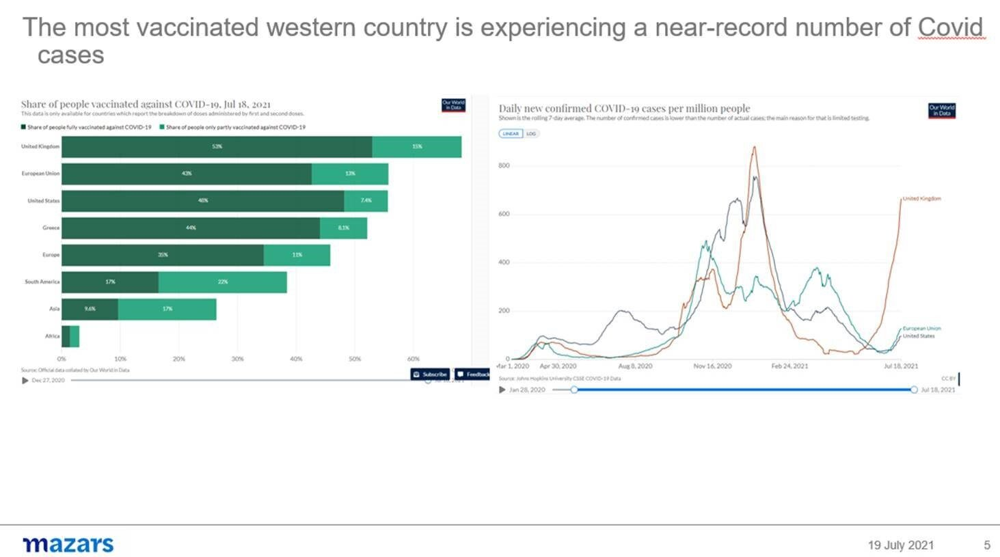

# The pandemic is still here and we are all out of patience and money

**Date:** July 19, 2021  
**Publisher:** Breakwave Advisors | **Category:** Market Insights  
**Original URL:** [https://www.breakwaveadvisors.com/insights/2021/7/19/the-pandemic-is-still-here-and-we-are-all-out-of-patience-and-money](https://www.breakwaveadvisors.com/insights/2021/7/19/the-pandemic-is-still-here-and-we-are-all-out-of-patience-and-money)  

---

*By George Lagarias, Chief Economist*

Last week saw stronger aggregate demand and, expectedly, more inflation across the board. It also featured a soothing speech by Jay Powell that inflation is temporary, although a growing number of investors harbour doubts as to whether this reflects an independent estimate or the preference of a central bank with no exit strategy from financial repression.

However, the important news of the week is reflected in the dichotomy between the growing number of Covid-19 cases worldwide and further easing of restrictions.

On the one hand, the Delta variant is spreading across the globe and vaccination levels are low. Scientists remind us that it takes both shots of a vaccine to be meaningfully protected. Globally, only 13% of people are privileged enough to have been vaccinated twice, with a skew towards older age groups which contribute less to economic growth. The number drops to 9.5% in Asia, the world’s most populous continent, where doubts have been raised that the prevalent Sinopharm and Sinovac vaccines are as effective against the new Covid variants. Two-dose vaccination figures are dismal in Africa (1.43%), very low in Latin America (16%), improving in Europe (34%), and much better in the US (48%). Yet considering that the new variant is now affecting the UK, where 53% of people have had two doses of provenly effective vaccines, endangering the economic re-opening, it is easy to understand that for the rest of the planet things are looking more precarious. And while richer countries may feel safer in terms of their own public health, investors should be reminded that global supply chains are mostly based in those lower-income countries with very low vaccination rates. It may be no coincidence that OPEC+ decided to increase oil production to stabilise its price, suggesting that its members believe that supply pressures will persist. This means that supply-side inflation may persist a bit more than the Fed lets on.

> **Figure 1: A3**  
> [Local Asset](file:///C:/Users/Dell/Github/Shipping/corpus/03-breakwave/insights/2021/assets/2021-07-19_the-pandemic-is-still-here-and-we-are-all-out-of-patience-and-money_img_a3_0aca220b9a4c.jpg)

On the other hand, governments in the West are now exhibiting signs of Covid-weariness. The political and economic toll of movement restrictions for over a year is tilting the scale towards economic re-openings, even at the risk of higher mortalities and stricter closures in the Autumn. The debt burden is climbing dangerously. The British government has chosen to ignore a record number of Covid-19 cases, as long as hospitalisations and deaths remain low. The French government is considering the withdrawal of stricter measures for those unvaccinated, a controversial tactic that increases social tensions and could result in further economic damage.

The point is that the second half of 2021 may feature a less cautious approach against the pandemic especially from developed nations.**The strategy shifts from ‘beating the virus’ to ‘learning to live with Covid’.**In terms of inflation, supply pressures, further variants, vaccination rates, freedom of movement, fiscal and monetary stimulus and bottom-line earnings the implications may even be significant enough for investment managers and asset allocators to eventually consider a re-rating of risk assets in the foreseeable future.

---

**Tags:** Economy, Inflation, Asset Management  
