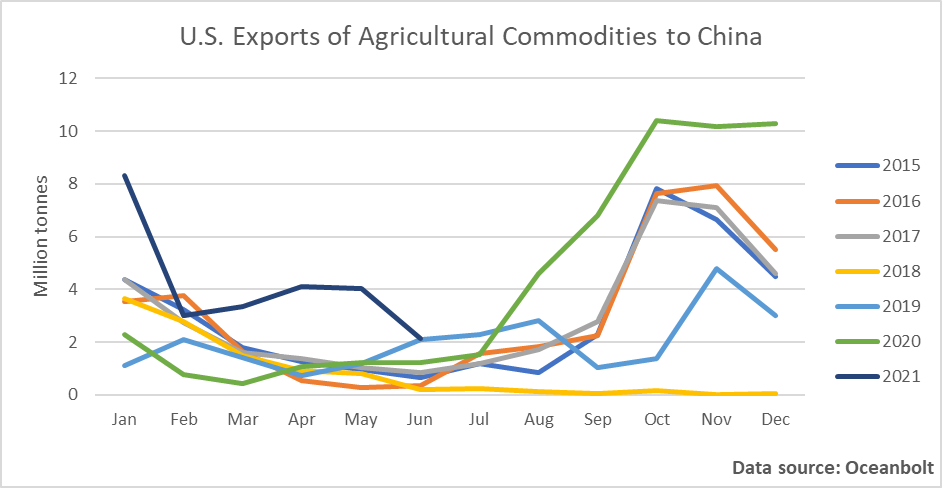

# The Trans-Pacific Trade War Is Heating Up Again

**Date:** July 20, 2021  
**Publisher:** Breakwave Advisors | **Category:** Market Insights  
**Original URL:** [https://www.breakwaveadvisors.com/insights/2021/7/20/the-trans-pacific-trade-war-is-heating-up-again](https://www.breakwaveadvisors.com/insights/2021/7/20/the-trans-pacific-trade-war-is-heating-up-again)  

---

*By Ulf Bergman*

News on the trade tensions between the U.S. and China have fallen into relative obscurity in recent months, with other areas of contention dominating the reporting. While the trade frictions have continued to simmer below the surface, the inauguration of a new U.S. president meant a period of relative calm while the new administration established its trade policy. Throughout this period the Biden administration has repeatedly stated that it is expecting China to live up to the commitments made in the Phase One trade deal eighteen months ago, during the previous presidency. The agreement has so far not proved to be a runaway success, with actual volumes falling short of the implied targets, and the overriding goal of a reduced U.S. trade deficit with China has failed to materialise. On the contrary, the pandemic has seen the trade balance shifting further in China’s favour as demand for Chinese goods increased in the U.S., offsetting increasing Chinese imports of U.S. goods.

In an interview with the New York Times a few days ago, the U.S. Treasury Secretary, Janet Yellen, expressed her doubts about the trade deal struck with China last year. This is the first explicit statement from the Biden administration detailing its mindset about the future of the agreement between the two largest economies in the world. In the interview, the Treasury Secretary voiced her misgivings about the tariffs that have been put in place on Chinese goods. In line with traditional economic theory, she argued that the tariffs in effect are taxes on consumers and hurting the American population through more expensive consumption. The tariffs are also to a great extent failing to address the fundamental problems the U.S. is facing in its trade with China, according to Janet Yellen. Hence, anyone expecting the U.S. under a new administration to adopt a softer approach towards China on trade is likely to be disappointed. The focus on tariffs is likely to be phased out over time, with alternative measures being put in place to achieve more balanced trade flows across the Pacific.

In a move that looks unlikely to be a coincidence, the U.S. has raised the prospect of a formal complaint to the World Trade Organization (WTO) concerning a ruling on Chinese quotas and tariffs on imports of agricultural commodities from 2019. The U.S. maintains that China’s continued use of a tariff-rate quota system for three crops, wheat, corn and rice, runs contrary to the ruling from two years ago and need to be rectified. A failure to do so could see Washington imposing countermeasures, such as suspending most-favoured-nation status on some Chinese products and potentially leading to the application of new tariffs. Much of the complaint centres on the access to the Chinese market for U.S. farmers, but the ruling did not stipulate the amount that needed to be purchased from the U.S. allowing China to make changes that resulted in increased imports from other countries instead. There were also some expectations that the quotas for corn, rice and wheat would increase following the Phase One trade agreement, but so far they have remained unchanged at 7.2 million tonnes, 5.3 million tonnes and 9.6 million tonnes respectively.

The U.S. exports of agricultural commodities has, despite the latest move, been the more successful area for the Phase One trade deal, with Chinese imports at 84 per cent of its commitments by the end of May, according to the Paterson Institute of International Economics. The reestablishment of the nation’s hog herd, following the ravages of the African swine flu, and an increasing focus on food security have fuelled a strong demand growth for imported grains. Total import volumes increased by more than 40 per cent to 84 million tonnes during the first half of the year, according to China’s customs authority, with much of the additional volumes sourced from U.S. farmers.

According to cargo tracking data from Oceanbolt, the first half of the year has seen large volumes of grains and oilseeds shipped to China from ports in the U.S. However, the shipments in June approached more normal levels, as inventories fell and buyers awaited the new harvest. The seaborne volumes of agricultural commodities heading for Chinese ports are likely to pick up again when the U.S. harvest gets underway in the coming months.

> **Figure 1: A1**  
> [Local Asset](file:///C:/Users/Dell/Github/Shipping/corpus/03-breakwave/insights/2021/assets/2021-07-20_the-trans-pacific-trade-war-is-heating-up-again_img_a1_a7556c919475.png)

If Washington is successful in its quest to increase access to the Chinese markets for its farmers and maintain the pressure on Beijing to live up to its commitments under the Phase One agreement, the second half of the year could see continued strong demand for American agricultural exports from Chinese buyers. This would be good news for the dry bulk shipping sector, as the trade involves long distances which tie up vessels for longer periods. However, the lack of rain in parts of the U.S. Mid-West could limit the upside of the volumes.

---

**Tags:** Usa, China, Tradewar  
