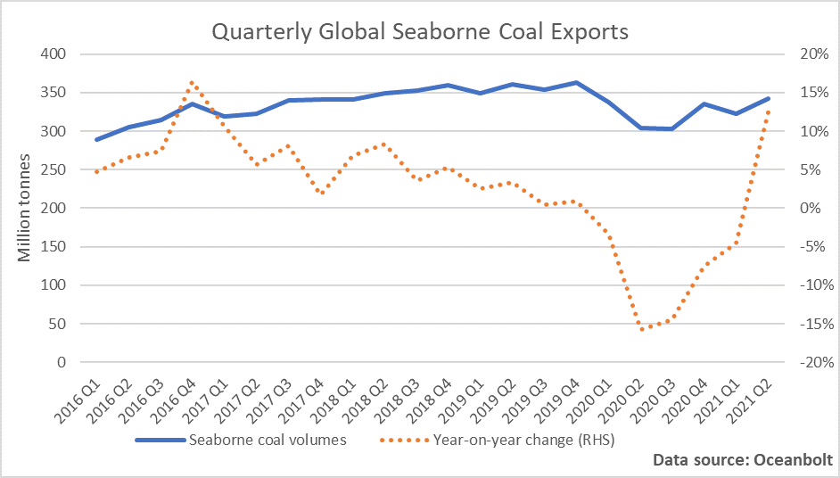
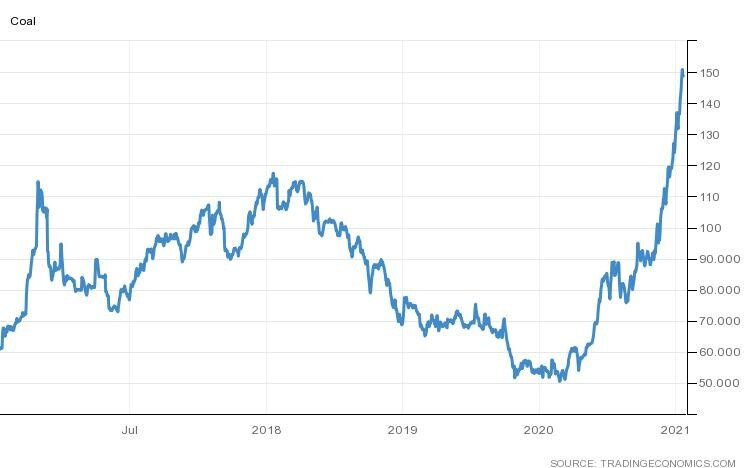
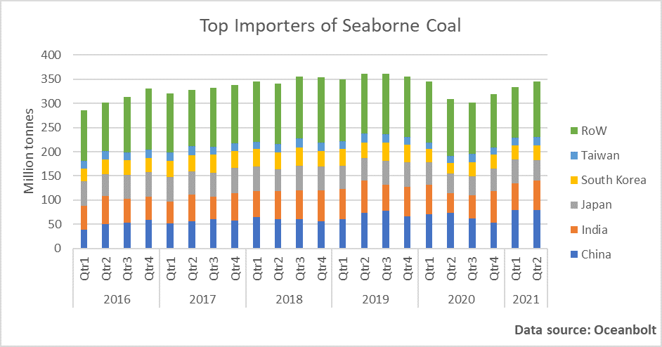
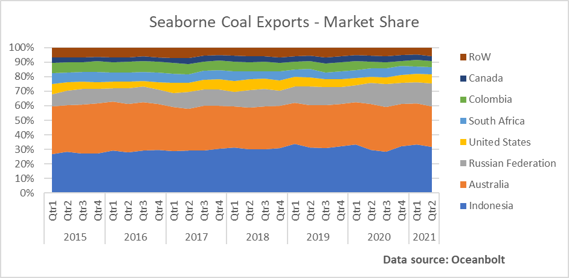
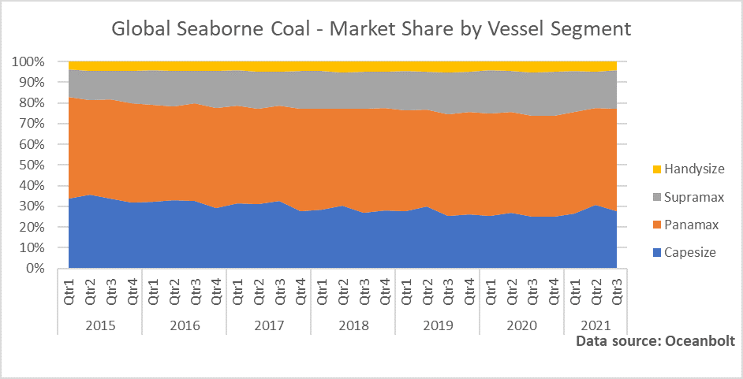

# Seaborne Coal: First Half of the Year in the Rear-view Mirror

**Date:** July 23, 2021  
**Publisher:** Breakwave Advisors | **Category:** Market Insights  
**Original URL:** [https://www.breakwaveadvisors.com/insights/2021/7/23/seaborne-coal-first-half-of-the-year-in-the-rear-view-mirror](https://www.breakwaveadvisors.com/insights/2021/7/23/seaborne-coal-first-half-of-the-year-in-the-rear-view-mirror)  

---

*By Ulf Bergman*

The last six months have witnessed an extensive debate on the virtues of decarbonisation and the need for swift action to combat the effects of climate change. The year has so far seen its fair share of extreme weather and adding to the sense of urgency, with heavy rains and severe flooding in China and Western Europe being some of the most recent examples. North America is on the other hand facing extremely hot and dry weather, which could potentially reduce the size of the harvest in the coming months. In light of this, it is perhaps somewhat surprising that the global trade in what is widely seen as the greatest culprit, coal, is recovering well after suffering during the earlier stages of the pandemic.

> **Figure 1: A1**  
> [Local Asset](file:///C:/Users/Dell/Github/Shipping/corpus/03-breakwave/insights/2021/assets/2021-07-23_seaborne-coal-first-half-of-the-year-in-the-rear-view-mirror_img_a1_595813cc2753.png)

The second quarter of the year saw global seaborne volumes of coal growing by thirteen per cent year-on-year after five quarters of contraction. The strong recovery meant that total volumes were higher during the first half of the year than in the same period last year. While volumes are lower than during the pre-pandemic peak in 2019, it is important to remember that many parts of the world are still suffering from the effects of the coronavirus with negative impacts on the coal demand as a result. A large part of the strong second-quarter growth can also be assigned to base effects, as economic activities during the equivalent periods last year were heavily curtailed by the COVID19-outbreak. In the years preceding the pandemic seaborne volumes of coal faced decelerating growth rates, something that may return once a post-pandemic equilibrium is reached. The recovering demand has pushed prices ever higher as supply remains tight, despite efforts by Beijing to control the surge in coal and other commodity prices. Since the beginning of the year, coal prices have risen by more than 80 per cent.

> **Figure 2: A2**  
> [Local Asset](file:///C:/Users/Dell/Github/Shipping/corpus/03-breakwave/insights/2021/assets/2021-07-23_seaborne-coal-first-half-of-the-year-in-the-rear-view-mirror_img_a2_e3471bb72bef.jpg)

Chinese demand for coal has been strong during the first half of the year, with volumes discharged in Chinese ports above pre-pandemic levels according to cargo tracking data from Oceanbolt. China’s customs authority also reported strong coal imports in June, with an increase of over twelve per cent year-on-year. While volumes have recovered for the other main importers, notably in India, levels remain below pre-pandemic readings. Chinese demand for coal also appears unlikely to start declining before the end of the current five-year plan in 2025 and global seaborne volumes will not weaken by any meaningful quantity before that. A combination of rising energy demand, as the Chinese economy continues to expand, and domestic production constraints is likely to see Chinese demand growth offsetting much of the decline in other parts of the world.

> **Figure 3: A3**  
> [Local Asset](file:///C:/Users/Dell/Github/Shipping/corpus/03-breakwave/insights/2021/assets/2021-07-23_seaborne-coal-first-half-of-the-year-in-the-rear-view-mirror_img_a3_495c826c2309.png)

The ongoing diplomatic tensions between China and Australia have been a dominant feature so far this year, with Chinese import bans on many Australian products affecting previously established trade flows. A Chinese avoidance of self-harm has seen iron ore shipments being spared from any direct embargo, but with substitutes to Australian coal available the flows of the commodity have dwindled to zero. While the Australian share of the global seaborne coal market has been under pressure for some years, the Chinese ban solidified Indonesia’s position at the top spot. After a drop in export volumes during the first quarter, Australian coal shipments recovered somewhat during the second quarter as new export markets were established, with India increasing its importance to the Australian producers.

> **Figure 4: A4**  
> [Local Asset](file:///C:/Users/Dell/Github/Shipping/corpus/03-breakwave/insights/2021/assets/2021-07-23_seaborne-coal-first-half-of-the-year-in-the-rear-view-mirror_img_a4_96933277bd1e.png)

Indonesia’s dominant position could, however, come under some pressure in the short term, as the nation battles a worsening COVID-19 situation. In what has been described as one of the most severe coronavirus outbreaks in the world, the country could face output disruptions and it has also been suggested that shipowners are reluctant to send their vessels to Indonesia for fears of the crew becoming infected with the delta variant of the virus. Hence, there could be a move among importers to find alternative sources.

The increasing importance of Indonesian coal to Chinese buyers, at the expense of shipments from Australia, has also had an impact on the tonnage used in the coal trade. The greater use of Panamaxes for shipping Indonesian coal to China, rather than Capesizes from Australia, has seen the midsized vessels increasing their market share in the coal trade during recent months. The shift has no doubt contributed to the strength of the charter rates in the Panamax segment.

> **Figure 5: A5**  
> [Local Asset](file:///C:/Users/Dell/Github/Shipping/corpus/03-breakwave/insights/2021/assets/2021-07-23_seaborne-coal-first-half-of-the-year-in-the-rear-view-mirror_img_a5_087306363e76.png)

To paraphrase Mark Twain, the report of coal’s death is an exaggeration. While it may be desirable for its use to be limited as soon as possible, the reality is that for many parts of the world it remains an important part of the energy mix and will remain so for years to come. The world’s largest consumer, China, is unlikely to reduce its appetite for it before the middle of the decade and even after that it is likely that the phasing out will be slow. As more and more countries emerge from the grip of the pandemic, global demand for coal is also likely to continue to pick up. It has been highlighted in previous contributions by Ocean Analytics, the seaborne trade in coal is likely to become increasingly Asia centric in the coming years. The developed economies in the West look set to continue their phase-out of the commodity in energy production, while it will remain important to many Asian nations.

---

**Tags:** China, Coal, Shipping  
