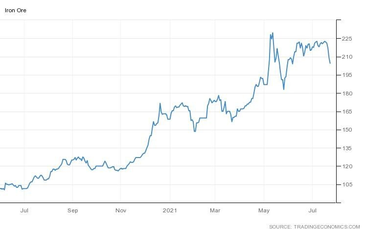
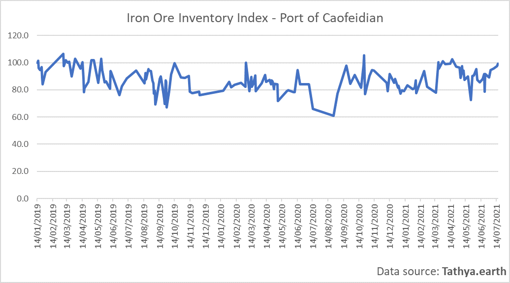
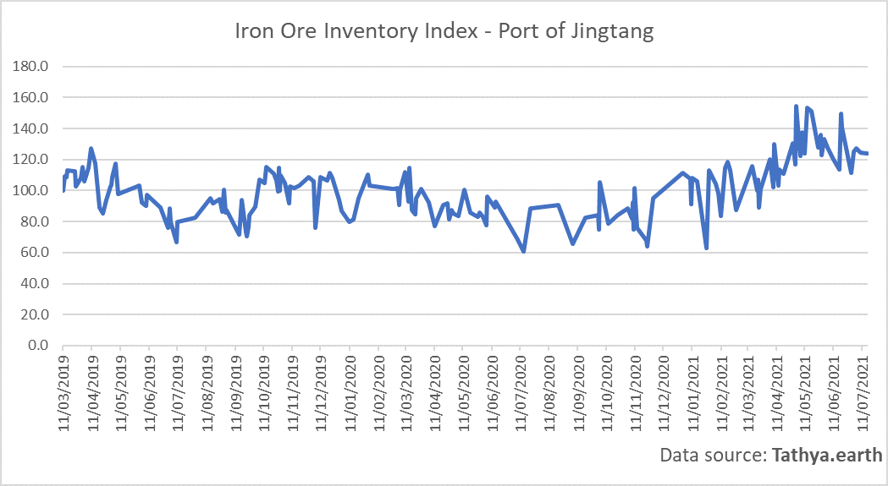
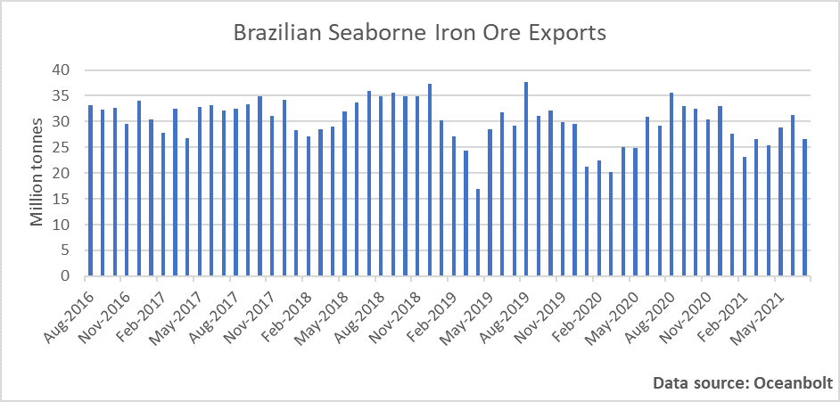

# Iron Ore: Prices Sliding Amid Softening Chinese Demand and an Improving Supply Situation

**Date:** July 27, 2021  
**Publisher:** Breakwave Advisors | **Category:** Market Insights  
**Original URL:** [https://www.breakwaveadvisors.com/insights/2021/7/27/iron-ore-prices-sliding-amid-softening-chinese-demand-and-an-improving-supply-situation](https://www.breakwaveadvisors.com/insights/2021/7/27/iron-ore-prices-sliding-amid-softening-chinese-demand-and-an-improving-supply-situation)  

---

*By Ulf Bergman*

The last week has seen iron ore prices dropping to readings not seen since early July, with the possibility of the 200 dollars per tonne level being tested from above. A combination of factors has seen the prices coming under pressure, probably much to the delight of the Chinese leadership which has tried to rein in the surging commodity prices with limited success so far. Iron ore was an early target, with speculation in the commodity seen by Beijing as a prime contributor to the soaring prices. A seasonal drop in construction activities and, what appears to be, greater compliance with environmental guidelines have reduced China’s steel output in recent weeks and limiting the demand for iron ore. There have also been additional measures put in place, with the Jiangsu, Fujian and Yunnan provinces among those requested to cut production during the last month, as the country is aiming for its annual steel production to be in line with last year’s levels.

### Iron Ore (Usd/tonne)

> **Figure 1: A1**  
> [Local Asset](file:///C:/Users/Dell/Github/Shipping/corpus/03-breakwave/insights/2021/assets/2021-07-27_iron-ore-prices-sliding-amid-softening-chinese-demand-and-an-improving-supply-si_img_a1_9ca72061b301.jpg)

The softening demand for steel has led to iron ore inventories building up in many Chinese ports, with Mysteel reporting that total portside stockpiles are approaching 130 million tonnes. While the number may appear large, it is the equivalent of approximately six weeks of seaborne imports. According to data from Tathya.earth, inventories in China’s largest iron ore port, Caofeidian, have been trending upwards during the last month and are currently at the highest level since the middle of April. The inventory levels in the port are also currently among the highest recorded since the beginning of 2019.

> **Figure 2: A2**  
> [Local Asset](file:///C:/Users/Dell/Github/Shipping/corpus/03-breakwave/insights/2021/assets/2021-07-27_iron-ore-prices-sliding-amid-softening-chinese-demand-and-an-improving-supply-si_img_a2_4f8bf321f825.png)

In another major iron ore import hub, Jingtang, the inventory situation is, however, more ambiguous, with levels below what has been generally seen during the last few months and on a declining trend. Nevertheless, compared to previous years the stockpiles are well above what has been registered in the port.

> **Figure 3: A3**  
> [Local Asset](file:///C:/Users/Dell/Github/Shipping/corpus/03-breakwave/insights/2021/assets/2021-07-27_iron-ore-prices-sliding-amid-softening-chinese-demand-and-an-improving-supply-si_img_a3_be7edcc9d38b.png)

The seasonal softening of Chinese iron ore demand is not the only reason for falling iron ore prices, with an improving outlook for production being a contributor as well. So far this year, Brazilian output growth has fallen below expectations, but a recent steady improvement in export volumes has provided hope for a better-supplied market among analysts and traders. According to cargo tracking data from Oceanbolt, Brazilian seaborne exports of iron ore have been improving throughout the year, with monthly volumes improving on a year-on-year basis. The current month also looks set to contribute to the trend. However, volumes are still below the levels achieved in the years before the dam accident in 2019, suggesting there is considerable potential for improving exports during the second half of the year.

> **Figure 4: A4**  
> [Local Asset](file:///C:/Users/Dell/Github/Shipping/corpus/03-breakwave/insights/2021/assets/2021-07-27_iron-ore-prices-sliding-amid-softening-chinese-demand-and-an-improving-supply-si_img_a4_f32fdcb49a07.png)

The Brazilian mining giant, Vale, has also recently reiterated its full-year production target of 315-335 million tonnes, despite falling short of the targets in the first half of the year. The company has additionally stated that it has reached a production capacity of 330 million tonnes per year and if this target is met, it would allow for an average daily production of one million tonnes. Hence, suggesting strong growth in Brazilian export volumes during the second half of the year and continued downward pressure on prices.

The pick up in Brazilian exports are likely to be welcome news from a Chinese perspective, as the ongoing diplomatic tensions with Australia show no signs of improving. The recent statement from Canberra that it is willing to pay the economic price of the trade dispute, rather than backing down, is likely to cement positions further. Under the circumstances, it is not hard to imagine that Chinese buyers will come under renewed pressure to purchase iron ore from alternative sources. Any additional output from Brazil is probably going to find its way to China, adding to the tonne-mile demand.

---

**Tags:** Shipping, China, Brazil  
