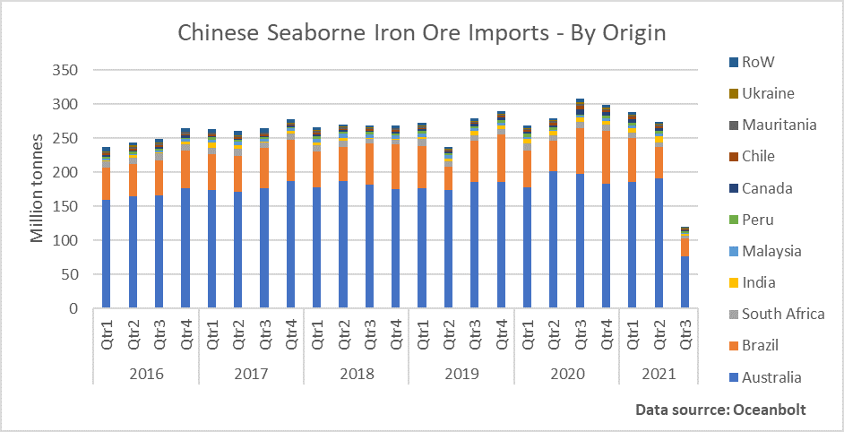
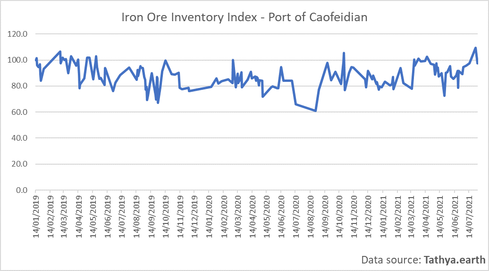
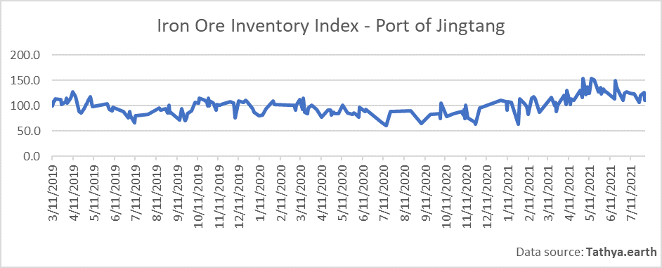
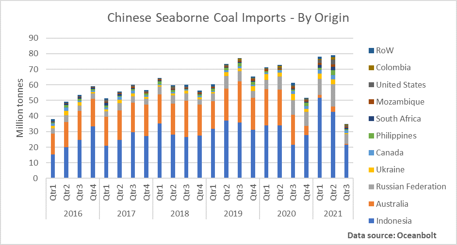

# China’s International Trade Is Facing Headwinds

**Date:** August 11, 2021  
**Publisher:** Breakwave Advisors | **Category:** Market Insights  
**Original URL:** [https://www.breakwaveadvisors.com/insights/2021/8/10/chinas-international-trade-is-facing-headwinds](https://www.breakwaveadvisors.com/insights/2021/8/10/chinas-international-trade-is-facing-headwinds)  

---

*By Ulf Bergman*

The news coming out of China continue to paint a picture of an economy facing increasing headwinds, both domestically and internationally. The release of import and export data by the Chinese customs authority over the weekend added to the increasingly gloomy sentiment, as both failed to meet economists’ rather conservative expectations. While the country’s continued growth of its international trade is enviable, by recent Chinese standards a 19.3 per cent growth in exports and 28.1 per cent hike in imports were modest. China watchers had expected exports to increase by twenty per cent and imports to climb by a third, compared to the same month last year. The decelerating export growth has fuelled concerns that the Chinese economy will face additional challenges during the second half of the year, as spending in many key export markets are shifting from goods to services. Additionally, with the delta variant of the coronavirus continuing to spread throughout Asia, there is a risk the supply chains across the region will encounter further disruptions and put pressure on Chinese export volumes. The most recent release of the purchasing managers’ index also highlighted a contraction in manufacturers’ export orders for a third consecutive month in July, which together with other leading indicators are pointing towards additional challenges for the Chinese export industry during the second half of the year.

Despite missing the consensus forecast in July, the growth in imports remains robust. However, the rising commodity prices have obscured the picture somewhat, with import values rising year to date but not volumes in many cases. The surge in commodity prices has also prompted Beijing to remove some tax breaks for exports and to consider imposing more trade tariffs to control domestic demand and pricing, which eventually have led to some results and iron ore prices have dropped by a quarter since the highs recorded in May. However, despite the sizeable correction, iron ore prices remain high in a historical context, but the partial retreat could help support increasing seaborne volumes and drive increased demand for tonnage. While the mining and dry bulk sectors both benefit from strong commodity markets, interests often diverge when it comes to the price levels. Hence, more moderate price levels are likely to be welcome news for the shipowners.

According to cargo tracking data from Oceanbolt, China’s seaborne iron ore imports peaked during the third quarter last year and quarterly volumes have been declining since. Despite an average quarter-on-quarter decline of four per cent since the end of last year, year-on-year growth has remained positive for much of the period. The second quarter was the first to record falling year-on-year volumes, since the beginning of 2020 when the pandemic started to unfold. The combined forces of rising prices, demand control and base effects saw two per cent less iron ore discharged in Chinese ports during the second quarter, compared to a year before. The current quarter also looks to be on track for negative year-on-year growth, with only 40 per cent of last year’s volumes attained as the mid-point of the quarter rapidly approaches.

> **Figure 1: A1**  
> [Local Asset](file:///C:/Users/Dell/Github/Shipping/corpus/03-breakwave/insights/2021/assets/2021-08-11_chinas-international-trade-is-facing-headwinds_img_a1_7cf364302b27.png)

Chinese attempts to reduce, at least marginally, its reliance on Australian iron ore, also showed during the second quarter. While the total seaborne volumes fell by two per cent, Australian shipments discharged in Chinese ports dropped by five per cent. At the same time, Brazilian consignments increased by two per cent. Many other lesser suppliers, such as India and Peru, also saw their shipments to China increase during the second quarter. Malaysia also saw its exports to China doubling during the last quarter, but with its role as a transhipment hub, much of the cargoes are of Brazilian origin. Hence, the shipments are contributing to increasing tonne-mile demand.

The decreasing volumes of iron ore discharged in Chinese ports are also contributing to inventories being reduced. In the two largest Chinese ports for iron ore, Caofeidian and Jingtang, the stockpiles show signs of shrinking, according to satellite data from Tathya.earth. A pick up in construction activity following the soft patch of the summer could see steel demand increasing and, with portside iron ore inventories trending lower, a recovery in imports could be on the cards.

> **Figure 2: A2**  
> [Local Asset](file:///C:/Users/Dell/Github/Shipping/corpus/03-breakwave/insights/2021/assets/2021-08-11_chinas-international-trade-is-facing-headwinds_img_a2_4a6ac0d3c526.png)

> **Figure 3: A3**  
> [Local Asset](file:///C:/Users/Dell/Github/Shipping/corpus/03-breakwave/insights/2021/assets/2021-08-11_chinas-international-trade-is-facing-headwinds_img_a3_8139bd8256ac.png)

For coal, the picture is rather different, with seaborne imports maintaining positive momentum with increasing volumes despite rising prices. After last year’s import restrictions, and subsequent shortage, imports have been boosted and the first half of the year saw nine per cent more coal offloaded in Chinese ports. The third quarter also appears to be on course to exceed last year’s third-quarter volumes, with almost 60 per cent already discharged. Seaborne imports have benefited from reduced Chinese output in the wake of increasing safety inspections and pollution restrictions, but with many mines recently allowed to resume production the volumes look set to recover. However, with last winter’s shortages in fresh memory seaborne volumes are likely to remain healthy. Especially, as they, at around 250 million tonnes, are a fairly small portion of China’s annual domestic production of 3.8 billion tonnes.

> **Figure 4: A4**  
> [Local Asset](file:///C:/Users/Dell/Github/Shipping/corpus/03-breakwave/insights/2021/assets/2021-08-11_chinas-international-trade-is-facing-headwinds_img_a4_83b4d711cdbd.png)

---

**Tags:** Shipping, Coal, China  
