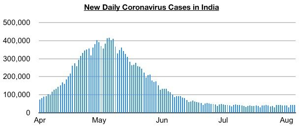
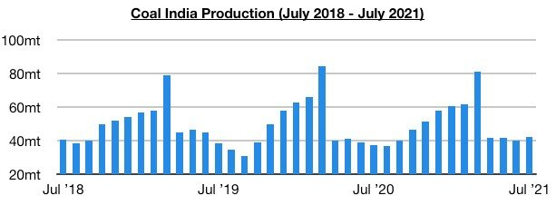
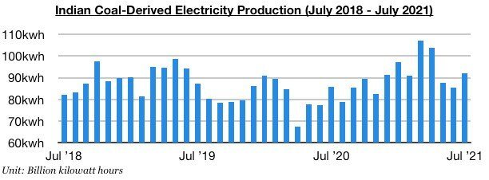
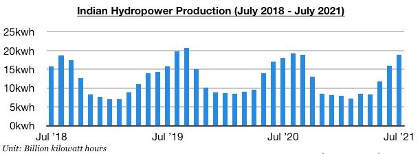

# India's Coal-Derived Electricity Generation Remains Strong

**Date:** August 13, 2021  
**Publisher:** Breakwave Advisors | **Category:** Market Insights  
**Original URL:** [https://www.breakwaveadvisors.com/insights/2021/8/13/indias-coal-derived-electricity-generation-remains-strong](https://www.breakwaveadvisors.com/insights/2021/8/13/indias-coal-derived-electricity-generation-remains-strong)  

---

*By Jeffrey Landsberg*

As we highlighted in our most recent Weekly Dry Bulk Report, new daily coronavirus cases in India have stayed well below May 6’s peak of 414,433 cases. Overall, India continuing to recover from its recent coronavirus surge has continued to lessen the chance of new widespread lockdowns in India. Both Indian coal production and electricity production are each likely to climb further in the near term. Helpful for the dry bulk market is that coal-derived electricity production has remained strong and power plant coal stockpiles have remained low.

> **Figure 1: A1**  
> [Local Asset](file:///C:/Users/Dell/Github/Shipping/corpus/03-breakwave/insights/2021/assets/2021-08-13_indias-coal-derived-electricity-generation-remains-strong_img_a1_5a1ddb4604e4.jpg)

Coal India produced approximately 42.6 million tons of coal last month, which marks a month-on-month increase of 2.6 million (7%) and a year-on-year increase of 5.2 million tons (14%). Despite the recent increase, Coal India’s production has stayed relatively low.

> **Figure 2: A2**  
> [Local Asset](file:///C:/Users/Dell/Github/Shipping/corpus/03-breakwave/insights/2021/assets/2021-08-13_indias-coal-derived-electricity-generation-remains-strong_img_a2_331896c52312.jpg)

India produced approximately 115.6 billion kilowatt hours of electricity last month. This has marked a month-on-month increase of 9.2 billion kilowatt hours (8%) and is up year-on-year by 7.2 billion kilowatt hours (7%). India’s coal-derived electricity generation totaled approximately 92 billion kilowatt hours of electricity last month. This has marked a month-on-month increase of 6.6 billion kilowatt hours (8%) and is up year-on-year by 6.4 billion kilowatt hours (7%).

> **Figure 3: A3**  
> [Local Asset](file:///C:/Users/Dell/Github/Shipping/corpus/03-breakwave/insights/2021/assets/2021-08-13_indias-coal-derived-electricity-generation-remains-strong_img_a3_c2b48d3c75c4.jpg)

India’s hydropower output totaled approximately 18.8 billion kilowatt hours last month. This has marked a month-on-month increase of 2.8 billion kilowatt hours (18%) and is up year-on-year by 900 million kilowatt hours (5%). Previously, hydropower output had contracted on a year-on-year basis for eleven straight months. India’s hydropower production has continued to rise on a month-on-month basis and has finally grown on a year-on-year basis, but coal-derived electricity generation has nevertheless still continued to experience significant strength.

> **Figure 4: A4**  
> [Local Asset](file:///C:/Users/Dell/Github/Shipping/corpus/03-breakwave/insights/2021/assets/2021-08-13_indias-coal-derived-electricity-generation-remains-strong_img_a4_bba039b4c903.jpg)

---

**Tags:** India, Coal, Shipping  
