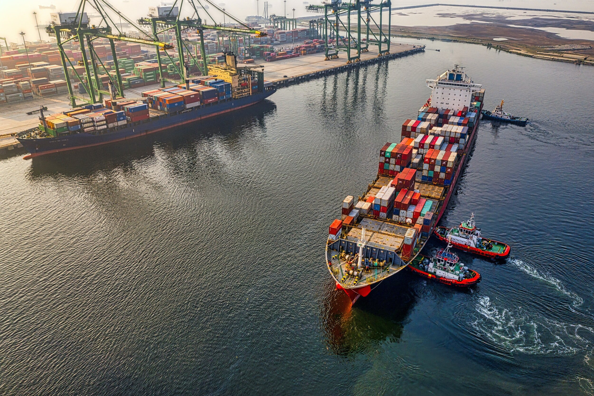
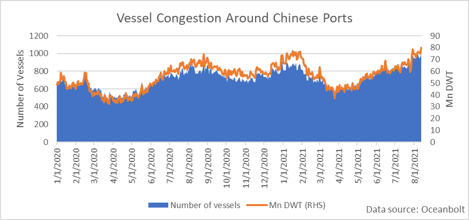

# Resurgent Pandemic Highlights the Risks to Global Growth – Strengthening the Case for Continued Economic Stimulus

**Date:** August 14, 2021  
**Publisher:** Breakwave Advisors | **Category:** Market Insights  
**Original URL:** [https://www.breakwaveadvisors.com/insights/2021/8/13/resurgent-pandemic-highlights-the-risks-to-global-growth-strengthening-the-case-for-continued-economic-stimulus](https://www.breakwaveadvisors.com/insights/2021/8/13/resurgent-pandemic-highlights-the-risks-to-global-growth-strengthening-the-case-for-continued-economic-stimulus)  

---

*By Ulf Bergman*

The news that Chinese authorities have ordered a partial closure of the world’s third-largest container port, following the discovery of COVID-19 infection among the workforce at one of the terminals, serves as a timely reminder that the pandemic and the disruptions are far from consigned to the history books. If the new infection is part of a broader outbreak in the region surrounding the port of Ningbo-Zhoushan, the disruptions to the cargo operations in the port could move beyond temporary and cause empty shelves in many shops in time for the Christmas shopping season in Europe and the US. Such new disruptions are likely to add to the ongoing congestion in container ports in many export markets for Chinese goods, such as on the US West Coast, and exacerbate the already tight supply of available containers. Beyond the expectation of the terminal closure driving container freight rates higher, there are fears that a prolonged closure at Ningbo could dampen global growth and feed inflation rates. A similar development in the port of Yantian back in May led to a month-long build-up of goods in factories and storage yards, which contributed to soaring container freight rates and global inflation rates drifting higher.

> **Figure 1: Unsplash Image Nndkt2kf1l4**  
> [Local Asset](file:///C:/Users/Dell/Github/Shipping/corpus/03-breakwave/insights/2021/assets/2021-08-14_resurgent-pandemic-highlights-the-risks-to-global-growth-strengthening-the-case_img_unsplash-image-nndkt2kf1l4_f5fd9f56e9a2.jpg)

While the recent headlines have been focused on container shipping, the resurgent Covid pandemic in China has also affected cargo operations beyond that sector. The last few weeks have seen increasing congestion in and around many ports handling dry bulk commodities in China. According to cargo tracking data from Oceanbolt, there are currently around one thousand dry bulk vessels idling of the coast of China, representing 80 million DWT. Port congestion was a developing subject during the tail-end of last year and the early parts of the current year, but the first quarter of the year saw a rapid decline in the numbers of vessels awaiting cargo operations when Chinese demand for commodities stabilised. However, a seasonal increase in commodity imports saw port congestion return to the levels which the year began at. The recent increase in infection rates in China, notably with the more contagious delta-variant, has continued to increase congestion in Chinese ports and driven the number of vessels waiting to a multi-year high.

> **Figure 2: A1**  
> [Local Asset](file:///C:/Users/Dell/Github/Shipping/corpus/03-breakwave/insights/2021/assets/2021-08-14_resurgent-pandemic-highlights-the-risks-to-global-growth-strengthening-the-case_img_a1_1159239d73dc.png)

The developing congestion in Chinese ports has quashed any hopes for a swift solution to the pandemic. A global shortage of vaccine doses and new, more contagious and potentially vaccine-resistant, variants developing has highlighted the fragility of the current global economic recovery. The risks to global growth have, if anything, increased in recent months and advocates for the tapering of current stimulus programmes have mostly fallen silent in recent weeks. As President Biden’s infrastructure investment plan is inching its way through the legislative process, a resurgent pandemic could add to a sense of urgency of not squandering any precious economic momentum and expedite approval. In China, economists linked to the government have suggested that Chinese interest rates may need to be lowered further to support the economy. The suggestion remains the outlier in the current climate, with most pundits expecting that the People’s Bank of China will keep interest rates steady during the rest of the year.​ However, the close links to the government of the economists add considerable credibility to the proposal and in light of weak construction activities, a rate cut could be on the cards in the near future.

It has been highlighted in previous Insights-contributions, shipping often benefits from disruptions in the global economy and there are no suggestions that it will be any different this time. Extended waiting times will tie up tonnage for longer and reduce supply. This would add to an already tight supply situation, with demand expected to show a seasonal pick up during the second half of the year. Additionally, more disruptions and higher freight rates in the container sector could see an accelerating process of many bagged, and typically containerised, commodities finding their way to the dry bulk sector.

---

**Tags:** Economy, Shipping, Pandemic  
