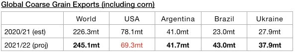
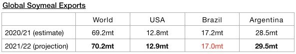
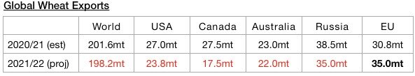
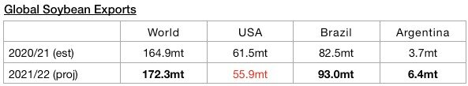

# Global Grain Trade Prospects Remain Encouraging

**Date:** August 19, 2021  
**Publisher:** Breakwave Advisors | **Category:** Market Insights  
**Original URL:** [https://www.breakwaveadvisors.com/insights/2021/8/19/global-grain-trade-prospects-remain-encouraging](https://www.breakwaveadvisors.com/insights/2021/8/19/global-grain-trade-prospects-remain-encouraging)  

---

*By Jeffrey Landsberg*

Global grain trade prospects remain just one of many bullish facets of the dry bulk market. Notable recently is that grain trade forecasts for the upcoming season have been lowered from a month ago, but significant year-on-year growth is still expected. The United States Department of Agriculture recently released their latest forecasts for 2021/22 and is now forecasting that global exports will total 491 million tons. This is 7.9 million tons (-2%) less than was forecast a month ago but would mark a year-on-year increase of 14.2 million tons (3%). Ongoing strength in grain trade will continue to support the smaller dry bulk vessels classes, along with ongoing strength in minor dry bulk cargo trade. For the bigger vessel classes, near-term coal and iron ore trade prospects also remain very encouraging.

Global coarse grain exports in 2021/22 are expected to total 245.1 million tons. This is 2.7 million tons (-1%) less than was forecast a month ago but would mark a year-on-year increase of 18.8 million tons (8%).

> **Figure 1: A1**  
> [Local Asset](file:///C:/Users/Dell/Github/Shipping/corpus/03-breakwave/insights/2021/assets/2021-08-19_global-grain-trade-prospects-remain-encouraging_img_a1_d7b0bdef986d.jpg)

Global wheat exports are expected to total 198.2 million tons. This is 5.8 million tons (-3%) less than was forecast a month ago and would mark a year-on-year decline of 3.4 million tons (-2%).

> **Figure 2: A2**  
> [Local Asset](file:///C:/Users/Dell/Github/Shipping/corpus/03-breakwave/insights/2021/assets/2021-08-19_global-grain-trade-prospects-remain-encouraging_img_a2_f1f84410968b.jpg)

In addition, global soybean exports (soybeans are not technically classified as a grain) are expected to total 172.3 million tons. This is 600,000 tons less than was forecast a month ago but would mark a year-on-year increase of 7.4 million tons (4%).

> **Figure 3: A3**  
> [Local Asset](file:///C:/Users/Dell/Github/Shipping/corpus/03-breakwave/insights/2021/assets/2021-08-19_global-grain-trade-prospects-remain-encouraging_img_a3_82e7404bb51d.jpg)

Global soymeal exports are expected to total 70.2 million tons. This is the same amount that was forecast a month ago and would mark a year-on-year increase of 1 million tons (1%).

> **Figure 4: A4**  
> [Local Asset](file:///C:/Users/Dell/Github/Shipping/corpus/03-breakwave/insights/2021/assets/2021-08-19_global-grain-trade-prospects-remain-encouraging_img_a4_1d7d77aeb396.jpg)

---

**Tags:** Shipping, Soybeans  
