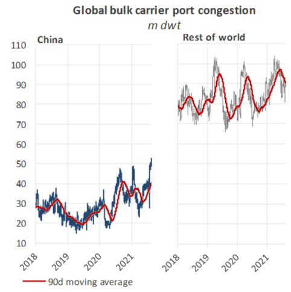
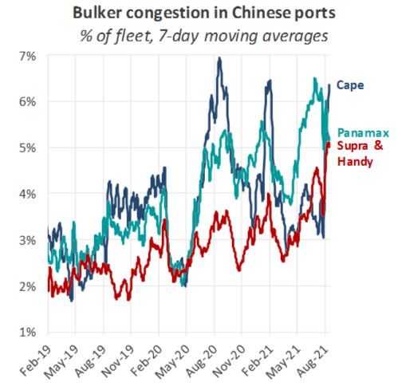
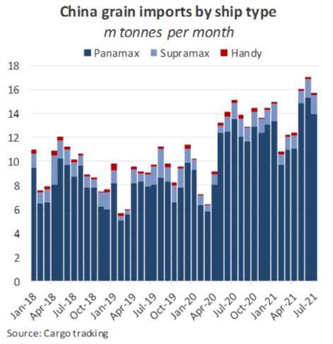
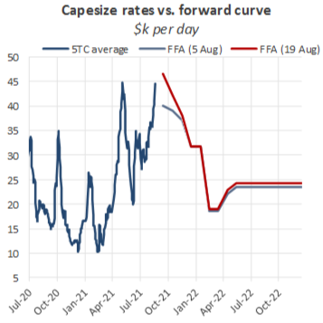

# Port congestion. Squeezing the fleet

**Date:** August 21, 2021  
**Publisher:** Breakwave Advisors | **Category:** Market Insights  
**Original URL:** [https://www.breakwaveadvisors.com/insights/2021/8/21/port-congestion-squeezing-the-fleet](https://www.breakwaveadvisors.com/insights/2021/8/21/port-congestion-squeezing-the-fleet)  

---

*By Nick Ristic*

A surge in the number of ships waiting outside ports in China is tightening effective fleet supply and helping to push rates to record levels. We look at the drivers behind this and how freight is being affected.

### Another China Story

At the global level, queues of bulk carriers at ports and anchorages hit a peak of almost 142m dwt over the weekend, the highest level we have on record and about 15% higher YoY. However, drilling into this data by region, elevated congestion in China appears to be the driving force behind this trend. Accounting for more than a third of total congestion, bulker capacity queuing in China hit an all time high of 52.7m dwt on the weekend, representing 6% of the global trading fleet. This figure also represents a spike of 28% MoM and 23% versus this time last year, which was itself a busy period for ports in China. Outside of China, congestion remains relatively high, but is behaving in line with its usual seasonal pattern, which is dictated by the various crop harvesting periods and weather related factors.

> **Figure 1: A0**  
> [Local Asset](file:///C:/Users/Dell/Github/Shipping/corpus/03-breakwave/insights/2021/assets/2021-08-21_port-congestion-squeezing-the-fleet_img_a0_16dc3b62f70c.png)

A major driver of the uptick in China has been a tightening in COVID-19 restrictions, put in place to stem a spate of outbreaks of the delta variant in the country. It’s tough to nail down exactly which rules are in place at each port, but it is clear that the individual restrictions and bottlenecks are compounding to slow the turnaround of ships in Chinese ports.

Based on the latest information from port agents, the only blanket quarantine measures at most Chinese ports is for ships which have called to Indian ports or have taken on Indian crew members in the previous 30 days.

> **Figure 2: A1**  
> [Local Asset](file:///C:/Users/Dell/Github/Shipping/corpus/03-breakwave/insights/2021/assets/2021-08-21_port-congestion-squeezing-the-fleet_img_a1_24f12f6d4edd.png)

Some of the most significant disruption appears to be in the Yangtze River region, where ships face strict pilotage rules. The region’s anchorages account for about 18% of total bulker congestion in China, but it has become a particularly bad bottleneck for geared vessels. Last week as much as 30% of Supra and Handy congestion in China was in the Yangtze region, where power plants have recently upped their purchases of Indonesian coal. Compared to the bigger ships, the geared fleet has seen the greatest YoY increases in Chinese congestion as a share of the trading fleet, reaching a record 5.2%, up by 2.1 points YoY.

Regardless of how long vessels have been at sea since their last port call, their risk level is reportedly being assessed by authorities based on factors such as crew nationality and boarding time, navigation route and cargo on board. On top of this, quarantine measures have greatly reduced the number of pilots operating on the river, which has been slashed by up to 50% versus normal levels. At other ports, we are hearing reports of mandatory quarantine periods, cargo operations not being allowed to proceed until negative PCR test results are obtained and other protocols contributing to build-ups of tonnage.

### Grain Storage Still an Issue

For the Panamaxes specifically, another key driver of congestion has been a lack of grain storage capacity in China. The country’s binge on foreign grain supplies over the last few months has translated to a spike in the number of laden vessels arriving, but terminals’ infrastructure has not been able to keep up, and ships are facing lengthy stays outside ports before being able to discharge.

> **Figure 3: A2 (002)**  
> [Local Asset](file:///C:/Users/Dell/Github/Shipping/corpus/03-breakwave/insights/2021/assets/2021-08-21_port-congestion-squeezing-the-fleet_img_a22800229_79146a888c4c.png)

China’s total grain imports over the first seven months of the year totaled almost 100m tonnes, up by around 32% YoY, with monthly receipts hitting an all time high of over 17m tonnes in June. The majority of the increase came from corn, imports of which are up by 290% YoY so far in 2021 to 18.7m tonnes after China increased its purchases to feed a recovering pig herd and rebuild stockpiles. Congestion resulting from grain imports is likely to remain high over the coming weeks, with laden vessels continuing to arrive.

Meanwhile, effective fleet capacity is being squeezed further by a recent uptick in yard activity, amid an jump in the number of ships requiring special survey work. Based on the age profile of the fleet, 2,259 bulkers hit the 5, 10, 15 or 20 year-old mark this year, up by about 12% YoY. Across all vessel types, we count about 8.5m dwt in shipyards across the Far East. About half of these are Capes, though with about 80% of these ships hitting special survey age, the remainder may be retrofitting scrubber units now that the spread between VSLFO and HSFO prices have widened again. Current Cape yard activity is still about 10m dwt lower than what it was in late-2019, which represented the peak of scrubber-related yard activity.

### The Market

With the carrying capacity of the fleet being trimmed, the market is clearly receiving support. After underperforming relative to the smaller ships, average Capesize rates are now approaching the $50,000 per day mark (not seen since June 2010), while near-term freight futures have rocketed by about 47% in the space of a month, implying further rises in freight. Meanwhile, strength is continuing to build on the smaller ships too, with Handies seeing 2008-level rates, and the Baltic’s 58k Supramax index surpassing $35,000 per day for the first time since it began printing in 2015.

> **Figure 4: A3 (002)**  
> [Local Asset](file:///C:/Users/Dell/Github/Shipping/corpus/03-breakwave/insights/2021/assets/2021-08-21_port-congestion-squeezing-the-fleet_img_a32800229_ccddf696361b.png)

Looking forward, it seems unlikely that the COVID-related stresses on China’s port activity will ease overnight, and with little room for grain capacity expansion, the pile-up of agricultural cargoes is also unlikely to quickly diminish. On the bigger ships, the recent uptick in iron ore shipments in both basins could also trigger an increase in the volume of Cape arrivals in China over the next few weeks, sustaining queues further. With these factors in mind, we believe there is still further upside to today’s incredibly strong market, despite this week’s turmoil in commodity prices.

---

**Tags:** Dry Bulk, Shipping, Rates  
