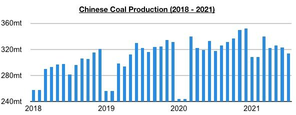
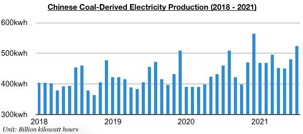
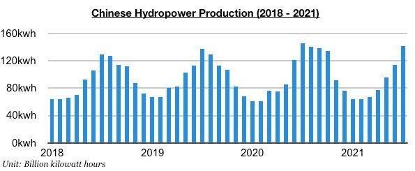
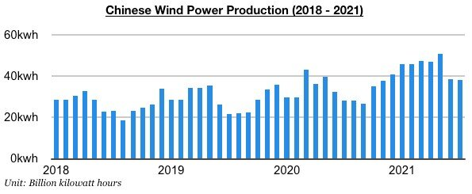
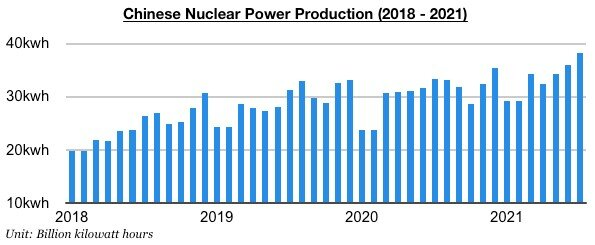
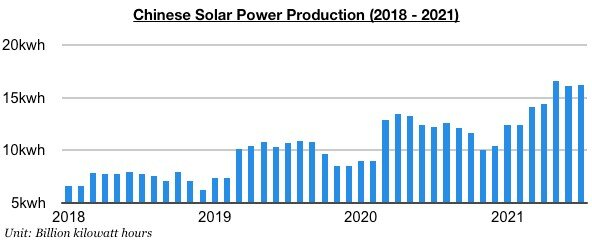

# Coal Remains King in China

**Date:** August 26, 2021  
**Publisher:** Breakwave Advisors | **Category:** Market Insights  
**Original URL:** [https://www.breakwaveadvisors.com/insights/2021/8/26/coal-remains-king-in-china](https://www.breakwaveadvisors.com/insights/2021/8/26/coal-remains-king-in-china)  

---

*By Jeffrey Landsberg*

China’s coal-derived electricity generation has continued to fare much better than domestic coal production and this remains very positive for China’s coal import prospects. China's coal production most recently totaled 314.2 million tons in July. This is down month-on-month by 9 million tons (-3%) and is down year-on-year by 3.7 million tons (-1%). Coal production has been coming under additional pressure due to mine inspections and restrictions, and growth is likely to remain under government-driven pressure in the near term.

> **Figure 1: A1**  
> [Local Asset](file:///C:/Users/Dell/Github/Shipping/corpus/03-breakwave/insights/2021/assets/2021-08-26_coal-remains-king-in-china_img_a1_a6fd4d487425.jpg)

Coal-derived electricity generation in July totaled 524 billion kilowatt hours. This is up month-on-month by 42.7 billion kilowatt hours (9%) and is up year-on-year by 64 billion kilowatt hours (14%). Coal-derived electricity generation during the last five months has increased year-on-year by 14% while coal production during the same period has contracted year-on-year by 0.4%. Also of note is that many renewable sources of electricity continue to experience significant growth — but they still contribute to only a relatively small amount of total electricity production. Coal is still set to remain king in China for many years and so far has contributed to 72% of electricity output this year.

> **Figure 2: A2**  
> [Local Asset](file:///C:/Users/Dell/Github/Shipping/corpus/03-breakwave/insights/2021/assets/2021-08-26_coal-remains-king-in-china_img_a2_113dadc64a05.jpg)

Hydropower power production totaled 142.2 billion kilowatt hours last month, which marked a year-on-year decline of 3%. So far this year, hydropower production has contributed to 14% of China’s total electricity production.

> **Figure 3: A3**  
> [Local Asset](file:///C:/Users/Dell/Github/Shipping/corpus/03-breakwave/insights/2021/assets/2021-08-26_coal-remains-king-in-china_img_a3_a8e57544af73.jpg)

Wind power production totaled 38 billion kilowatt hours last month, which marked year-on-year growth of 34%. So far this year, wind power production has contributed to 7% of China’s total electricity production.

> **Figure 4: A4**  
> [Local Asset](file:///C:/Users/Dell/Github/Shipping/corpus/03-breakwave/insights/2021/assets/2021-08-26_coal-remains-king-in-china_img_a4_751b204a3cd4.jpg)

Nuclear power production totaled 38.2 billion kilowatt hours last month, which marked year-on-year growth of 14%. So far this year, nuclear power production has contributed to 5% of China’s total electricity production.

> **Figure 5: A5**  
> [Local Asset](file:///C:/Users/Dell/Github/Shipping/corpus/03-breakwave/insights/2021/assets/2021-08-26_coal-remains-king-in-china_img_a5_7932f778ad0f.jpg)

Solar power production totaled 16.2 billion kilowatt hours last month, which marked year-on-year growth of 33%. So far this year, solar power production has contributed to 2% of China’s total electricity production.

> **Figure 6: A6**  
> [Local Asset](file:///C:/Users/Dell/Github/Shipping/corpus/03-breakwave/insights/2021/assets/2021-08-26_coal-remains-king-in-china_img_a6_506e2173c673.jpg)

---

**Tags:** China, Coal, Hydropower, Windpower, Nuclear Power, Solar Power  
