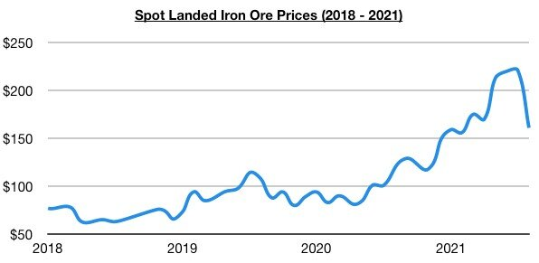

# Containerization in Dry Bulk; Correction in Iron Ore Prices (But Strength in Capesize Rates)

**Date:** August 27, 2021  
**Publisher:** Breakwave Advisors | **Category:** Market Insights  
**Original URL:** [https://www.breakwaveadvisors.com/insights/2021/8/27/containerization-in-dry-bulk-correction-in-iron-ore-prices-but-strength-in-capesize-rates](https://www.breakwaveadvisors.com/insights/2021/8/27/containerization-in-dry-bulk-correction-in-iron-ore-prices-but-strength-in-capesize-rates)  

---

*By Jeffrey Landsberg*

There have been rumors this week that a capesize vessel has been chartered to carry containers. While we cannot confirm this report, some smaller dry bulk vessels this year have certainly been used to carry container vessels. We can all but confirm that at least three dry bulk vessels have been used this year entirely to carry containers -- and sources have stated the total this year exceeds twelve vessels.

Overall, the containerization of dry bulk is an issue we will be continuing to monitor closely in our Weekly Dry Bulk Reports. The container market continues to dominate new vessel orders, which remains helpful for the dry bulk market as fewer shipbuilding slots are available for dry bulk vessels -- and there is a chance that the extreme strength in the container market will also have more of an impact on the dry bulk spot market going forward. Of note today is that Golden Ocean stated on their quarterly earnings call that they are also looking into the possibility of chartering some of their own vessels to carry containers. Nothing could come from this as it is still difficult to get dry bulk vessels certified to carry containers, but it is wonderful that a blue chip capesize/panamax owner is also exploring the containerization of dry bulk vessels.

At present, the dry bulk market continues to fare very well and prospects for all four dry bulk vessel classes remain very promising. While the recent correction in iron ore prices has been concerning to many globally, it should be acknowledged that spot capesize rates have climbed while iron ore prices have fallen. Iron ore prices from mid-July through the end of last week fell from $221 to $139, while capesize rates during the same period rose from $28,500 to $49,700. The capesize market has continued to fare very well despite the recent correction in iron ore prices, and the same is true with China and the world’s iron ore exporters. Chinese steel mills have been benefiting greatly -- and the environment will also benefit if more iron ore imports are consumed at the expense of domestically mined iron ore. On the export side, global iron ore miners also continue to make great profits even with spot iron ore prices having fallen sharply recently.

Going forward, there is a solid chance that China’s iron ore import demand will increase soon as long as global iron ore miners continue to ramp up production. If demand for imports does ultimately increase, capesize rates will likely reach extremely high levels this year. Miners still very much want to sell iron ore even with prices remaining well below this year's high of $221/ton.

> **Figure 1: A1**  
> [Local Asset](file:///C:/Users/Dell/Github/Shipping/corpus/03-breakwave/insights/2021/assets/2021-08-27_containerization-in-dry-bulk-correction-in-iron-ore-prices-but-strength-in-capes_img_a1_8ab51351d185.jpg)

---

**Tags:** Shipping, Containers  
