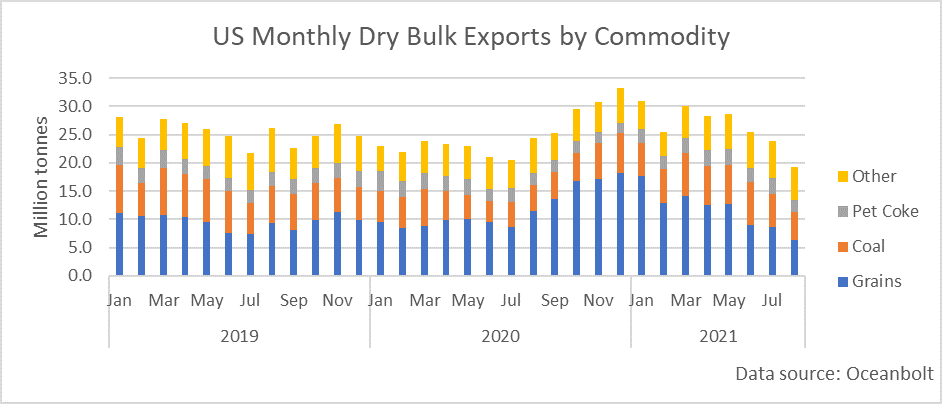
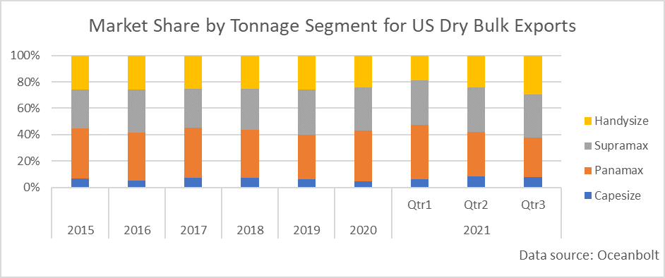

# The US Economy Remains on the Path to Recovery and Beyond

**Date:** August 28, 2021  
**Publisher:** Breakwave Advisors | **Category:** Market Insights  
**Original URL:** [https://www.breakwaveadvisors.com/insights/2021/8/27/the-us-economy-remains-on-the-path-to-recovery-and-beyond](https://www.breakwaveadvisors.com/insights/2021/8/27/the-us-economy-remains-on-the-path-to-recovery-and-beyond)  

---

*By Ulf Bergman*

The US economy saw a modest upgrade of the second-quarter growth, as the second estimate of the GDP for the quarter was released this week. Economists had expected an upward revision to 6.7 per cent from the 6.5 per cent growth initially reported in July, with the actual revision slotting in between the original and expected readings at 6.6 per cent. Much of the revision was driven by a somewhat more robust pace of consumer expenditure and business investment than initially estimated. By comparison, the US economy grew by 6.3 per cent in the first quarter and with the two strong consecutive quarters, the US economy has recovered all ground lost during the pandemic and is currently 0.8 per cent above the pre-pandemic peak set in the fourth quarter of 2019.

The US corporate profits also surged during the second quarter to a new record, according to data from the US Commerce Department. The business earnings were boosted by robust demand and higher prices, indicating that the projected deceleration of economic growth in the current quarter as a result of soaring COVID-19 infections could prove to be only temporary. The profits rose by close to ten per cent during the second quarter to a highly respectable 2.8 trillion dollars, with almost three-quarters of the growth originating in the domestic nonfinancial corporations. As a result, pre-tax profits accounted for 12.3 per cent of the GDP during the second quarter, which is the highest reading since 2014. The jump in profits reported on Thursday was particularly significant in light of businesses currently confronting rising costs owing to scarcities of raw materials and labour. The resurgence in infections driven by the contagious delta variant of the coronavirus is also chipping away demand for services like air travel and cruises, resulting in some economists tempering their third-quarter growth expectations.

US exports can also be expected to pick up during the second half of the year, as the new harvest of grains is getting ready to ship. The dominance of agricultural commodities in the dry bulk trade out of the US gives a significant seasonal variation, especially when inventories are as low as they are currently.

> **Figure 1: A1**  
> [Local Asset](file:///C:/Users/Dell/Github/Shipping/corpus/03-breakwave/insights/2021/assets/2021-08-28_the-us-economy-remains-on-the-path-to-recovery-and-beyond_img_a1_425052088335.png)

While the number of shipments of US coal to Chinese ports is on the rise, as buyers in China are seeking to replace the banned Australian coal, the average monthly volumes of coal still only account for a bit more than half of the volumes of the grains. However, the coal shipments tend to lack the seasonality that the exports of agricultural commodities are exhibiting and remain reasonably stable throughout the year. The important role of the grains in the dry bulk trade out of US ports and the smaller shipments of coal has resulted in the trade being dominated by the smaller and mid-sized vessels, while the largest tonnage barely features in the transportation mix. Hence, once the shipments of the new harvest get underway it can be expected to provide support to the Panamax and Supramax freight rates.

> **Figure 2: A2**  
> [Local Asset](file:///C:/Users/Dell/Github/Shipping/corpus/03-breakwave/insights/2021/assets/2021-08-28_the-us-economy-remains-on-the-path-to-recovery-and-beyond_img_a2_c077c40e0656.png)

The increasing spread of the delta variant of the Covid has, somewhat surprisingly, only had a limited effect on the oil and gasoline demand in the US so far. According to data released by the Energy Information Administration, US crude stocks are now at the lowest levels since January 2020, before the pandemic descended on the country with its full might. In addition to crude supplies declining, gasoline inventories also fell more than expected according to the agency and underscoring a greater degree of resilience in the economy than previously in the face of the pandemic. The limited impact that the spread of the more contagious variant has on oil demand and economic growth in the US, and in Europe as well, serves to highlight the different approaches being adopted in different parts of the world. While the economies on both sides of the Atlantic are allowed to operate with only a limited amount of restrictions, other countries, notably China and Australia, are taking a more direct approach and impose considerable restrictions to control only a few cases. Only time will tell which approach will prove to be the more successful one but in the short term the more restrictions being put in place the greater the impact on economic growth and supply chains. The disruptions to the supply chains due to restrictions is also having an impact on countries where there are only limited restrictions, as shortage of parts is shutting down the production lines.

---

**Tags:** Usa, Economy, Shipping  
