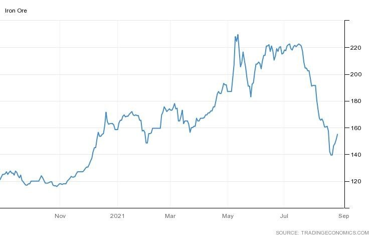
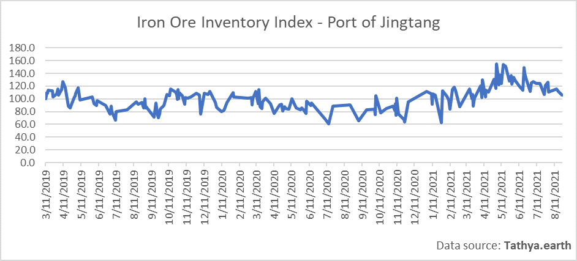
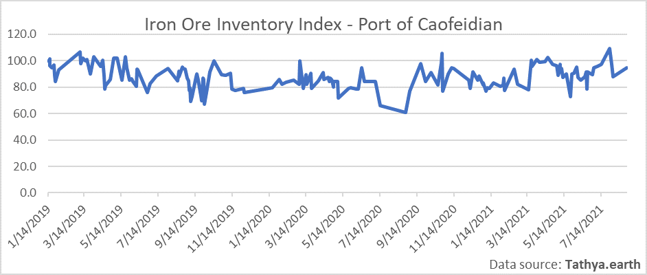
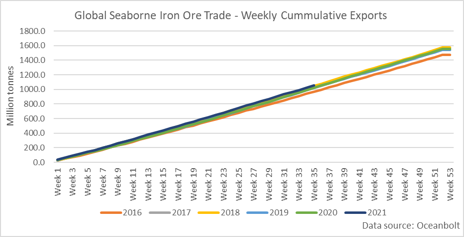
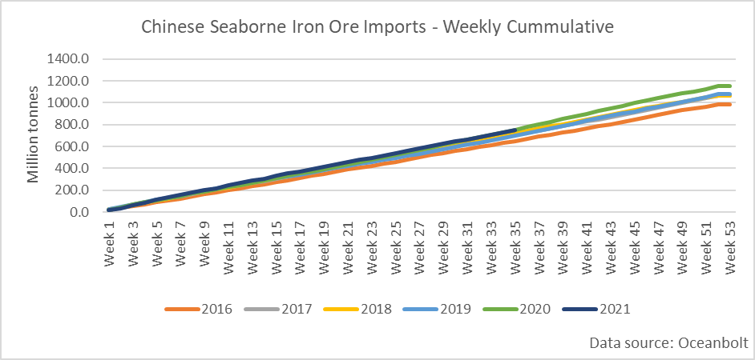
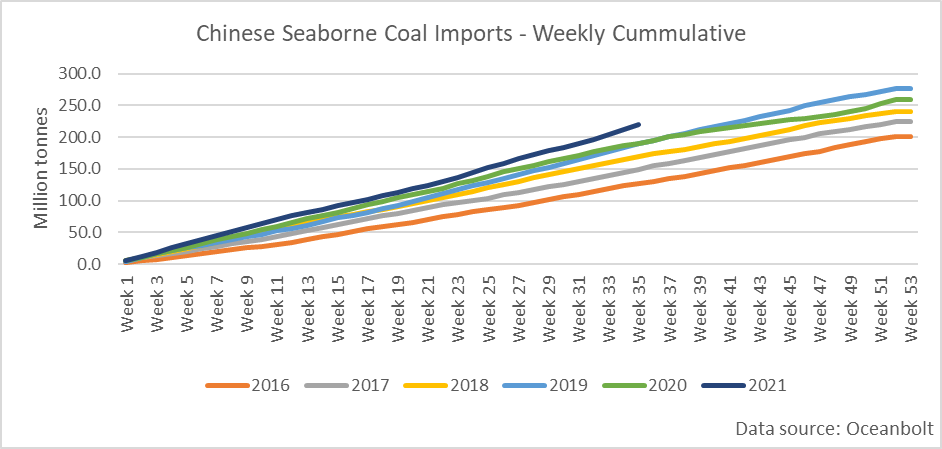

# Autumn in the Northern Hemisphere: Back to Business?

**Date:** August 31, 2021  
**Publisher:** Breakwave Advisors | **Category:** Market Insights  
**Original URL:** [https://www.breakwaveadvisors.com/insights/2021/8/31/autumn-in-the-northern-hemisphere-back-to-business](https://www.breakwaveadvisors.com/insights/2021/8/31/autumn-in-the-northern-hemisphere-back-to-business)  

---

*By Ulf Bergman*

> **Figure 1: Unsplash Image Trvsyef4uee**  
> [Local Asset](file:///C:/Users/Dell/Github/Shipping/corpus/03-breakwave/insights/2021/assets/2021-08-31_autumn-in-the-northern-hemisphere-back-to-business_img_unsplash-image-trvsyef4uee_64a2cae48b8a.jpg)

In France, the build-up to the annual phenomena of “la rentrée”, loosely translated as back to school, is currently underway. Much of the focus is on the amount of stationery and any other products that the children will need in the coming school year, with the merchandise dominating much of the floor space in the supermarkets and letterboxes being swamped with advertising leaflets. This year prices and availability are also likely to have been affected by the rising freight prices and delays in the container sector. The cultural significance of this annual event in the country runs considerably deeper than being just a question of supplies of stationery. A large part of the French society is affected by it and typically it represents the relaunch of activities after the lull of the summer holidays. In the corporate world, it comes with a considerable emphasis on new projects and rising demand for labour and raw materials.

With the end of summer holidays and the autumn descending on many parts of the northern hemisphere, will the commodity and shipping markets see their own “rentrées” with rising demand? The most important seaborne dry bulk commodity by volume, iron ore, has since the middle of July seen a dramatic price drop as the Chinese authorities have clamped down on the demand. Steel production has been curtailed to bring surging iron ore prices and rising pollution levels under control. However, in the last few trading sessions prices have recouped some of the losses as demand is expected to recover somewhat following the news that the latest Covid-19 outbreak in China has been brought under control. While the Chinese measures grabbed much of the headlines, the improving iron ore supply situation, with increasing Brazilian output, has also added to the downward pressure on the prices. In addition, seaborne volumes from Australia usually improve during the fourth quarter.

### Iron Ore – Usd per Tonne

> **Figure 2: A1**  
> [Local Asset](file:///C:/Users/Dell/Github/Shipping/corpus/03-breakwave/insights/2021/assets/2021-08-31_autumn-in-the-northern-hemisphere-back-to-business_img_a1_71b950e2e2e6.jpg)

As iron prices have retreated inventories in different Chinese ports have evolved along different paths. Last year’s second most important iron ore port, Jingtang, has seen its stockpiles trending lower since May and are at the lowest since early April. At the same time, the port has fallen down the rankings during the first half of the third quarter with a declining portion of the discharged iron ore cargoes.

> **Figure 3: A2**  
> [Local Asset](file:///C:/Users/Dell/Github/Shipping/corpus/03-breakwave/insights/2021/assets/2021-08-31_autumn-in-the-northern-hemisphere-back-to-business_img_a2_e6709861c3b6.png)

For the largest iron ore port in China this year, Caofeidian, the inventories remain more volatile but above the long-term average. However, like Jingtang, it has seen its importance slipping during July and August, with Quingdao grabbing the top spot, as measured by cargoes discharged according to Oceanbolt’s cargo tracking data. As Quingdao has grown in importance, its stockpiles have also grown to near all-time high levels in late August.

> **Figure 4: A3**  
> [Local Asset](file:///C:/Users/Dell/Github/Shipping/corpus/03-breakwave/insights/2021/assets/2021-08-31_autumn-in-the-northern-hemisphere-back-to-business_img_a3_ba33a0a2bc8c.png)

Despite the attempts to control demand by the Chinese leadership, or perhaps thanks to the resulting lower prices, the global iron ore trade is currently on track for a new record year. Cargo tracking data from Oceanbolt is showing the year-yo-date export volumes ahead of the previous record year, 2018, at the same point. While there is still a third left of the year and much can still happen, the expectation of a continued recovery in Brazilian export volumes and increasing shipments from Australia, combined with a sustained global economic recovery, suggest there is a good chance that a new record will be set by the end of the year.

> **Figure 5: A4**  
> [Local Asset](file:///C:/Users/Dell/Github/Shipping/corpus/03-breakwave/insights/2021/assets/2021-08-31_autumn-in-the-northern-hemisphere-back-to-business_img_a4_2c6787e81cbe.png)

Chinese iron ore imports on the other hand are trailing last year’s record levels marginally, suggesting that the country’s ambition to keep this year’s steel output at, or below, last year’s levels may turn out to be successful. Despite this, an additional 400 million tonnes can be expected to be discharged in Chinese ports during the next four months.

> **Figure 6: A5**  
> [Local Asset](file:///C:/Users/Dell/Github/Shipping/corpus/03-breakwave/insights/2021/assets/2021-08-31_autumn-in-the-northern-hemisphere-back-to-business_img_a5_fbfcb69f1d33.png)

For coal, with seaborne quantities second to only iron ore, volumes so far this year are lagging behind both 2018 and 2019 at the same point. The high coal prices and a push towards decarbonization are potential candidates for driving the demand reduction. However, the current resurgence in Covid infection rates in many parts of Asia is likely to be the main culprit and if the outbreaks are brought under control there is the possibility of a demand recovery. Shipments of coal to China have on the other hand increased, with year-to-date volumes well ahead of previous years.

> **Figure 7: A6**  
> [Local Asset](file:///C:/Users/Dell/Github/Shipping/corpus/03-breakwave/insights/2021/assets/2021-08-31_autumn-in-the-northern-hemisphere-back-to-business_img_a6_e67387d11c2c.png)

Ongoing domestic supply problems and a strong electricity demand over the summer, in combination with transportation bottlenecks, have driven coal inventories to near historical lows in China. News that the Chinese cement and chemical industries are restocking their coal supplies after their production curbs were lifted is likely to further tighten the supply situation and support seaborne import volumes during the rest of the year.

---

**Tags:** Shipping, China  
