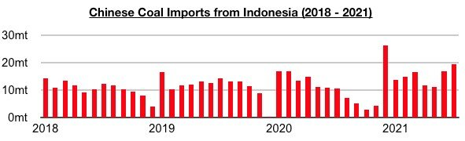
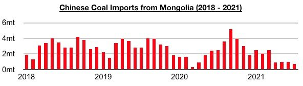
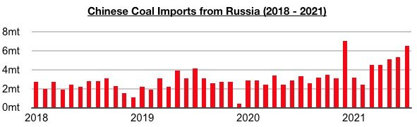
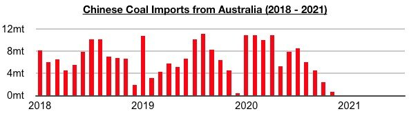
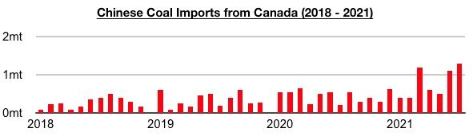
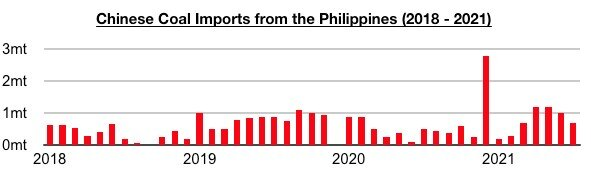

# China's Coal Import Shift Continues

**Date:** September 03, 2021  
**Publisher:** Breakwave Advisors | **Category:** Market Insights  
**Original URL:** [https://www.breakwaveadvisors.com/insights/2021/9/3/chinas-coal-import-shift-continues](https://www.breakwaveadvisors.com/insights/2021/9/3/chinas-coal-import-shift-continues)  

---

*By Jeffrey Landsberg*

Coal import data for July by origin has been released and shows imports from Indonesia have remained the primary source of imports. Also notable is imports from Indonesia, Russia, Canada, the Philippines, the United States, Colombia, and South Africa all experienced year-on-year growth. Imports from Indonesia totaled 19.4 million tons in July, which is up month-on-month by 2.4 million tons (14%) and up year-on-year by 8.7 million tons (81%).

> **Figure 1: A1**  
> [Local Asset](file:///C:/Users/Dell/Github/Shipping/corpus/03-breakwave/insights/2021/assets/2021-09-03_chinas-coal-import-shift-continues_img_a1_3e5dda6c36b6.jpg)

Imports from Russia totaled 6.5 million tons, which is up month-on-month by 1.2 million tons (23%) and up year-on-year by 3.2 million tons (97%).

> **Figure 2: A2**  
> [Local Asset](file:///C:/Users/Dell/Github/Shipping/corpus/03-breakwave/insights/2021/assets/2021-09-03_chinas-coal-import-shift-continues_img_a2_afdf0239416e.jpg)

Imports from Mongolia totaled 700,000 tons, which is down month-on-month by 300,000 tons (-30%) and down year-on-year by 1.8 million tons (-72%). Imports from Mongolia have remained under sporadic pressure from the Chinese government due to Mongolian coronavirus cases.

> **Figure 3: A3**  
> [Local Asset](file:///C:/Users/Dell/Github/Shipping/corpus/03-breakwave/insights/2021/assets/2021-09-03_chinas-coal-import-shift-continues_img_a3_eae2709e694b.jpg)

Australia again did not export any coal to China last month. July has marked the eighth straight month where China did not import any Australian coal.

> **Figure 4: A4**  
> [Local Asset](file:///C:/Users/Dell/Github/Shipping/corpus/03-breakwave/insights/2021/assets/2021-09-03_chinas-coal-import-shift-continues_img_a4_c44ae074f443.jpg)

Imports from Canada totaled 1.3 million tons, which is up month-on-month by 200,000 tons (18%) and up year-on-year by 1.1 million tons (550%).

> **Figure 5: A5**  
> [Local Asset](file:///C:/Users/Dell/Github/Shipping/corpus/03-breakwave/insights/2021/assets/2021-09-03_chinas-coal-import-shift-continues_img_a5_2069d4e211c5.jpg)

Imports from the Philippines totaled 700,000 tons, which is down month-on-month by 300,000 tons (-30%) but up year-on-year by 200,000 tons (40%).

> **Figure 6: A6**  
> [Local Asset](file:///C:/Users/Dell/Github/Shipping/corpus/03-breakwave/insights/2021/assets/2021-09-03_chinas-coal-import-shift-continues_img_a6_41827297a347.jpg)

Imports from the United States totaled 600,000 tons, which is down month-on-month by 300,000 tons (-33%) but up year-on-year by 600,000 tons. Imports from Colombia totaled 300,000 tons, which is down month-on-month by 500,000 tons (-63%) but up year-on-year by 100,000 tons (50%). Imports from South Africa totaled 500,000 tons, which is down month-on-month by 300,000 tons (-38%) but up year-on-year by 500,000 tons.

---

**Tags:** Shipping, Coal, China  
