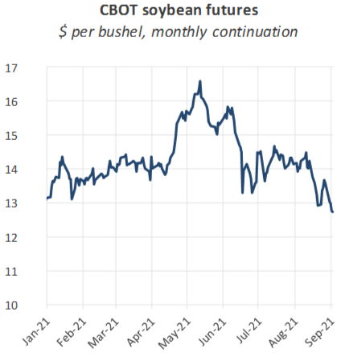
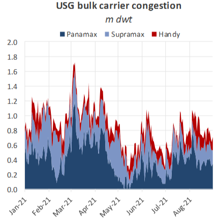
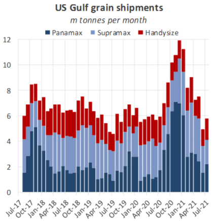
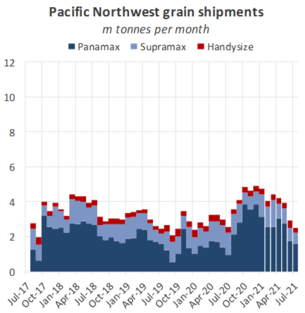

# Hurricane Ida - after the Storm

**Date:** September 04, 2021  
**Publisher:** Breakwave Advisors | **Category:** Market Insights  
**Original URL:** [https://www.breakwaveadvisors.com/insights/2021/9/4/hurricane-ida-after-the-storm](https://www.breakwaveadvisors.com/insights/2021/9/4/hurricane-ida-after-the-storm)  

---

Following Hurricane Ida’s landfall on 29 August, some infrastructure critical to the USA’s dry bulk exports has been damaged. We assess the potential impacts on trade flows and freight rates.

*By Nick Ristic*

### What We Know

Ida made landfall in south-eastern Louisiana on 29 August as a Category 4 hurricane, wreaking havoc across the state and causing power and water outages that may persist for weeks. More recently, the weather event has caused serious flooding in regions to the north. The destruction has both directly and indirectly hit infrastructure critical to the US’ cargo import and export capabilities. On the energy side, Ida forced 1.8m b/d of US Gulf (USG) crude production capacity (17% of total output) to temporarily shut, on top of about 4.3m b/d of refining capacity equating to about half the state’s total.

Meanwhile, vulnerable supply chain infrastructure in the area, such as barge and rail facilities, have reportedly been forced to close until damage assessments have been completed. These effects may impact the flow of goods like petcoke and coal, at a time when the latter is in extremely short supply on the seaborne market.

But perhaps most importantly for the dry market, a number of grain terminals have been taken offline by the hurricane, either due to direct damage or power outages. The USG typically makes up about two thirds of total US grain shipments, which in turn accounts for 22% of the world’s total export market. And according to some reports, the industrial power black-outs could last weeks. Some ports, which*have*reopened, have done so with draft restrictions. Further, barge operations along the Mississippi River, which are crucial to the flow of grain to the export market, have also been disrupted by debris and obstacles in the channel. According to the Louisiana Ports Authority, deep draft vessels operating in the river are restricted to daylight transits only. As such, the fallout from Ida could have a meaningful impact on the short term dry market fundamentals.

### Effect on Market

So far, we have not seen too many ripples from the hurricane in the dry markets. Soybean futures in the US have dipped, anticipating slightly lower exports and greater domestic supply, but this may also be due to expectations of better harvests due to the increased rainfall.

> **Figure 1: A1**  
> [Local Asset](file:///C:/Users/Dell/Github/Shipping/corpus/03-breakwave/insights/2021/assets/2021-09-04_hurricane-ida-after-the-storm_img_a1_d7e5e7c349b4.png)

The shock has come at a critical time, when US soybean shipments are just beginning to ramp up for the Q4 peak export season. Many ships, have repositioned to take advantage of the typical ramp up, and so if power outages do indeed last for several weeks, we could see congestion start to swell. For now, queues of bulk carriers in the Gulf are yet to build up, and remain at average seasonal levels of about 708k dwt.

> **Figure 2: A2**  
> [Local Asset](file:///C:/Users/Dell/Github/Shipping/corpus/03-breakwave/insights/2021/assets/2021-09-04_hurricane-ida-after-the-storm_img_a2_ae83cec13577.png)

And if the disruption is more persistent, there are other ways the dry market may be affected. For importers, an alternative to US supply could be that from South America, though for soybeans specifically, we are currently in the seasonal low-point for shipments from this hemisphere. Additional tonnes could come from stockpiles in the country, but buyers of animal feed may need to look to other commodities, such as wheat and corn, to fill the gap. If cargoes can be found, greater voyage lengths to customers in China would likely translate to a slight increase in vessel demand.

> **Figure 3: A3**  
> [Local Asset](file:///C:/Users/Dell/Github/Shipping/corpus/03-breakwave/insights/2021/assets/2021-09-04_hurricane-ida-after-the-storm_img_a3_2ba7f92466eb.png)

We have also heard reports that some US grain exporters are redirecting cargoes to their facilities in the Pacific Northwest (PNW). It is unclear how much rail capacity there is to move these volumes towards this coastline, but the shift could leave some bulkers better off than others. Even if total exported volumes are unchanged this season, more shipments from the PNW would likely benefit the Panamax market. Panamaxes and Kamsarmaxes typically account for about 62% of grain shipments from this region, as opposed to 36% from the USG.

But there is a trade-off. In terms of demand per tonne of cargo moved, grain shipments on Panamaxes from the PNW are about 33% less impactful than those from the Gulf, given the shorter voyage duration to the Far East. For Supramaxes, PNW shipments are about 29% less demand-intensive, though total volumes are far lower.

> **Figure 4: A4**  
> [Local Asset](file:///C:/Users/Dell/Github/Shipping/corpus/03-breakwave/insights/2021/assets/2021-09-04_hurricane-ida-after-the-storm_img_a4_aea7f1a8d750.png)

So while it is not clear exactly how this event will shape the market over the next few weeks, there are several aspects to keep an eye on. We’ll continue to watch as the story unfolds and more information becomes available.

---

**Tags:** Shipping, Hurricane, Freight Rates  
