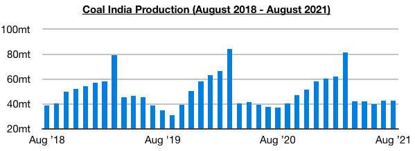
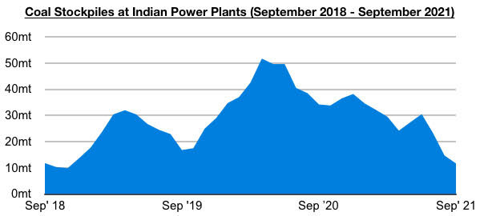
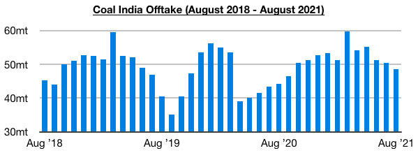

# Coal India's Production and Offtake Remain Relatively Low

**Date:** September 09, 2021  
**Publisher:** Breakwave Advisors | **Category:** Market Insights  
**Original URL:** [https://www.breakwaveadvisors.com/insights/2021/9/9/coal-indias-production-and-offtake-remain-relatively-low](https://www.breakwaveadvisors.com/insights/2021/9/9/coal-indias-production-and-offtake-remain-relatively-low)  

---

*By Jeffrey Landsberg*

The most recently released data shows that Coal India produced only 42.6 million tons of coal last month. This is the same amount that was produced in July and is 5.4 million tons (15%) more than was produced in August 2020. Production has remained well below this year's peak of 81.2 million tons seen in March.

> **Figure 1: Ch1**  
> [Local Asset](file:///C:/Users/Dell/Github/Shipping/corpus/03-breakwave/insights/2021/assets/2021-09-09_coal-indias-production-and-offtake-remain-relatively-low_img_ch1_28010c37a03b.jpg)

Offtake totaled only 48.6 million tons last month, which marks a month-on-month decline of 1.9 million tons (-4%) and a year-on-year increase of 4.3 million tons (10%). Offtake has now increased on a year-on-year basis for six consecutive months but has remained well below this year’s peak of 59.7 million tons seen in March.

> **Figure 2: Ch2**  
> [Local Asset](file:///C:/Users/Dell/Github/Shipping/corpus/03-breakwave/insights/2021/assets/2021-09-09_coal-indias-production-and-offtake-remain-relatively-low_img_ch2_b0e14edb8bfd.jpg)

Overall, it has become problematic for India that domestic coal production and offtake have remained relatively low. The nation's power plant coal stockpiles have continued to plummet and more coal desperately needs to be sent to power plants. As of the start of this week, India’s power plant coal stockpiles have fallen to 11.7 million tons. This marks a week-on-week decline of 1.1 million tons (-9%), is down year-on-year by 25.8 million tons (-69%), and marks the lowest amount seen since November 2018.

> **Figure 3: Ch3**  
> [Local Asset](file:///C:/Users/Dell/Github/Shipping/corpus/03-breakwave/insights/2021/assets/2021-09-09_coal-indias-production-and-offtake-remain-relatively-low_img_ch3_56d02f10eaf1.jpg)

India's stockpiles are amazingly now able to meet only 6 days of demand, even though the normal requirement for this time of year is to meet 21 days of demand. As a result of low domestic coal production/offtake and extremely low power plant stockpiles levels, India's near-term coal import prospects have become even more encouraging. This remains a very positive issue for the dry bulk shipping market.

---

**Tags:** India, Coal, Shipping  
