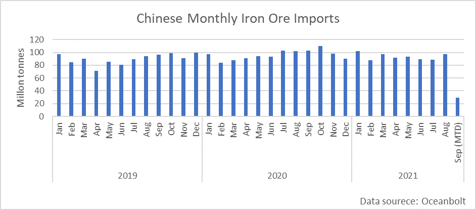

# China: The Growth Is Under Pressure but Indicators Remain Mixed

**Date:** September 10, 2021  
**Publisher:** Breakwave Advisors | **Category:** Market Insights  
**Original URL:** [https://www.breakwaveadvisors.com/insights/2021/9/10/china-the-growth-is-under-pressure-but-indicators-remain-mixed](https://www.breakwaveadvisors.com/insights/2021/9/10/china-the-growth-is-under-pressure-but-indicators-remain-mixed)  

---

*By Ulf Bergman*

The Chinese economy is, after a long period of exceptional growth, showing signs of a slowdown. The release of the inflation data earlier in the week yet again showed the disconnect between the export-driven industry and the domestic economy. The year-on-year price increases that the Chinese producers are facing are the steepest in thirteen years, at 9.5 per cent, and was above what the economists were anticipating. This follows a very respectable nine per cent increase in the preceding month of July. At the same time, the sluggish growth in consumer consumption saw the consumer price index failing to meet analysts’ expectations and is on track to fall well below Beijing’s target for the year. The large divergence between the two sets of price indices has led to many pundits fearing an imminent economic slowdown in the country. It also highlights the challenge the Chinese leadership is facing to try to stimulate the domestic economy, without causing other parts to overheat.

The outlook for the Chinese economy is currently dominated by mixed signals. While the domestic economy continues to struggle to regain its momentum, China’s international trade continues to defy analysts’ projections. In August, Chinese exports grew by 25.6 per cent compared to a year ago, while imports grew by a third. The strong growth of the latter was partly due to base effects, as imports fell by 2.1 per cent in August last year. For the first eight months of the year, Chinese exports have expanded by a third year-on-year to 2.1 trillion dollars, while imports have risen by almost 35 per cent to 1.7 trillion dollars. The strength of the exports has also seen the surplus in the trade with the rest of the world expanding by almost two billion dollars compared to July and passing 58 billion dollars.

> **Figure 1: 20210910 143828**  
> [Local Asset](file:///C:/Users/Dell/Github/Shipping/corpus/03-breakwave/insights/2021/assets/2021-09-10_china-the-growth-is-under-pressure-but-indicators-remain-mixed_img_20210910-143828_e7fa2f810cfb.jpg)

The Chinese property market has long been a source of concern for many economists and analysts, as debt levels have been building alongside rising valuations and suggesting that a property bubble has been in the making. This week has also seen a major Chinese property developer, China Evergrande Group, running out of cash to service its debt which forced the company to seek assistance from the authorities. The developer has since been allowed to negotiate with creditors on a piecemeal basis, to alleviate its cash crunch and remove any immediate threats of bankruptcy. However, this is not an isolated problem and Beijing has launched a campaign to cool the property market, with a reduction of the available credit. Many analysts are now warning that the aggressive nature of the measures could cause more harm than good, with negative consequences for industrial demand, consumption and economic growth. There has already been a significant slowdown in property construction activities, which could weigh on the demand for steel and iron ore during the remainder of the year. The property sector has also been graced with its own catchphrase for the new policies: “housing is for living, not for speculation”. However, the authorities need to tread carefully, the construction sector is of vital importance to the domestic economy and it accounts for 28 per cent of the GDP.

Adding to the mixed economic picture, the iron ore volumes discharged in Chinese ports have been on the rise in recent weeks. While four per cent below the same month last year, August has nevertheless shown a strong recovery from the weak volumes registered in July. According to data from Oceanbolt, the amount discharged in Chinese ports were also the highest since the beginning of the year. The current month has so far seen healthy import levels, with a good chance of matching last month’s volumes.

> **Figure 2: Ch4**  
> [Local Asset](file:///C:/Users/Dell/Github/Shipping/corpus/03-breakwave/insights/2021/assets/2021-09-10_china-the-growth-is-under-pressure-but-indicators-remain-mixed_img_ch4_b73525d3afc1.png)

The increasingly problematic outlook for the Chinese economy is presenting Beijing with a raft of new challenges, with many being contradictory. The big question remains what will have to give as the country may struggle to maintain the desired growth rate. A central initiative of the current five-year plan is “dual-circulation”, which aims to build a domestic economy that is insulated from the shocks of the global economy, may struggle to gain traction in the current environment. The Chinese consumers remain reluctant to spend money, as recurrent coronavirus outbreaks have dented confidence, limiting the likelihood of a renascence for the domestic economy any time soon. Hence, stimulus programmes are likely to remain in place. Another new policy slogan, “common-prosperity”, suggests that there is an increasing willingness to clamp down on the increasing wealth inequality, something that could affect economic activity adversely. However, with much of the growth likely to continue to originate in the export industry in the coming months, the Chinese leadership may feel compelled to ease some of the production curbs, particularly in the steel industry, to maintain export volumes and economic growth.

---

**Tags:** China, Economy, Shipping  
