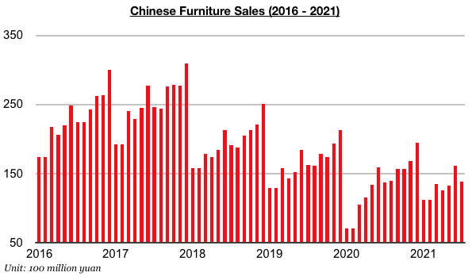
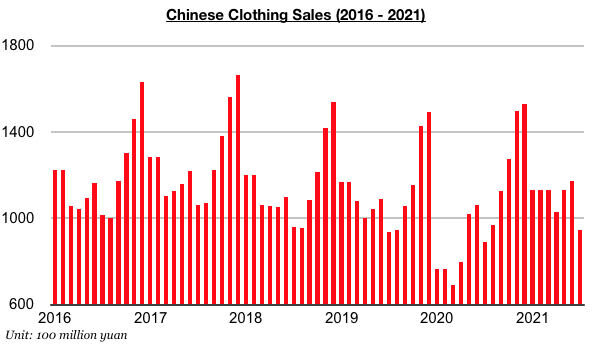
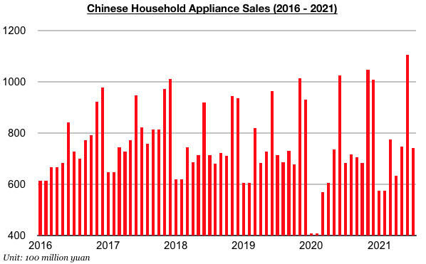

# China's Consumer Market Continues to Turn Corner

**Date:** September 10, 2021  
**Publisher:** Breakwave Advisors | **Category:** Market Insights  
**Original URL:** [https://www.breakwaveadvisors.com/insights/2021/9/10/chinas-consumer-market-continues-to-turn-corner](https://www.breakwaveadvisors.com/insights/2021/9/10/chinas-consumer-market-continues-to-turn-corner)  

---

*By Jeffrey Landsberg*

As we have been highlighting in our Weekly China Reports since last year, various segments of China’s consumer market (which previously had long been showing signs of a pre-covid recession) continue to turn a corner. Forgotten by some analysts is that furniture, clothing, and household appliance sales in China were all contracting on a year-on-year basis throughout 2018 and 2019 and well before the nation’s coronavirus outbreak. In recent months, though, a turnaround has remained in effect. Furniture sales in China in July totaled approximately 13.8 billion yuan. This marks year-on-year growth of 1%. Furniture sales in China have now grown on a year-on-year basis during six of the last seven months. Prior to this year, furniture sales in China had contracted on a year-on-year basis for thirty-six consecutive months.

> **Figure 1: Ch1**  
> [Local Asset](file:///C:/Users/Dell/Github/Shipping/corpus/03-breakwave/insights/2021/assets/2021-09-10_chinas-consumer-market-continues-to-turn-corner_img_ch1_4bebb8e26774.jpg)

Clothing sales (which includes garments, footwear, hats, and knitwear) in China have remained even more positive recently as sales have continued to experience stronger growth. Clothing sales in China in July totaled approximately 94.5 billion yuan, which marks a year-on-year increase of 6%. China’s domestic clothing sales have now grown on a year-on-year basis for twelve consecutive months. Prior to this period, they had contracted on a year-on-year basis during twenty-nine out of the previous thirty months.

> **Figure 2: Ch2**  
> [Local Asset](file:///C:/Users/Dell/Github/Shipping/corpus/03-breakwave/insights/2021/assets/2021-09-10_chinas-consumer-market-continues-to-turn-corner_img_ch2_4733eb2f2bfb.jpg)

Household appliance sales totaled approximately 74.1 billion yuan in July, which marks a year-on-year increase of 8%. Household appliance sales have now grown grown on a year-on-year basis for ten consecutive months. Prior to this period, household appliance sales had contracted on a year-on-year basis during eight out of the previous twelve months.

> **Figure 3: Ch3**  
> [Local Asset](file:///C:/Users/Dell/Github/Shipping/corpus/03-breakwave/insights/2021/assets/2021-09-10_chinas-consumer-market-continues-to-turn-corner_img_ch3_df3cbd0f6867.jpg)

---

**Tags:** Sales, Economy, China  
