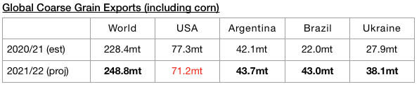
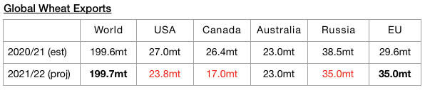
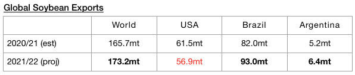
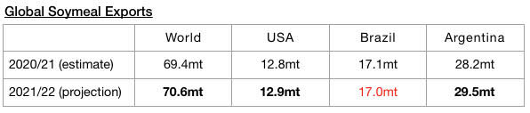

# Global Grain Trade Forecasts Raised Even Higher

**Date:** September 17, 2021  
**Publisher:** Breakwave Advisors | **Category:** Market Insights  
**Original URL:** [https://www.breakwaveadvisors.com/insights/2021/9/17/global-grain-trade-forecasts-raised-even-higher](https://www.breakwaveadvisors.com/insights/2021/9/17/global-grain-trade-forecasts-raised-even-higher)  

---

*By Jeffrey Landsberg*

Global grain trade prospects still remain just one of many bullish facets of the dry bulk market. Notable recently is that grain trade forecasts for the current 2021/2022 season have been raised from a month ago and strong year-on-year growth is also still expected. The United States Department of Agriculture has released their latest forecasts for 2021/22 and is now forecasting that global grain exports will total 497.1 million tons. This is 6.1 million tons (1%) more than was forecast just a month ago and would mark a year-on-year increase of 20.7 million tons (4%). Global coarse grain exports in 2021/22 are now expected to total 248.8 million tons. This is 3.7 million tons (2%) more than was forecast a month ago and would mark a year-on-year increase of 20.4 million tons (9%).

> **Figure 1: Ch1 Jef**  
> [Local Asset](file:///C:/Users/Dell/Github/Shipping/corpus/03-breakwave/insights/2021/assets/2021-09-17_global-grain-trade-forecasts-raised-even-higher_img_ch1jef_e08f0d0f4c62.jpg)

Global wheat exports are expected to total 199.7 million tons. This is 1.5 million tons (1%) more than was forecast a month ago and would mark a year-on-year increase of 100,000 tons.

> **Figure 2: Ch2 Jef**  
> [Local Asset](file:///C:/Users/Dell/Github/Shipping/corpus/03-breakwave/insights/2021/assets/2021-09-17_global-grain-trade-forecasts-raised-even-higher_img_ch2jef_8dc2a5981533.jpg)

In addition, global soybean exports (soybeans are not technically classified as a grain) are expected to total 173.2 million tons. This is 900,000 tons (1%) more than was forecast a month ago and would mark a year-on-year increase of 7.4 million tons (4%).

> **Figure 3: Ch3 Jef**  
> [Local Asset](file:///C:/Users/Dell/Github/Shipping/corpus/03-breakwave/insights/2021/assets/2021-09-17_global-grain-trade-forecasts-raised-even-higher_img_ch3jef_59feda8539cc.jpg)

Global soymeal exports are expected to total 70.6 million tons. This is 400,000 tons (1%) more than was forecast a month ago and would mark a year-on-year increase of 1.2 million tons (2%).

> **Figure 4: Ch4jef**  
> [Local Asset](file:///C:/Users/Dell/Github/Shipping/corpus/03-breakwave/insights/2021/assets/2021-09-17_global-grain-trade-forecasts-raised-even-higher_img_ch4jef_6532f6c049c9.jpg)

---

**Tags:** Global, Grains, Trade  
