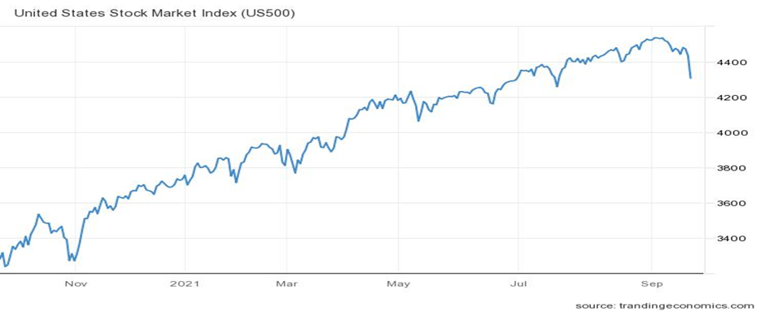
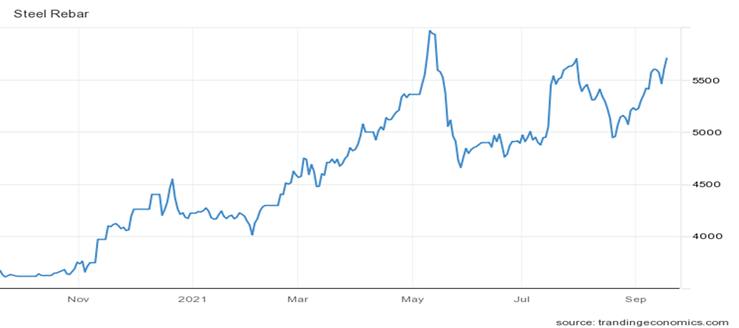

# The Global Economic Recovery Hitting the Speed Bumps

**Date:** September 21, 2021  
**Publisher:** Breakwave Advisors | **Category:** Market Insights  
**Original URL:** [https://www.breakwaveadvisors.com/insights/2021/9/21/the-global-economic-recovery-hitting-the-speed-bumps](https://www.breakwaveadvisors.com/insights/2021/9/21/the-global-economic-recovery-hitting-the-speed-bumps)  

---

*By Ulf Bergman*

The global markets have suffered about of severe jitters in recent days, as concerns are developing over the continued strength of the economic recovery in the wake of the pandemic. Much of the negative news flow has originated in China, but the country is by no means the sole source of the growing unease among investors. The exuberance of the first half of the year, when a solid global recovery appeared to be a foregone conclusion, has faded with the resurgence of the pandemic. The expectation of higher inflation, as a result of rising energy and transportation costs, in combination with new social restrictions and supply-chain disruptions, have dampened economic sentiments in many parts of the world. In Europe, with electricity prices already at record levels due to a shortage of natural gas, a cold winter could lead to power cuts and even higher energy prices, fueling inflation. On the other side of the Atlantic, the looming federal debt ceiling could shut down much of the activities of the US government and the country defaulting on its financial obligations.

However, the travails of the troubled Chinese property developer Evergrande have dominated the headlines recently, as it struggles to cope with USD 300 billion of liabilities. Beijing has also indicated that the company will be unable to pay the interest due on its debt in the coming week. As the story has unfolded, the world’s equity markets have suffered from the growing fears of a full-scale and uncontrolled default. Such a development could potentially trigger a chain reaction in the Chinese real estate market with additional defaults and spill over into other sectors, which could threaten the county’s continued economic growth. Much of the Chinese property market is already resting on a shaky foundation, with high valuations and excessive leverage. A string of bankruptcies among property developers could leave millions of homebuyers in limbo and harm the already weak growth in consumer spending. Fears that this will be China’s “Lehman Brothers” have sent the global equity markets lower. However, it is not only the debacle surrounding Evergrande that has weighed on the sentiment in the equity markets. An expectation of reduced stimulus from the Federal Reserve has contributed to the US equity markets dropping the most this year.

> **Figure 1: Ch1**  
> [Local Asset](file:///C:/Users/Dell/Github/Shipping/corpus/03-breakwave/insights/2021/assets/2021-09-21_the-global-economic-recovery-hitting-the-speed-bumps_img_ch1_61149879034b.png)

It is not only the equity markets that have suffered as investors’ risk aversion grow as they fret over the strength of the economic recovery. In recent days, many industrial commodities have retreated, led by iron ore. The steel-making ingredient is now trading below 100 dollars per tonne for the first time in over a year. Copper, the traditional bellwether for the global economy, has also dropped around ten per cent in the last week. China, the world’s leading steelmaker, has increased production curbs to control rising iron ore prices and pollution levels. The first half of the year saw steel production on course for yet another annual record, but Beijing’s recent insistence on the output not exceeding last year’s levels changed that. August represented the third straight month of falling crude steel production, and there are indications that September will follow suit. The reduction in steel output amid a continued solid domestic demand has driven prices higher, but any problems among the property developers could see demand and prices falling sharply.

> **Figure 2: Ch2**  
> [Local Asset](file:///C:/Users/Dell/Github/Shipping/corpus/03-breakwave/insights/2021/assets/2021-09-21_the-global-economic-recovery-hitting-the-speed-bumps_img_ch2_8bbc39583df6.png)

The restrictions on steel production look set to remain in place until the middle of October, but with the upcoming Winter Olympics in Beijing, the curbs are likely to be extended. Especially in the regions close to the Chinese capital to safeguard blue skies during the February event. However, a disorderly Evergrande default with knock-on effects on the rest of the property sector could see steel demand falling sharply, negatively affecting steel and iron ore demand. Such a development is unlikely to be desirable for the Chinese leadership, as it could put the economic growth targets in jeopardy. Hence, if Evergrande is allowed to default, it is likely to be rapidly followed by additional stimulus measures to offset any political or social fallout.

For dry bulk shipping, the prospect of a decelerating economic recovery is a concern, and if it gains momentum, it could dent tonnage demand. Several factors could nevertheless dampen the impact of slowing economic growth on the sector. The historically thin orderbook for new vessels will maintain the tight tonnage supply and healthy freight rates, even if the demand weakens. The delays and record high freight rates in the container sector will continue to shift cargoes from containers to bulkers and support tonnage demand. Additionally, the appetite for thermal coal shows no signs of abating, with the commodity trading near its all-time high. The high natural gas prices are forcing many countries to opt for cheaper coal instead, and with gas prices projected to remain high into next year and beyond, the coal trade will continue to support the tonnage demand in the dry bulk sector.

---

**Tags:** Pandemic, Economy, Shipping  
