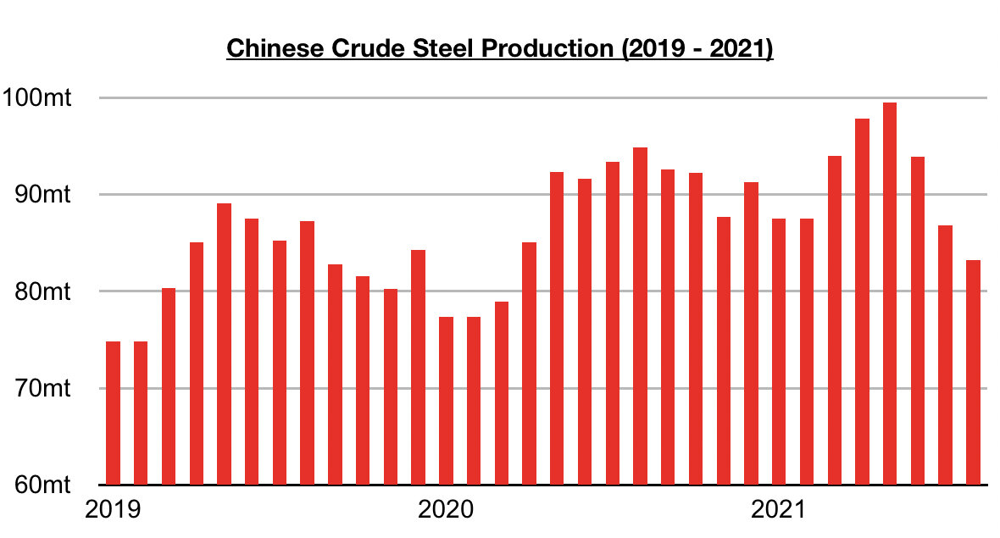
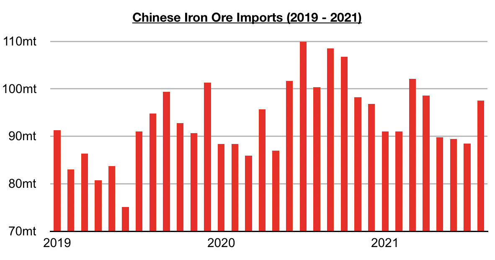
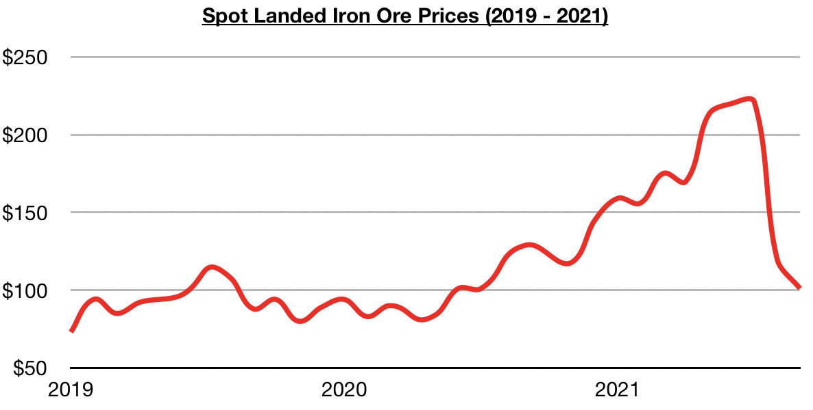
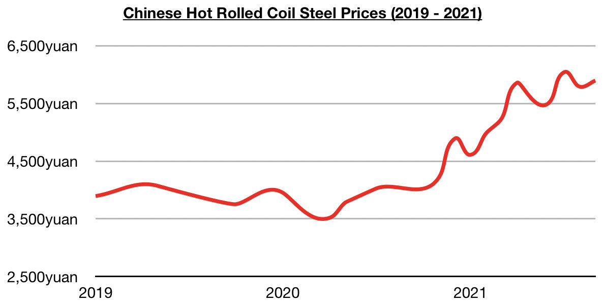

# Divergence in Iron Ore and Steel

**Date:** September 25, 2021  
**Publisher:** Breakwave Advisors | **Category:** Market Insights  
**Original URL:** [https://www.breakwaveadvisors.com/insights/2021/9/25/divergence-in-iron-ore-and-steel](https://www.breakwaveadvisors.com/insights/2021/9/25/divergence-in-iron-ore-and-steel)  

---

*By Jeffrey Landsberg*

As was widely reported recently, crude steel output totaled only 83.2 million tons in August. This has marked a month-on-month decline of 3.6 million tons (-4%), is down year-on-year by 11.7 million tons (-12%), and has marked the smallest amount of steel produced since March 2020.

> **Figure 1: Chart 1**  
> [Local Asset](file:///C:/Users/Dell/Github/Shipping/corpus/03-breakwave/insights/2021/assets/2021-09-25_divergence-in-iron-ore-and-steel_img_chart1_bb75520735d7.jpg)

Crude steel output peaked at 99.5 million tons in May this year and has been coming under consistent pressure ever since. However, iron ore imports — while coming under consistent pressure during April through July — rebounded in August.

> **Figure 2: Chart 2**  
> [Local Asset](file:///C:/Users/Dell/Github/Shipping/corpus/03-breakwave/insights/2021/assets/2021-09-25_divergence-in-iron-ore-and-steel_img_chart2_49c19171e91c.jpg)

As we discussed in our note published on September 7th, China imported 97.5 million tons of iron ore in August which marked a month-on-month increase of 9 million tons (10%) and was the largest amount imported since April. China’s iron ore imports started to fall in March, well before steel output peaked in May, but imports rebounded in August even though steel output has not yet enjoyed a single month of month-on-month growth.

Overall, we continue to stress that iron ore imports can easily climb even when steel output declines. This year’s decline in iron ore imports began well before steel output peaked, and a rebound has also occurred even though steel output has not yet rebounded. While it remains to be seen if imports will climb further in the near term, there is a chance that July's 88.5 million ton import total will mark this year's low. Historically it has been global iron ore production that has dictated China’s iron ore import volume, and iron ore prices now are relatively low and attractive to steel mills. The last ten weeks have seen spot iron ore prices decline by 54%.

> **Figure 3: Chart 3**  
> [Local Asset](file:///C:/Users/Dell/Github/Shipping/corpus/03-breakwave/insights/2021/assets/2021-09-25_divergence-in-iron-ore-and-steel_img_chart3_e72799d9d12d.jpg)

During the same period, Chinese steel prices have increased by 0.2%.

> **Figure 4: Chart 4**  
> [Local Asset](file:///C:/Users/Dell/Github/Shipping/corpus/03-breakwave/insights/2021/assets/2021-09-25_divergence-in-iron-ore-and-steel_img_chart4_586d2e3581b5.jpg)

---

**Tags:** Economy, Steel, Iron Ore  
