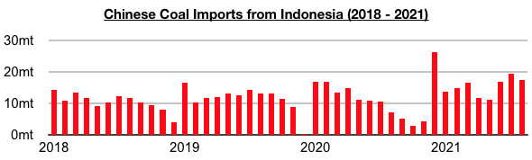
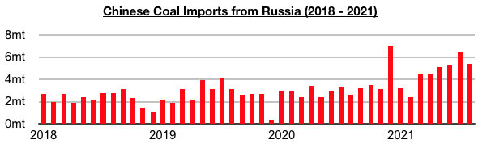
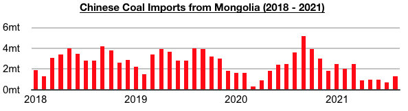
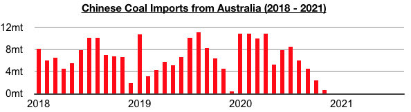
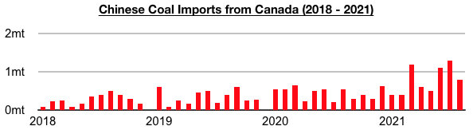
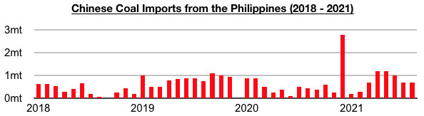

# China's Coal Import Shift Continues

**Date:** September 30, 2021  
**Publisher:** Breakwave Advisors | **Category:** Market Insights  
**Original URL:** [https://www.breakwaveadvisors.com/insights/2021/9/30/chinas-coal-import-shift-continues](https://www.breakwaveadvisors.com/insights/2021/9/30/chinas-coal-import-shift-continues)  

---

*By Jeffrey Landsberg*

Chinese coal import data for August by origin has been released and shows imports from Indonesia have remained the primary source of imports. Also notable is imports from Indonesia, Russia, Canada, the Philippines, the United States, Colombia, and South Africa all experienced year-on-year growth. Imports from Indonesia totaled 17.4 million tons in August, which is down month-on-month by 2 million tons (-10%) but up year-on-year by 10.1 million tons (138%).

> **Figure 1: Chart 1**  
> [Local Asset](file:///C:/Users/Dell/Github/Shipping/corpus/03-breakwave/insights/2021/assets/2021-09-30_chinas-coal-import-shift-continues_img_chart1_c1a9cbaa61fc.jpg)

Imports from Russia totaled 5.4 million tons, which is down month-on-month by 1.1 million tons (-17%) but up year-on-year by 2.8 million tons (108%).

> **Figure 2: Chart 2**  
> [Local Asset](file:///C:/Users/Dell/Github/Shipping/corpus/03-breakwave/insights/2021/assets/2021-09-30_chinas-coal-import-shift-continues_img_chart2_e71d8a7f94cf.jpg)

Imports from Mongolia totaled 1.3 million tons, which is up month-on-month by 600,000 tons (86%) but down year-on-year by 2.3 million tons (-64%). Imports from Mongolia have remained under sporadic pressure from the Chinese government due to Mongolian coronavirus cases.

> **Figure 3: Chart 3**  
> [Local Asset](file:///C:/Users/Dell/Github/Shipping/corpus/03-breakwave/insights/2021/assets/2021-09-30_chinas-coal-import-shift-continues_img_chart3_f1f974bb1655.jpg)

Australia again did not export any coal to China. August has marked the ninth straight month where China did not import any Australian coal.

> **Figure 4: Chart 4**  
> [Local Asset](file:///C:/Users/Dell/Github/Shipping/corpus/03-breakwave/insights/2021/assets/2021-09-30_chinas-coal-import-shift-continues_img_chart4_789301c2bce1.jpg)

Imports from Canada totaled 800,000 tons, which is down month-on-month by 500,000 tons (-38%) but up year-on-year by 250,000 tons (45%).

> **Figure 5: Chart 5**  
> [Local Asset](file:///C:/Users/Dell/Github/Shipping/corpus/03-breakwave/insights/2021/assets/2021-09-30_chinas-coal-import-shift-continues_img_chart5_e45862f23756.jpg)

Imports from the Philippines totaled 700,000 tons, which is the same as seen in July and up year-on-year by 300,000 tons (75%).

> **Figure 6: Chart 6**  
> [Local Asset](file:///C:/Users/Dell/Github/Shipping/corpus/03-breakwave/insights/2021/assets/2021-09-30_chinas-coal-import-shift-continues_img_chart6_65bbb97a7f41.jpg)

Imports from the United States totaled 1.2 million tons, which is up month-on-month by 600,000 tons (100%) and up year-on-year by 500,000 tons (71%). Imports from Colombia totaled 600,000 tons, which is up month-on-month by 300,000 tons (100%) and up year-on-year by 400,000 tons (200%). Imports from South Africa totaled 500,000 tons, which is the same as seen in July and up year-on-year by 500,000 tons.

---

**Tags:** Economy, Coal, Imports, China  
