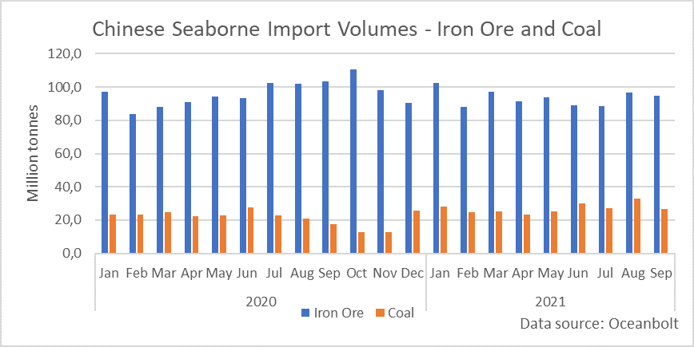
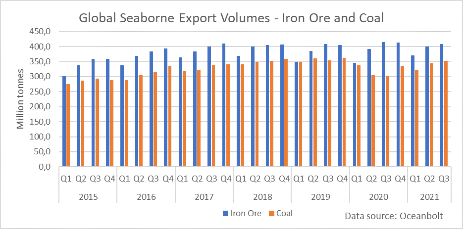

# China: The Not So Golden Week

**Date:** October 01, 2021  
**Publisher:** Breakwave Advisors | **Category:** Market Insights  
**Original URL:** [https://www.breakwaveadvisors.com/insights/2021/10/1/china-the-not-so-golden-week](https://www.breakwaveadvisors.com/insights/2021/10/1/china-the-not-so-golden-week)  

---

*By Ulf Bergman*

This Friday marks the beginning of the Chinese celebrations of its National Day and the following Golden Week. Contrary to last year, the festivities occur in the shadow of rising challenges for the Chinese economy. A year ago, manufacturing exports and imports of commodities were surging, prompting many pundits to believe that we were witnessing a new dawn. Fast forward a year, an uneven recovery with the domestic economy struggling to keep up with the export industry has caught up with the country. The Chinese economy has come under pressure from, among other things, surging commodity prices, the Evergrande debacle and, most recently, the energy crisis. In addition, there are concerns in some quarters about excessive debt levels, especially at the local authority level.

The catalogue of challenges and the rapidly evolving electricity crunch has seen manufacturing activities falling into contraction territory for the first time since the early stages of the pandemic in February 2020. The official manufacturing Purchasing Manager's Index (PMI) was at 49.6 in September versus 50.1 in August, the National Bureau of Statistics reported on Thursday. A survey by Reuters showed analysts had been expecting the index to remain unchanged from the previous month. Beyond a further slowdown in manufacturing, the upcoming public holidays are also unlikely to live up to the expectations regarding a boost in consumer spending and alleviate the situation. The resurgent pandemic and the rising economic headwinds are likely to weigh heavily on consumer sentiment and consumption.

The often contradictory policies regarding economic growth, commodity prices, and environmental protection in China complicate and add to the economy's challenges. The ongoing clampdown on steel production to control inflationary iron ore prices and emissions has borne fruits but are somewhat at odds with the country's ambitious growth targets. Likewise, the ongoing safety and environmental checks of the nation's coal mines have disrupted domestic production at a time when inventories are low following last winter's cold weather. The drive for blue skies for the approaching Winter Olympics has also restricted coal-fired power production, especially in the regions close to the Chinese capital.

The disappointing manufacturing activity suggests that Chinese authorities will introduce additional policy supports to avoid a rapid deceleration in economic growth. Softening external demand and continued virus outbreaks are risks that the economy faces in the near term, but they pale into insignificance in the face of the developing energy crisis. Hence, it is not that much of a surprise that Chinese Vice Premier Han Zheng is reported to have ordered the country's top state-owned energy companies to secure supplies for this winter at any cost. The news also saw many energy prices taking another jump north, as it is likely to trigger increasing global competition for the already scarce energy sources.

The Chinese economy's restrictive policies and problems have also impacted the volumes of commodities discharged in Chinese ports. Both iron ore and coal saw weakening volumes in September compared to the preceding month. While the decline was modest for iron ore, coal discharged in Chinese ports during September fell by nineteen per cent compared to August.

> **Figure 1: Ch1**  
> [Local Asset](file:///C:/Users/Dell/Github/Shipping/corpus/03-breakwave/insights/2021/assets/2021-10-01_china-the-not-so-golden-week_img_ch1_f510d3cda946.png)

Despite the weakening Chinese iron ore and coal imports, global export volumes have kept up rather well. Both iron ore and coal export shipments during the third quarter are broadly in line with the same quarter in 2019 before the pandemic hit. However, iron ore shipments are two per cent below last year's blockbuster third quarter when the Chinese recovery was in full swing. Coal exports during the third quarter, on the other hand, rose by seventeen per cent compared to the previous year.

> **Figure 2: Ch2**  
> [Local Asset](file:///C:/Users/Dell/Github/Shipping/corpus/03-breakwave/insights/2021/assets/2021-10-01_china-the-not-so-golden-week_img_ch2_8dc7ed870f46.png)

New economic stimulus programmes and a newfound ambition to rebuild dwindling energy inventories look set to fuel Chinese imports of coal and commodities. However, as global seaborne volumes for many raw materials have remained stable despite the slowdown in Chinese imports, any increase in Chinese activities will add to the already tight tonnage supply situation in the dry bulk sector and support current freight rates.

---

**Tags:** China, Economy, Crisis  
