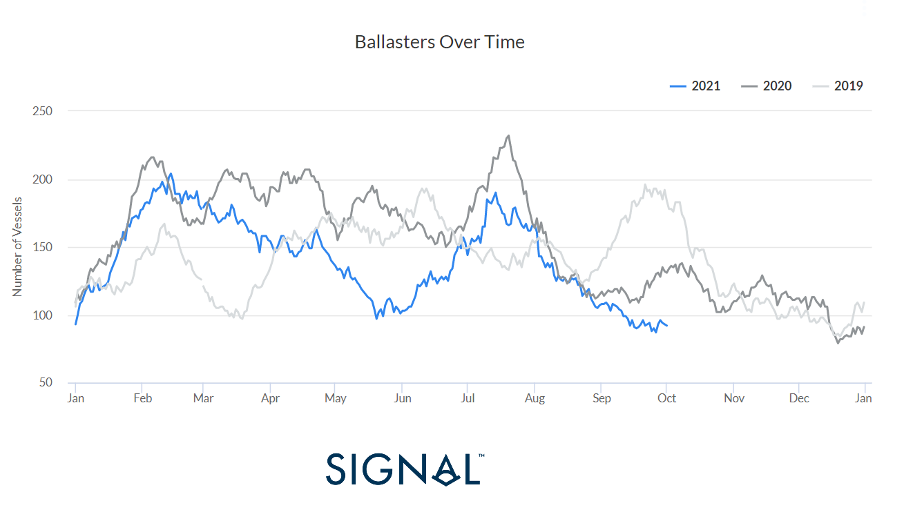
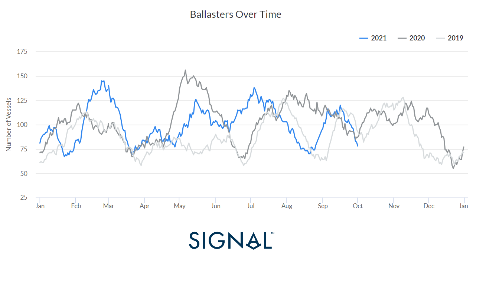

# Dry Bulk Supply Trends: Ballasters’ View over time

**Date:** October 05, 2021  
**Publisher:** Breakwave Advisors | **Category:** Market Insights  
**Original URL:** [https://www.breakwaveadvisors.com/insights/2021/10/5/dry-bulk-supply-trends-ballasters-view-over-time](https://www.breakwaveadvisors.com/insights/2021/10/5/dry-bulk-supply-trends-ballasters-view-over-time)  

---

By Maria Bertzeletou

**A lot of discussion over days about the tight supply tonnage and elevated port congestions driving dry bulk freight rates to new highs. Signal Ocean data gives a clear trend on ballasters’ view over time to analyze the shortage or surplus of tonnage in parallel with the freight market trends.**

Capesize bulkers are nearing record highs of freight rates with panamax ships resembling a similar picture. The Baltic Dry Index keeps increasing despite concerns of the Chinese economy after the collapse of Evergrande. Economist concerns are that if Evergrande is the first domino in a chain to fall, then China may experience something like the credit crunch of 2004-05, when a slowdown in GDP growth there took the wind out of commodity and freight market sails.

Capesize and Panamax freight indices led the Baltic Dry Freight Index to be over 5000 points at the last day of September. The Capesize Freight Index remained close to its highest points in 13 years to 8,944 points and the Panamax Freight Index at 3,382 points.

What is important to note is that the dry freight market is experiencing a shortage of tonnage and expectations are that rates may go even higher if the declining trend persists week by week. In the third quarter of 2021, the Baltic Dry Freight Index gained about 53%, largely driven by the strength in the capesize segment and tight supply tonnage. The recent significant declines in the supply of ships rebalances the concerns about Chinese demand on seaborne trade flows following the recent collapse of Evergrande.

Market concerns are around whether tonnage will flow at a declining pace in the next weeks or change direction to an upward flow of ships that will deleverage the bonanza of the third quarter. It is worth saying that similar significant declining trends in the availability of ships ready to load were noticed back in June 2020 with a 40% drop in the number of capesize vessels for loading in Brazil.

Signal Ocean data reveal the evolution of the number of vessels sailing in ballast status. Image 1 demonstrates the number of panamax bulkers sailing in ballast, at areas of East Africa, South Africa and East Coast India, over time within this year compared to previous years of 2019 and 2020. The number of active panamax vessels for sailing in ballast to load and absorb seaborne demand decreased to 92 vessels at the first day of October, which is 50% down from the highs of 184 vessels at the same date of October 2019. In the capesize segment, the number of vessels sailing in ballast, dropped to less than 80 ships at the first day of October compared to 138 vessels at the beginning of July.

## Panamax 67-85kt DWT

> **Figure 1: Signal1**  
> **Interactive Data & Source:** [Signal Ocean Platform](https://www.thesignalgroup.com/newsroom/dry-bulk-supply-trends-ballasters-view-over-time?fbclid=IwAR1UheGex6kiZfuv1fOFvWT7kDsb6qhlpmC1xirWpuwznsDFumWhEtCvpcY) | [Local Asset](file:///C:/Users/Dell/Github/Shipping/corpus/03-breakwave/insights/2021/assets/2021-10-05_dry-bulk-supply-trends-ballasters-view-over-time_img_signal1_08498c9cce03.png)

## Capesize 120-220kt DWT

> **Figure 2: Signal2**  
> **Interactive Data & Source:** [Signal Ocean Platform](https://www.thesignalgroup.com/newsroom/dry-bulk-supply-trends-ballasters-view-over-time?fbclid=IwAR1UheGex6kiZfuv1fOFvWT7kDsb6qhlpmC1xirWpuwznsDFumWhEtCvpcY) | [Local Asset](file:///C:/Users/Dell/Github/Shipping/corpus/03-breakwave/insights/2021/assets/2021-10-05_dry-bulk-supply-trends-ballasters-view-over-time_img_signal2_852dcbef8786.png)

So far the bulker freight market remains unperturbed and owners have enjoyed a remarkable growth of earnings in the last 12 months. It seems that spot freight market rates will continue their upward trend and Pacific Asia even more as the supply of tonnage appears to be even tighter and combined with accelerated number of port congestion at Chinese ports will strongly support the upward trend of freight rates.

We will continue to monitor the supply trends during the fourth quarter and the volatility of freight rates along with port congestion and port’s operating efficiency at major hubs in the Atlantic and Pacific. Demand fundamentals have surely returned firm and the challenge is the supply trends month by month with direct impact on charterers'-owners' negotiations and voyages optimization for maximum profitability on both sides.

**Main source**[**: Signal Ocean**](https://www.thesignalgroup.com/newsroom/dry-bulk-supply-trends-ballasters-view-over-time?fbclid=IwAR1UheGex6kiZfuv1fOFvWT7kDsb6qhlpmC1xirWpuwznsDFumWhEtCvpcY)

---

**Tags:** Shipping, Dry Bulk, Capesize, Panamax  
