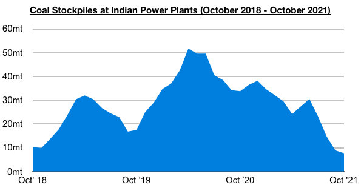

# India Likely to Experience Largest Ever Blackouts Soon

**Date:** October 07, 2021  
**Publisher:** Breakwave Advisors | **Category:** Market Insights  
**Original URL:** [https://www.breakwaveadvisors.com/insights/2021/10/6/india-likely-to-experience-largest-ever-blackouts-soon](https://www.breakwaveadvisors.com/insights/2021/10/6/india-likely-to-experience-largest-ever-blackouts-soon)  

---

Global Market Possibly Could Ultimately See "Coal At Any Price" / "Freight At Any Price"

*By Jeffrey Landsberg*

India’s power plant coal stockpiles now stand at only 7.7 million tons. This is 500,000 tons (-6%) less than was stockpiled at the end of last week, down year-on-year by 26.3 million tons (-77%), and marks the lowest amount stockpiled since October 2017. The stockpiles collectively are still able to meet only 4 days of demand, even though the normal requirement for this time of year is to meet 21 days of demand. We are unaware of any other time when India's stockpiles have been able to meet only 4 days of demand. Also of note is that among the nation's power plants, 14 power plants can meet only 3 days of demand, 20 can meet only 2 days of demand, 25 can meet only 1 day of demand, and 16 are not able to meet any demand. This issue will be discussed in greater detail in Commodore's next Weekly Dry Bulk Report.

> **Figure 1: Chart 1**  
> [Local Asset](file:///C:/Users/Dell/Github/Shipping/corpus/03-breakwave/insights/2021/assets/2021-10-07_india-likely-to-experience-largest-ever-blackouts-soon_img_chart1_30f7976d9e51.jpg)

Overall, we expect that India will experience its largest ever blackouts soon. It would not be surprising to us if this occurs this month. India's largest ever blackouts (and also the world's largest) occurred back on July 30-31, 2012. During this two-day period, approximately 600 million Indians were left without any power. If and when India does experience large blackouts this year, it will further turn the world's attention to the ongoing energy crisis -- which of course already remains a significant issue in China and other nations as well.

In China, the energy crisis is already well underway. Power rationing remains in effect in China, and recent days prior to the current holiday saw even more power outages in both the industrial and residential sectors. This has prompted China's National Power Grid last month to finally announce that it will be "fighting a battle" to ensure there is electricity across the nation, and more recently government officials reportedly ordered the country’s top state-owned energy companies to secure supplies for this winter at all costs. Many local officials this week have also promised to do everything possible to expand coal supplies and guarantee electricity during the upcoming winter season.

In the global dry bulk shipping market, freight rates are already at generational highs and thermal coal prices are at record levels. There is a chance that the world could see the situation intensify to the point where coal is seemingly being purchased at any price available, and the same too with paying to secure dry bulk vessels to ship the coal. An energy crisis in October is problematic. An energy crisis in winter months is even more problematic. Winter is fast approaching, and the world is likely to see dramatic events unfold. We will be continuing to monitor all new developments closely and will be continuing to analyze these issues in our weekly reports and special mid-week updates.

---

**Tags:** Energycrisis, India, Coal  
