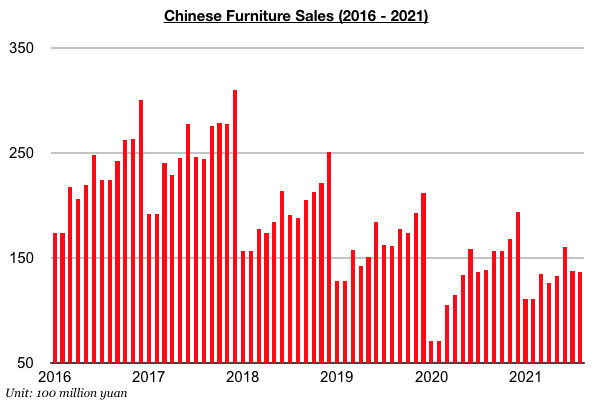
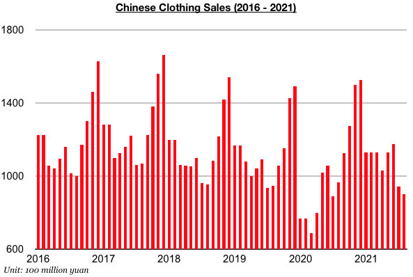
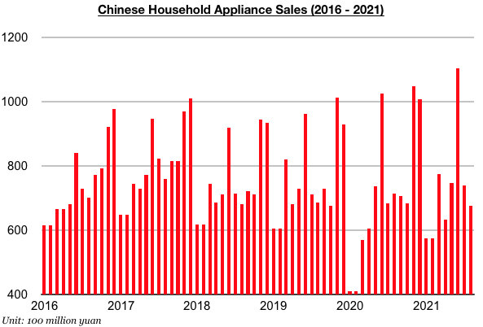

# Chinese Consumer Market Under New Pressure

**Date:** October 08, 2021  
**Publisher:** Breakwave Advisors | **Category:** Market Insights  
**Original URL:** [https://www.breakwaveadvisors.com/insights/2021/10/8/chinese-consumer-market-under-new-pressure](https://www.breakwaveadvisors.com/insights/2021/10/8/chinese-consumer-market-under-new-pressure)  

---

*By Jeffrey Landsberg*

As has been widely reported, China’s retail sales in August grew year-on-year by only 2.5% and marked a drastic change from the 8.5% year-on-year growth seen in July. The growth also marked the lowest seen since August 2020. The government now needs to have consumer spending significantly improve if China’s overall economy is to be able to enjoy at least moderate growth as desired. To this end, the sharp decline in consumer spending has been partially responsible for the central government again turning more accommodative recently (the Evergrande situation has also ushered in more support).

Of particular note is that furniture, clothing, and household appliance sales in China — which had previously been enjoying a turnaround — all contracted on a year-on-year basis last month. Furniture sales in China totaled approximately 13.7 billion yuan, which has marked a year-on-year contraction of 1%. Furniture sales in China had previously increased on a year-on-year basis during six of the previous seven months.

> **Figure 1: Chart 1 (1)**  
> [Local Asset](file:///C:/Users/Dell/Github/Shipping/corpus/03-breakwave/insights/2021/assets/2021-10-08_chinese-consumer-market-under-new-pressure_img_chart128129_904c67a529e1.jpg)

Clothing sales (which includes garments, footwear, hats, and knitwear) in China have contracted by an even larger amount. Clothing sales in China in August totaled approximately 90 billion yuan, which has marked marked a year-on-year contraction of 7%. China’s domestic clothing sales had previously increased on a year-on-year basis for twelve consecutive months.

> **Figure 2: Chart 2**  
> [Local Asset](file:///C:/Users/Dell/Github/Shipping/corpus/03-breakwave/insights/2021/assets/2021-10-08_chinese-consumer-market-under-new-pressure_img_chart2_1ee895a1bb35.jpg)

Household appliance sales totaled approximately 67.7 billion yuan in August, which has marked a year-on-year contraction of 5%. Household appliance sales had previously grown on a year-on-year basis for ten consecutive months.

> **Figure 3: Chart 3**  
> [Local Asset](file:///C:/Users/Dell/Github/Shipping/corpus/03-breakwave/insights/2021/assets/2021-10-08_chinese-consumer-market-under-new-pressure_img_chart3_89c3c0308a3b.jpg)

---

**Tags:** China, Economy, Market  
