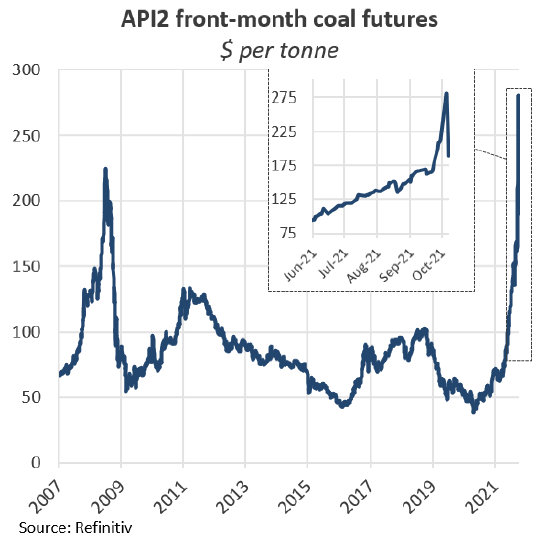
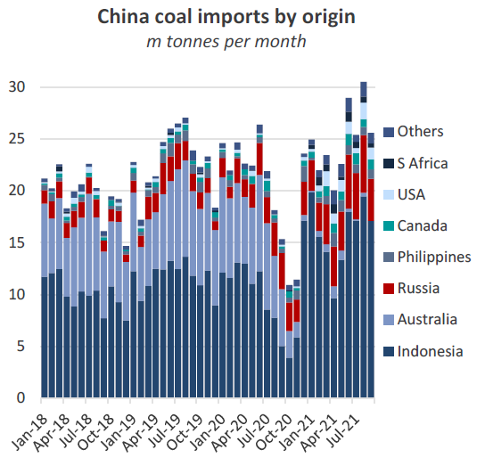
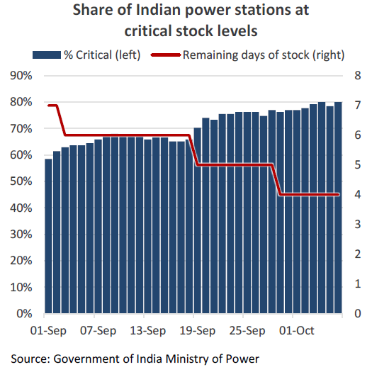
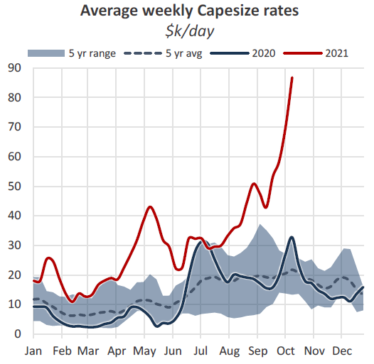

# The Big Picture: Energy markets

**Date:** October 09, 2021  
**Publisher:** Breakwave Advisors | **Category:** Market Insights  
**Original URL:** [https://www.breakwaveadvisors.com/insights/2021/10/9/the-big-picture-energy-markets](https://www.breakwaveadvisors.com/insights/2021/10/9/the-big-picture-energy-markets)  

---

*By Nick Ristic*

Coal chaos

The shipping markets have been pulled further into wild markets of coal and other energy sources. Given how nebulous this sector is, it’s always difficult to point to individual stories that are impacting freight, the below is an overview of how shipping is being affected in the various corners of this market.

### Enormous Volatility

Another day, another supply chain crisis. Since we last wrote about coal a few weeks ago, the market has continued to tighten, with the commodity becoming exceptionally scarce. This week, prices delivered in Europe (API2), for example, surged to record levels of $280 per tonne, a more than 300% increase since the start of the year and 25% higher than the peak of 2008. Prices for thermal coal here were in part dragged up by surging gas costs. In Europe, benchmark LNG prices also turned parabolic this week, with near-term futures touching a high of €155 per MWh, translating to a 657% gain YTD.

However prices dramatically corrected downwards yesterday on news of imminent increased Russian supply. At the time of writing, futures have swung below €100 per MWh. This appears to have put a dent in Coal prices in the region too, which slumped to $190 per tonne earlier today and have since stabilised around $214.

> **Figure 1: Market Chart 1**  
> [Local Asset](file:///C:/Users/Dell/Github/Shipping/corpus/03-breakwave/insights/2021/assets/2021-10-09_the-big-picture-energy-markets_img_image028129_774475b828b5.png)

Still, despite these wild moves, prices are such that coal-fired power generators here have been strongly incentivised to increase utilisation rates and import more coal where possible. Europe’s imports were up by 34% YoY in Q3, reaching 11.6m tonnes, and there is scope for this to grow if generating capacity can be found.

Amid peak gas prices this week, the cost of generating electricity from coal was as much as 50% cheaper versus using gas, accounting for the cost of burning the former under the EU emissions trading scheme. Given the extent of coal power capacity cuts in Europe over the last few years however, there is likely a ceiling to how far imports can rebound, but the shortage here is just one facet to how coal is driving freight.

### China Getting Tighter

As we have written for much of this year, China has been facing extremely high coal prices due to its import quotas, the ban on Australian supply, COVID-related restrictions on overland imports and shortfalls in domestic supply. But in recent weeks the situation has deteriorated and end-users are scrambling for material. Inventories at China’s power stations currently translate to eleven days of supply, the lowest this metric has been in five years, while power supply for energy-intensive industries, such as cement and fertiliser production, has been rationed.

Despite the official ban on Australian cargoes still being in place, China’s total coal imports over Q3 surged by 47% YoY to 27.2m tonnes, buoyed by a surge in volumes from nearby suppliers Indonesia and Russia. But these volumes have not been able to satisfy demand, especially for higher-grade material. As a result, we’ve also seen a jump in imports from further afield, such the US, volumes of which were up almost seven-fold YoY in Q3 at 1.2m tonnes. Imports from Canada, Colombia and Mozambique were also up by 74%, 189% and 341% YoY respectively. And even more indicative of scarce supply is, this week we heard of coal from Kazakhstan being shipped to China in a Cape (via Russia).

> **Figure 2: Market Chart 2**  
> [Local Asset](file:///C:/Users/Dell/Github/Shipping/corpus/03-breakwave/insights/2021/assets/2021-10-09_the-big-picture-energy-markets_img_image1_db9be6a5efb8.png)

The upshot of this shake-up is that average Cape employment per tonne of coal shipped increased by about 4% in Q3 versus the same period last year. The dislocation of the fleet caused by these trends has meant that Capes are on average ballasting 6% longer for coal cargoes versus before the pandemic.

### India Too

More recently, India has joined the ranks of countries experiencing fuel shortages, helping to propel coal prices higher. Coal India, the country’s state-owned producer that accounts for about 80% of the country’s output has seen its operations throttled by flooding, while Indian power demand is resurging from the pandemic lows. At the same time, imports, which typically satisfy about a quarter of India’s demand have dipped over the last couple of months because of the surge in prices. With many utilities locked into long-term energy supply contracts at fixed prices, their purchases on the seaborne market are extremely price-sensitive.

In the longer-term, a recovery in domestic output and the winter slowdown in power demand will likely ease shortages, but with short-term domestic supply becoming extremely tight, the government may act to bolster imported volumes. Based on the latest government reports, 80% of Indian coal power stations are operating at ‘critical’ or ‘super-critical’ levels of inventories, meaning their stocks are below 3 to 9 days of supply, depending how far the utility is from a coal mine.

> **Figure 3: Market Chart 3**  
> [Local Asset](file:///C:/Users/Dell/Github/Shipping/corpus/03-breakwave/insights/2021/assets/2021-10-09_the-big-picture-energy-markets_img_image2_fbeb65074389.png)

### Freight

Amid this coal rush, freight rates have also surged for the larger bulk carriers, with Capesize utilisation rates now at the extremely high levels that the geared ships have been at for the last few months. The bump in demand has come on top of healthy volumes of iron ore shipments in both basins and continued congestion issues in China, which are currently sapping about 6.6% of Capesize supply. Headlines were made this week when average Cape earnings surged to $86,870 per day, levels last seen in 2009, and with rates in exponential territory, a push above the $100,000 mark is not out of the question.

> **Figure 4: Market Chart 4**  
> [Local Asset](file:///C:/Users/Dell/Github/Shipping/corpus/03-breakwave/insights/2021/assets/2021-10-09_the-big-picture-energy-markets_img_image3_29b3a68679ca.png)

Naturally the FFA market has also seen a frenzy of buying activity, though prices have wobbled over the last two days amid the extreme volatility in energy markets. October Capesize futures surged by $22,000 in the space of a week to over $80,000 on Wednesday, before easing back to $73,500 at the time of writing. Meanwhile, deferred contracts for calendar-year 2022 jumped by 12.5% WoW to $29,500, more than twice what they were trading at in January, before being knocked back down to $27,000.

Looking forward, demand for coal is likely to remain strong as winter approaches in the northern hemisphere, but it remains to be seen how much additional seaborne supply can be found. If more cargoes do emerge from smaller exporters they will continue to have a disproportionate effect on the Cape market and could push rates higher. If North American exporters, for example, can bring more supply to the water and take advantage of high prices, they could potentially insulate the market from a slowdown in iron ore shipments during the Brazilian rainy season later in the year. Per tonne of cargo, coal shipments from the US to China generate 87% more Capesize employment versus those from Russia, and 159% more than shipments from Indonesia. Similarly, if China can coax more supply out of South Africa, these volumes could peel some more ships away from the Brazil ballaster list, and help to tighten the Atlantic Market.

---

**Tags:** Global Economy, Energy, Coal  
