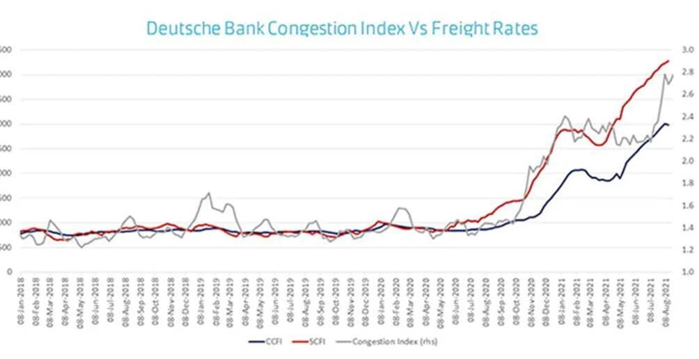

# Port congestions aren’t dealt with interest rate hikes

**Date:** October 11, 2021  
**Publisher:** Breakwave Advisors | **Category:** Market Insights  
**Original URL:** [https://www.breakwaveadvisors.com/insights/2021/10/11/port-congestions-arent-dealt-with-interest-rate-hikes](https://www.breakwaveadvisors.com/insights/2021/10/11/port-congestions-arent-dealt-with-interest-rate-hikes)  

---

*By George Lagarias*

As inflation is rising and energy prices are soaring, central banks are preparing to deal with the possibility of having to raise interest rates to fight it. The Fed has said that asset purchase tapering is in the cards in the next two months and interest rate hikes near the end of 2022, while the ECB last week noted that “inflation risks are now tilted on the upside”.

The question before us is: The world’s major central banks are arguably the most powerful institutions run by unelected leaders. They are staffed (and stuffed) with some of the brightest economic minds available. The analysis produced internally informs decisions that will affect millions upon millions of consumers and businesses across the globe. Their conclusions and intentions are followed by almost all major investment organisations, corporate treasuries, business leaders in the world.

And when inflation goes up, surely they must raise rates.

Far be it from us to ever question their divinations. And yet, it beggars belief to assume that their weapon of choice to deal with port congestions is … interest rates.

Central banks appear to be faithful disciples of two pieces of theory:

One: Milton Friedman’s “inflation is always and everywhere a monetary phenomenon”. Inflation is a result of more money into the system, leading to higher demand. Flush that money away by raising the cost of money, and we should return to equilibrium prices.

Two: Inflation expectations are self-fulfilling prophecies. If only people can believe higher rates will fight inflation, then surely inflation should come down.

Policy makers should question whether these two tenants hold. Milton Friedman died in 2006, 94 years old, never having fully experienced globalisation, let alone de-globalisation. He described a very different world, even if energy prices are reminiscent of the 70’s. Yet what we are experiencing today is a profound disruption in global supply chains, that transcends energy price volatility. It is the first stress test of a global system built in the last thirty years to transfer anything, everywhere in a matter of days.

> **Figure 1: Market Chart 1**  
> [Local Asset](file:///C:/Users/Dell/Github/Shipping/corpus/03-breakwave/insights/2021/assets/2021-10-11_port-congestions-arent-dealt-with-interest-rate-hikes_img_image002_67ac38487bfc.jpg)

A system we attacked politically, before Covid-19 attacked it physically, and without a credible alternative. Hiking interest rates might have worked in the late 70’s, but a tool with a nine-month horizon is too slow to solve the port congestion problem. According to global shipping behemoth Maersk, this congestion is unlikely to resolve itself before 2022. And even if it does, higher rates on top of soaring energy prices could seriously inhibit the confidence of a consumer tempered by two decades of secular stagnation.

As for inflation expectations needing to fall, apologies, but in the[words](../pdfs/2021-10-11_port-congestions-arent-dealt-with-interest-rate-hikes_2021062pap_6ecd13a8e172.pdf)of Fed researcher Jeremy B. Rudd, “mainstream economics is replete with ideas that “everyone knows” to be true, but that are actually arrant nonsense”. The link between inflation and inflation expectations is backwards. Expectations, surveys really, reflect what has already transpired, not what is newly expected. So ‘talking’ future rates up might steepen the yield curve enough to keep pension funds afloat, but beyond that it has little to do with actually fighting inflation.

**If major central banks meaningfully raise rates before any serious fiscal easing in the US and the EU, we fear that we could be staring down the barrel of a policy mistake.**

**For the time being, we assume that hawkish rhetoric is used to influence the yield curve and maintain the illusion of control of the economy. We thus remain dovish, and equal weight in risk assets, in line with what we believe are the true intentions of the world’s central banks.**

---

**Tags:** Economy, Inflation, Shipping  
