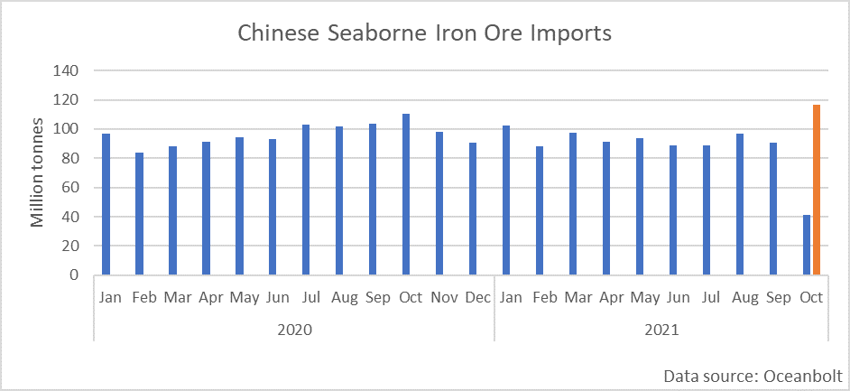
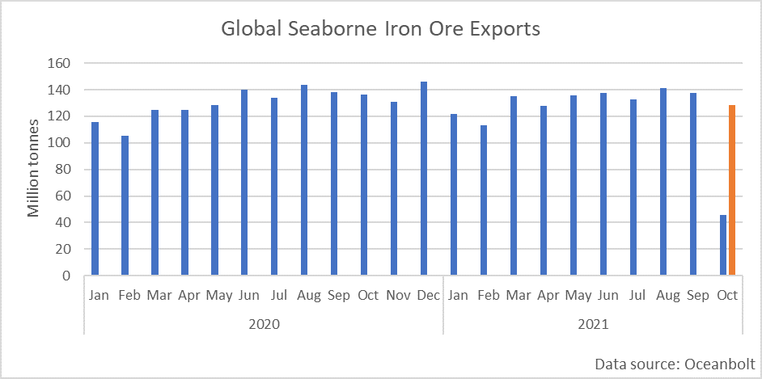
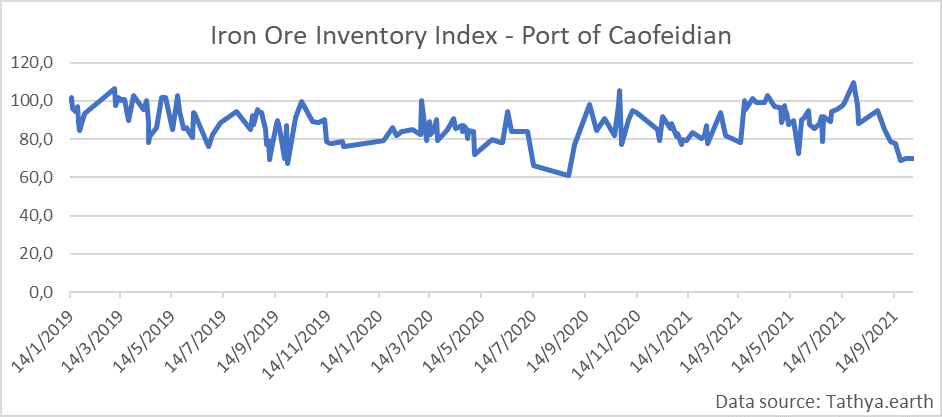
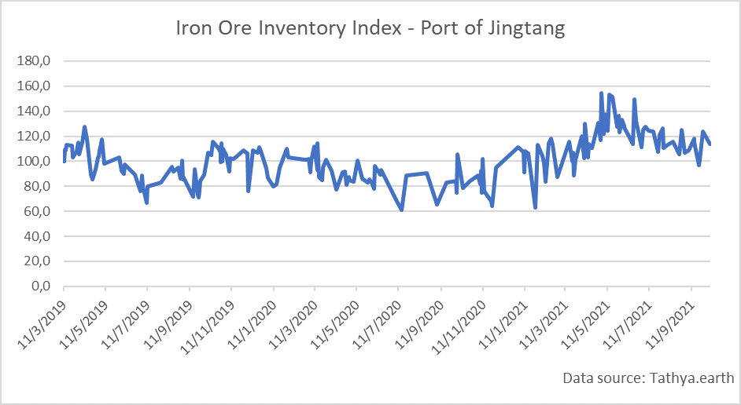

# Iron Ore: A Recovery in the Shadow of the Energy Crisis

**Date:** October 13, 2021  
**Publisher:** Breakwave Advisors | **Category:** Market Insights  
**Original URL:** [https://www.breakwaveadvisors.com/insights/2021/10/13/iron-ore-a-recovery-in-the-shadow-of-the-energy-crisis](https://www.breakwaveadvisors.com/insights/2021/10/13/iron-ore-a-recovery-in-the-shadow-of-the-energy-crisis)  

---

*By Ulf Bergman*

As Chinese Golden Weeks come, the latest instalment did not conform to traditions and is likely to be treated as an outlier by analysts in the coming years. The weeklong national celebrations are typically the trigger for a slowdown in commodities and shipping markets activities, with prices and freight rates softening to some extent. While the rest of the world continues to trade, the sheer dominance of China in the markets usually mean it will have a global impact. However, this year anyone who had looked forward to a quiet week was sorely disappointed. The unfolding global energy crisis saw energy and freight markets gaining considerable ground last week, with coal reaching an all-time high and the Baltic Dry Index reaching a thirteen-year high.

Somewhat in the shadow of events in the energy markets, iron ore has unexpectedly gone from a straggler to a top performer among commodities. After a twelve-month rally that saw iron ore prices almost tripling, the commodity shed nearly sixty per cent from its peak in May to the latter parts of September. However, the steel-making ingredient has staged a comeback in recent weeks with a gain of around fifty per cent. An expectation of rising Chinese steel production following greater than expected production cuts among the steelmakers in September has driven the recovery. Recent weeks’ disappointing Chinese economic data could also force Beijing to expand stimulus policies and relax the clampdown on pollution to avoid falling short of the growth targets. Still, the squeeze on energy supplies is likely to limit the extent of such measures. At the same time, the surging iron ore prices will curb profit margins for the steel mills, as they may be unable to pass on the higher costs to their domestic customers in the property and construction sectors. The headwinds that these sectors face following the fallout of the Evergrande debacle have constrained their ability to absorb increasing costs and restrict any rise in steel demand.

While the developing energy crisis may curtail steel production and, by extension, iron ore demand, the Chinese seaborne imports of the ore appears to have recovered in October. After volumes in September declined both month-on-month and year-on-year, data from Oceanbolt suggest October could post some awe-inspiring numbers. During the first third of the month, around 41 million tonnes were discharged in Chinese ports, already representing 45 per cent of the entire volumes of September. Assuming the early month volumes are representative for the whole of the month, it suggests that the total for October could reach a new record of 116 million tonnes.

> **Figure 1: Ch1**  
> [Local Asset](file:///C:/Users/Dell/Github/Shipping/corpus/03-breakwave/insights/2021/assets/2021-10-13_iron-ore-a-recovery-in-the-shadow-of-the-energy-crisis_img_ch1_69c184316f1f.png)

At the same time as China could be on course for record-breaking iron ore imports during October, global exports during the same month may turn out to be a bit of a disappointment. The early parts of October have seen some 46 million tonnes of iron ore exported globally, suggesting that volumes for the whole month may struggle to match the ones of September and the same month last year. Given the lead time involved in iron ore shipping, the decreasing export volumes may suggest that Chinese imports will soften in the coming months.

> **Figure 2: Ch2**  
> [Local Asset](file:///C:/Users/Dell/Github/Shipping/corpus/03-breakwave/insights/2021/assets/2021-10-13_iron-ore-a-recovery-in-the-shadow-of-the-energy-crisis_img_ch2_3afb665a6530.png)

The reduced Chinese imports during September, following a month-on-month decline of six per cent, has seen inventory levels in some ports continuing their downward trend. In the largest Chinese port for iron ore imports, Caofeidian, the stockpiles have shrunk sharply since their peak in July and are at some of the lowest levels observed since the beginning of 2019.

> **Figure 3: Ch3**  
> [Local Asset](file:///C:/Users/Dell/Github/Shipping/corpus/03-breakwave/insights/2021/assets/2021-10-13_iron-ore-a-recovery-in-the-shadow-of-the-energy-crisis_img_ch3_e805f21961e8.png)

Jingtang, the second-largest iron ore port in China last year, has also seen its inventory levels trending south in recent months. However, the decline is less pronounced than in Caofeidian, and the stockpiles remain above their historical average. For some of the smaller iron ore ports, such as Qingdao and Rizhao, inventories have, on the other hand, been building, according to satellite data from Tathya. earth.

> **Figure 4: Ch4**  
> [Local Asset](file:///C:/Users/Dell/Github/Shipping/corpus/03-breakwave/insights/2021/assets/2021-10-13_iron-ore-a-recovery-in-the-shadow-of-the-energy-crisis_img_ch4_582ef24865e7.png)

Suppose the expected increase in Chinese steel production materialises. In that case, seaborne iron ore imports are likely to continue to pick up, especially as inventories in two of the largest ports remain low. However, the ongoing energy crunch may force steel mills to reduce production. The current flooding in the Shanxi province, China’s most significant coal-producing region, could further exaggerate the energy shortage and send steel production lower. Therefore, an extended disruption in the coal hub could see Chinese iron ore demand decrease but increase the appetite for seaborne coal imports.

---

**Tags:** Economy, Energycrisis, Iron Ore  
