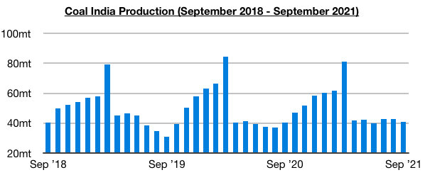
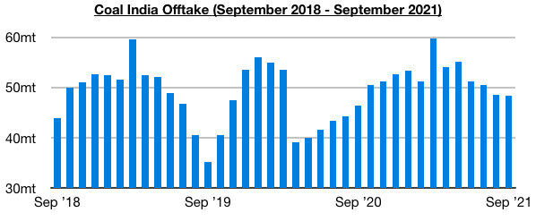
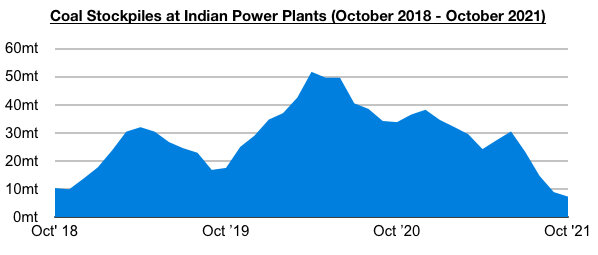

# About Those Vanishing Coal India Production Targets...

**Date:** October 14, 2021  
**Publisher:** Breakwave Advisors | **Category:** Market Insights  
**Original URL:** [https://www.breakwaveadvisors.com/insights/2021/10/13/about-those-vanishing-coal-india-production-targets](https://www.breakwaveadvisors.com/insights/2021/10/13/about-those-vanishing-coal-india-production-targets)  

---

*By Jeffrey Landsberg*

Coal India produced approximately 40.7 million tons of coal last month, which marks a month-on-month decline of 1.9 million tons (-4%) and is just 200,000 tons more than was produced in September 2020. Heavy rainfall has contributed to production coming under more pressure recently — but, frankly, production has stayed low for many months. Coal India has continued to show that it is unable to meet the nation’s coal needs.

> **Figure 1: Chart 1 (2)**  
> [Local Asset](file:///C:/Users/Dell/Github/Shipping/corpus/03-breakwave/insights/2021/assets/2021-10-14_about-those-vanishing-coal-india-production-targets_img_chart128229_b56e2c824334.jpg)

Offtake totaled 48.3 million tons last month, which marks a month-on-month decline of 300,000 tons (-1%) and a year-on-year increase of 1.8 million tons (4%). Offtake has now increased on a year-on-year basis for seven consecutive months, but since June it has been declining consistently on a month-on-month basis.

> **Figure 2: Chart 2 (1)**  
> [Local Asset](file:///C:/Users/Dell/Github/Shipping/corpus/03-breakwave/insights/2021/assets/2021-10-14_about-those-vanishing-coal-india-production-targets_img_chart228129_4b974a4955a5.jpg)

More coal is desperately needed at Indian power plants, but Coal India is simply not able to come close to meeting demand (Coal India contributes to around 80% of India’s domestic coal output). India's power plant stockpiles ended last week at approximately 7.3 million tons, which is 900,000 tons (-11%) less than was stockpiled at the end of the previous week. India’s power plant coal stockpiles have now declined during fifteen of the last sixteen weeks and are down year-on-year by 26.4 million tons (-78%). This marks the lowest amount since October 2017. The stockpiles are able to meet only 4 days of demand, even though the normal requirement for this time of year is to meet 21 days of demand.

> **Figure 3: Coal India Is the Type of Company That Rather Than Actually**  
> *Coal India is the type of company that rather than actually striving for success in reaching its targets, it instead simply stops publishing targets. We continue to have no confidence in Coal India being able to meet the nation’s demand in the near-term, and we continue to view India as a whole as having seemingly no choice but to import more coal regardless of high prices. While high imported coal prices is a concern to authorities, the costshouldbe passed off to the electricity producers in our view. Having expensive electricity in a society is not nearly as problematic as not having the electricity.*  
> [Local Asset](file:///C:/Users/Dell/Github/Shipping/corpus/03-breakwave/insights/2021/assets/2021-10-14_about-those-vanishing-coal-india-production-targets_img_chart328129_fe43579efbd3.jpg)

As we also highlighted many years ago, Coal India’s chronic inability to meet its production targets led the company to stop publishing official targets back in 2018. As we discussed often in Commodore's Weekly Dry Bulk Reports in 2017 and 2018, Coal India’s production during much of 2017 and the first half of 2018 continued to miss targets. During April 2017 through June 2018, production was not able to meet its target in thirteen of fifteen months. June 2018 alone saw production come in at 7.9 million tons under the target (which marked the largest failure seen during those two years). July 2018 then suddenly saw targets permanently removed from official reports

---

**Tags:** Economy, Coal, India  
