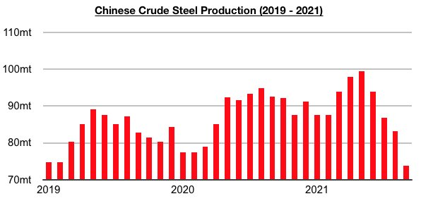
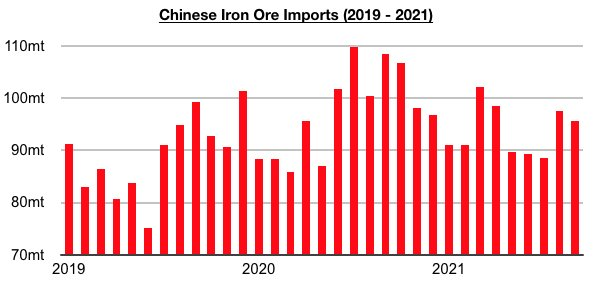

# Ongoing Divergence in Chinese Steel Production and Iron Ore Imports

**Date:** October 20, 2021  
**Publisher:** Breakwave Advisors | **Category:** Market Insights  
**Original URL:** [https://www.breakwaveadvisors.com/insights/2021/10/20/ongoing-divergence-in-chinese-steel-production-and-iron-ore-imports](https://www.breakwaveadvisors.com/insights/2021/10/20/ongoing-divergence-in-chinese-steel-production-and-iron-ore-imports)  

---

*By Jeffrey Landsberg*

One issue very much worthy of conversation but still often ignored is that China's iron ore imports and steel production have been diverging recently. China's steel production peaked back in May at 99.5 million tons, and then fell each month in June, July, August, and September (with September seeing production reach a low of 73.8 million tons).

> **Figure 1: Chart 1 (3)**  
> [Local Asset](file:///C:/Users/Dell/Github/Shipping/corpus/03-breakwave/insights/2021/assets/2021-10-20_ongoing-divergence-in-chinese-steel-production-and-iron-ore-imports_img_chart128329_0bac125c57dc.jpg)

However, July has marked this year's low in monthly iron ore import volume. China's iron ore imports peaked this year at 102.1 million tons back in March, and then fell each month in April, May, June, and July (with July seeing imports reach a low of 88.5 million tons). Iron ore imports then increased to 97.5 million tons in August, and in September they remained well above July's low as they came in at 95.6 million tons.

> **Figure 2: Chart2**  
> [Local Asset](file:///C:/Users/Dell/Github/Shipping/corpus/03-breakwave/insights/2021/assets/2021-10-20_ongoing-divergence-in-chinese-steel-production-and-iron-ore-imports_img_chart228229_b5acd5bd5076.jpg)

In our Weekly Dry Bulk Reports and Weekly China Reports this year, we have continued to stress that China's iron ore imports can remain steady and even climb when steel production is declining. This has remained true for short and medium-term durations, and also even longer periods. As we have often stressed in our reports, China’s iron ore imports have historically stayed resilient even during the years where China's steel production has had low growth or even contracted. During the last ten years, there have been three years where China’s steel production grew by less than 5% (2012, 2015, and 2016) — and during all of these years China’s iron ore imports set records. Iron ore imports during these years also grew year-on-year by an average of 6%, while steel production during these years averaged growth of just 1%. This included 2015 which saw steel production decline by 2% while iron ore imports rose by 2%.

Overall, it has historically been global iron ore production that dictates China’s iron ore import volume. While it remains to be seen just how iron ore imports will fare going forward, both history and recent trade volume should at the very least be part of the conversation for what comes next with iron ore imports. As we also highlighted in our most recent Weekly Dry Bulk Report, China's iron ore imports even remained steady both leading up to and during the 2008 Beijing Olympics. China's steel production fell leading up to and during those Olympics (in order to help improve air quality), but iron ore imports did not come under any significant pressure.

---

**Tags:** China, Steel, Iron Ore  
