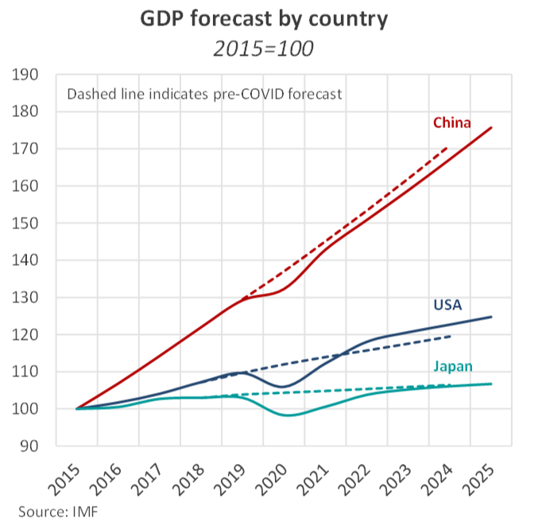
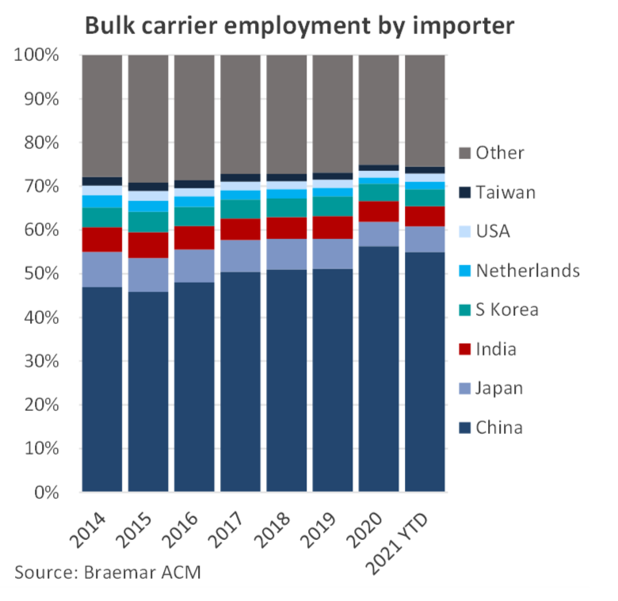
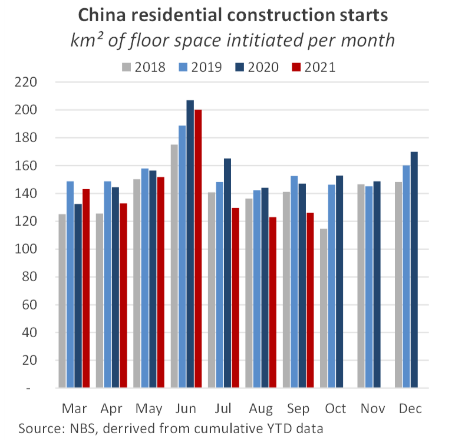

# The Big Picture: Global economic outlook

**Date:** October 23, 2021  
**Publisher:** Breakwave Advisors | **Category:** Market Insights  
**Original URL:** [https://www.breakwaveadvisors.com/insights/2021/10/22/the-big-picture-global-economic-outlook](https://www.breakwaveadvisors.com/insights/2021/10/22/the-big-picture-global-economic-outlook)  

---

*By Nick Ristic*

### Mixed Bag

The IMF has just released its latest World Economic Outlook, tweaking global output growth projections. Since the last outlook in April, revisions have been modest, but relative to the group’s pre-pandemic forecasts, a divide is opening up between the world’s largest economies.

### Global Outlook

Since the IMF’s last World Economic Outlook (WEO) in April there have been modest changes to the group’s projections of global output. World economic growth is forecast to settle at 4.9% in 2021, 0.1 percentage points lower than previously expected, while 2022 growth has been bumped up by half a percentage point to 4.9%. On the regional level however there have been some more significant revisions. The US’ economy, which sets the tone for the developed world, is projected to grow by 6% in 2021. This is down by 0.4 percentage points from the last fully-fledged outlook, but is a whole point lower than the intermediate update released by the fund in July, reflecting the recent supply chain issues and lower than expected consumption.

2022 growth, however, has now been pegged at 5.2%, up from 3.5% previously. This significant upward revision incorporates hefty infrastructure spending, and a stronger vaccine-fuelled rebound in the first half of the year. Compared to the forecasts made before COVID hit, these long-term upward revisions are even more stark: in October 2019, the IMF expected the US economy to grow by just 1.6% in 2022. The most recent expectations of 2023 growth at 2.2% are also 0.6 percentage points higher than the pre-pandemic numbers.

> **Figure 1: Market Chart 1**  
> [Local Asset](file:///C:/Users/Dell/Github/Shipping/corpus/03-breakwave/insights/2021/assets/2021-10-23_the-big-picture-global-economic-outlook_img_image028229_e2d63fbe7a53.png)

Based on these figures, the US economy is now expected to be 2.0% larger in 2022 than it would have been without the recent policy response to COVID-19, and 2.6% larger in 2023.

Growth expectations in the Euro Area meanwhile have been raised for both this year and the next, again owing to policy support, while Japan, on the other hand, has had its 2021 growth downgraded by almost a whole percentage point to 2.4%. At the same time, 2023 has been revised up by 0.7 points to 3.2%, bringing the economy just shy of where it would have been if had it stuck to its pre-COVID path.

### China Prospects

Despite the optimistic figures for the US and other economic heavyweights, the outlook for regions that make up the lion’s share of dry bulk demand seems a little shakier. China, the world’s second largest economy, directly accounted for more than 56% of bulk carrier employment last year, and it is here that the long-term prospects have dimmed slightly.

> **Figure 2: Market Chart 2**  
> [Local Asset](file:///C:/Users/Dell/Github/Shipping/corpus/03-breakwave/insights/2021/assets/2021-10-23_the-big-picture-global-economic-outlook_img_image128129_0cf54b0dcdf8.png)

Its economy is expected to expand by 8.0% this year. This has been trimmed from 8.4% projected in April, however the high figure masks, and may not fully account for, a slowdown in growth in the second half of this year (Chinese GDP figures released this week revealed that the economy barely grew in Q3 on a QoQ basis).

2022 growth expectations have been left unchanged at 5.6%, however, comparing these rates to the pre-COVID figures, the IMF appears to believe that the pandemic has stunted China’s economic development. Compared to October 2019 forecasts, economic expansion in 2022 has been downgraded by 0.6 percentage points while 2023 has been lowered from 5.6% to 5.3%. This indicates a longer term slowdown, which leaves the economy 1.6% smaller in 2022 versus the 2019 outlook and 1.9% smaller in 2023. In 2024, the latest numbers place the economy 2.2% smaller than expected before the pandemic.

China has recently been grappling with energy shortages, which have hamstrung productivity in the country’s industrial base and sent coal prices soaring. The official metric of YoY industrial output growth came in at 3.1% for September, which is even lower than during the aftermath of the Global Financial Crisis, and the manufacturing PMI has slipped into contraction.

Meanwhile, the property and infrastructure sectors have recently been rocked by credit issues and a string of defaults across large property developers. Last month, new residential construction, derived from cumulative increases initiated floor space, dropped by more than 14% YoY and over 17% percent versus September 2019 to 126.1 km², while real-estate sales slumped.

> **Figure 3: Market Chart 3**  
> [Local Asset](file:///C:/Users/Dell/Github/Shipping/corpus/03-breakwave/insights/2021/assets/2021-10-23_the-big-picture-global-economic-outlook_img_image228129_7a197bd027d6.png)

As we covered a few weeks ago, a downshift in this engine of growth filters into the longer term prospects for China’s economy and thus raw material demand, as land sales are key way for local governments to raise funding for infrastructure. Amid this turmoil, average home prices also reportedly dipped for the first time since 2015 on a MoM basis, and given that property is seen as a key store of household wealth in China, this feature is likely to have ripple effects on the retail and services economy.

Elsewhere, India’s economy, the third most important to dry bulk demand, is also expected to sustain permanent scars from the pandemic. There too, industry has grappled with severe energy shortages, driven by high prices of coal and gas and protectionist import policies, on top of deadly bouts of COVID-19. 2021 growth forecasts have been dragged down by 3 percentage points since the last WEO to 9.5%, and although 2022 has been raised from 6.9% to 8.5%, a wide gap has emerged between the current and pre-pandemic growth trends. In 2023, the economy is now expected to be more than 13% below where it was projected to be before the pandemic.

We don’t expect to see any further demand-destruction from India as a result of lower economic growth, but the downgrades make it increasingly less likely that India becomes the main driver of the dry market, as was once hoped. The same goes for other developing countries, which are emerging as bright spots for bulker demand, but have recently been hit hard by the delta variant, especially those in Southeast Asia. Vietnam’s growth for 2022 and 2023 has been scaled back by 2.7 points and 0.6 points respectively, and for Thailand, the forecast has dipped by 1.6 and 1.1 points respectively.
