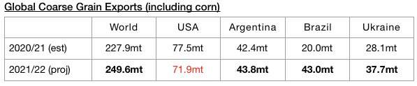
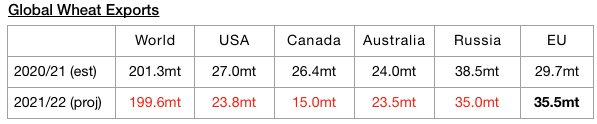
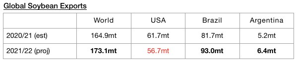
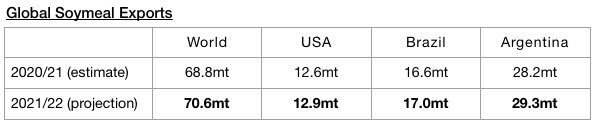

# Global Grain Trade Prospects Remain Encouraging

**Date:** October 27, 2021  
**Publisher:** Breakwave Advisors | **Category:** Market Insights  
**Original URL:** [https://www.breakwaveadvisors.com/insights/2021/10/27/global-grain-trade-prospects-remain-encouraging](https://www.breakwaveadvisors.com/insights/2021/10/27/global-grain-trade-prospects-remain-encouraging)  

---

*By Jeffrey Landsberg*

Global grain trade prospects still remain just one of many bullish facets of the dry bulk market. Notable recently is that grain trade forecasts for the current 2021/2022 season have been raised from a month ago and strong year-on-year growth is also still expected. The United States Department of Agriculture recently released their latest forecasts for 2021/22 and is now forecasting that global grain exports will total 499 million tons. This is 1.9 million tons more than was forecast a month ago and would mark a year-on-year increase of 20.7 million tons (4%).

Global coarse grain exports in 2021/22 are now expected to total 249.6 million tons. This is 800,000 tons more than was forecast a month ago and would mark a year-on-year increase of 21.7 million tons (10%).

> **Figure 1: Chart 1**  
> [Local Asset](file:///C:/Users/Dell/Github/Shipping/corpus/03-breakwave/insights/2021/assets/2021-10-27_global-grain-trade-prospects-remain-encouraging_img_chart1_c9952146d476.jpg)

Global wheat exports are expected to total 199.6 million tons. This is 100,000 tons less than was forecast a month ago and would mark a year-on-year decrease of 1.7 million tons (-1%).

> **Figure 2: Chart 2**  
> [Local Asset](file:///C:/Users/Dell/Github/Shipping/corpus/03-breakwave/insights/2021/assets/2021-10-27_global-grain-trade-prospects-remain-encouraging_img_chart2_6078782aebcc.jpg)

In addition, global soybean exports (soybeans are not technically classified as a grain) are expected to total 173.1 million tons. This is 100,000 tons less than was forecast a month ago but would mark a year-on-year increase of 8.2 million tons (5%).

> **Figure 3: Chart 3**  
> [Local Asset](file:///C:/Users/Dell/Github/Shipping/corpus/03-breakwave/insights/2021/assets/2021-10-27_global-grain-trade-prospects-remain-encouraging_img_chart3_5700a68f999c.jpg)

Global soymeal exports are expected to total 70.5 million tons. This is 100,000 tons less than was forecast a month ago but would mark a year-on-year increase of 1.7 million tons (2%).

> **Figure 4: Chart 4**  
> [Local Asset](file:///C:/Users/Dell/Github/Shipping/corpus/03-breakwave/insights/2021/assets/2021-10-27_global-grain-trade-prospects-remain-encouraging_img_chart4_3b4c4557e94b.jpg)

---

**Tags:** Global, Economy, Gain  
