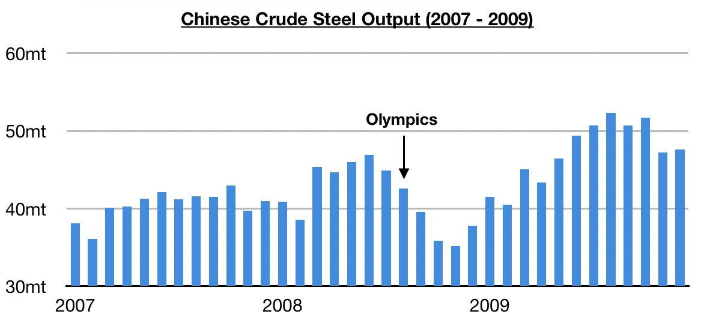
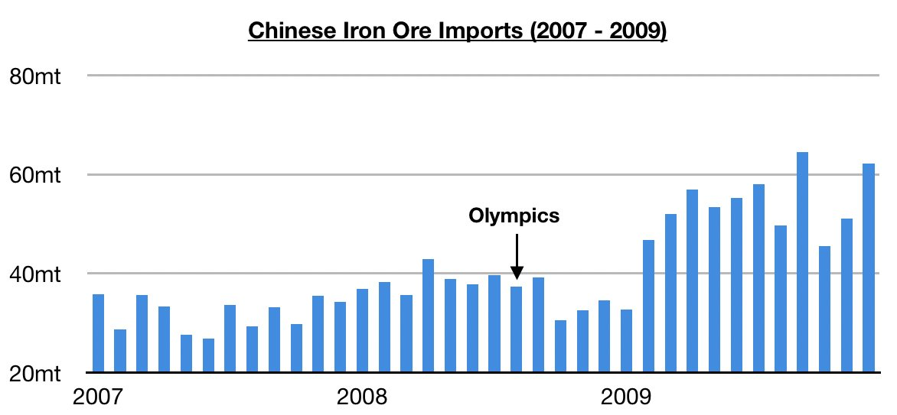

# China's Iron Ore Imports Firm Leading Up To And During Previous Beijing Olympics

**Date:** October 28, 2021  
**Publisher:** Breakwave Advisors | **Category:** Market Insights  
**Original URL:** [https://www.breakwaveadvisors.com/insights/2021/10/27/chinas-iron-ore-imports-firm-leading-up-to-and-during-previous-beijing-olympics](https://www.breakwaveadvisors.com/insights/2021/10/27/chinas-iron-ore-imports-firm-leading-up-to-and-during-previous-beijing-olympics)  

---

*By Jeffrey Landsberg*

With the Beijing Olympics set to start next year on February 4th, it is significant to examine just how China’s iron ore imports fared leading up to the previous Beijing Olympics held back in August 2008. While it is no secret that steel production fell both leading up to and during the 2008 Beijing Olympics (to improve air quality), it is important to stress that China’s iron ore imports did not come under any significant pressure both leading up to and during those Olympics. As we have stressed often in our research, China’s iron ore import volume during short and medium-term durations is not dictated by steel production. China’s iron ore imports leading up to and during the 2008 Beijing Olympics is yet another example of this.

Back in 2008, China’s crude steel production peaked at 47 million tons in June. Production then dropped to 44.9 million tons during July (as the Olympics were approaching) and fell even further to 42.6 million tons during August (which was the month of the Olympics). By September, production was even lower at 39.6 million tons. Those three months saw significant sequential declines in China's steel production, as well as significant weakness on a year-on-year basis. In July, steel production fell year-on-year by 4%, in August it fell by 5%, and in September it fell by 7%.

> **Figure 1: Chart 1 (4)**  
> [Local Asset](file:///C:/Users/Dell/Github/Shipping/corpus/03-breakwave/insights/2021/assets/2021-10-28_chinas-iron-ore-imports-firm-leading-up-to-and-during-previous-beijing-olympics_img_chart128429_d75e7e3f9084.jpg)

During the same period, however, China’s iron ore imports remained rather steady and also continued to experience strong year-on-year growth. Iron ore imports in July climbed to 39.6 million tons, August saw 37.4 million tons imported, and September saw 39.2 million tons imported. All three months saw year-on-year growth (with the year-on-year growth during this period averaging 16%), and in fact only one month throughout 2008 saw any year-on-year decline in iron ore imports. November saw imports decline year-on-year by 8%. By the time 2008 came to an end, China’s iron ore imports had also set yet another record. Also of note is that the quarter with China’s lowest iron ore import volume in 2008 was Q1, and this was unrelated to the Olympics.

> **Figure 2: Chart 2 (3)**  
> [Local Asset](file:///C:/Users/Dell/Github/Shipping/corpus/03-breakwave/insights/2021/assets/2021-10-28_chinas-iron-ore-imports-firm-leading-up-to-and-during-previous-beijing-olympics_img_chart228329_db5b8b813ec9.jpg)

While it remains to be seen how China’s iron ore imports will fare both leading up to and during the next Beijing Olympics (which will start on February 4th and will last through February 20th), we continue to stress that iron ore imports can remain steady and even climb when steel output is falling (as has already been seen during the last few months too this year). As we have stressed often in our Weekly Dry Bulk Reports and Weekly China Reports, historically it is global iron ore production that actually dictates China's iron ore import volume. Price, of course, is another story -- but it is cargo volume that is the engine of growth for the global dry bulk shipping market.

---

**Tags:** Economy, China, Iron Ore  
