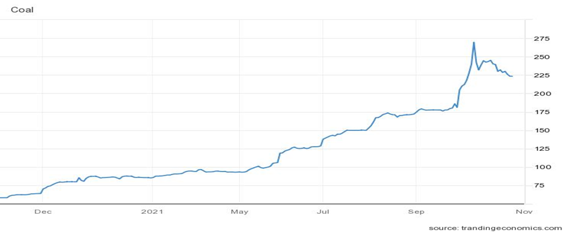
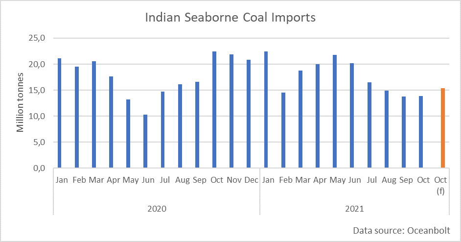
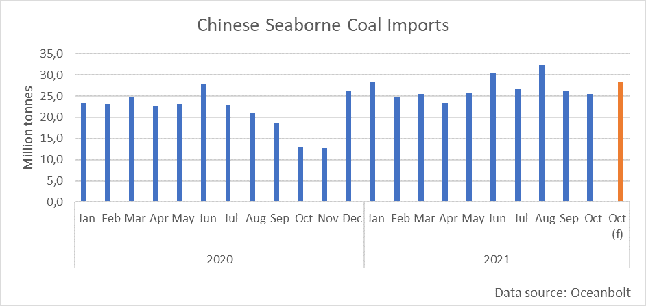

# Seaborne Coal: A Tale of Two Countries

**Date:** October 29, 2021  
**Publisher:** Breakwave Advisors | **Category:** Market Insights  
**Original URL:** [https://www.breakwaveadvisors.com/insights/2021/10/29/seaborne-coal-a-tale-of-two-countries](https://www.breakwaveadvisors.com/insights/2021/10/29/seaborne-coal-a-tale-of-two-countries)  

---

*By Ulf Bergman*

Thermal coal prices have in recent days given up some of the spectacular gains the commodity has recorded since September last year. At its peak at the beginning of October, the fossil fuel had seen an increase of 450 per cent in thirteen months. However, since then, gC Newcastle coal futures have retreated almost fifteen per cent to just above 220 dollars per tonne. Although the supply and demand balance remains tight with the unravelling of the global energy crisis, prices have been heading on a downward path since the beginning of October. This is partially the result of authorities in the world’s largest coal consumer, China, increasing their efforts to stabilise the market and boost domestic output. The National Development and Reform Commission, China’s top economic planning body, plans to limit domestic miners’ pricing power for thermal coal as it seeks to ease the power crunch that has prompted electricity rationing and affected industrial production.

> **Figure 1: Ch1**  
> [Local Asset](file:///C:/Users/Dell/Github/Shipping/corpus/03-breakwave/insights/2021/assets/2021-10-29_seaborne-coal-a-tale-of-two-countries_img_ch1_429bf5ea65fe.png)

According to reports, the plans, yet to be officially published, will impose a target pithead price of 440 yuan (USD 69) per tonne for the most-popular grade of thermal coal, with an absolute ceiling of 528 yuan (USD 83). The scheme, expected to run until May next year, is pending approval by the State Council and could still be amended. The price cap is unlikely to hurt Chinese coal output, as coal mining is a highly state-controlled industry in China, and Beijing has already ordered coal miners to maximise production. In a move likely to benefit seaborne coal imports, buyers of overseas sourced supplies will receive subsidies to balance their losses when selling to power plants. While imported coal only accounts for a small part of Chinese consumption, they remain crucial to bridge the current energy crunch.

In India, the world’s second-largest consumer of coal, the previous supply crunch appears to have stabilised. However, the inventories at the powerplants are still only a quarter of the levels seen a year ago and are equivalent to four days of consumption. Much of the travails facing India’s power plants are due to inventories being allowed to fall to below-recommended levels rather than a substantial increase in electricity demand. A high degree of uncertainty regarding the electricity demand saw many power plants utilising stockpiles and decreasing purchases in recent months. While the supply situation has improved somewhat, India’s largest power producer, NTPC Ltd., is looking to import coal for the first time in two years. The New Dehli-based company has issued tenders totalling two million tonnes. Skyrocketing prices have previously seen Indian power producers retreating from the market for seaborne coal. Still, Beijing’s efforts to control and reverse the surge could contribute to them returning to the market.

In light of rising international prices and a resurgent pandemic, Indian seaborne imports of coal have been falling in recent months. Since May, volumes have shrunk from 21.8 million tonnes to 13.8 million tonnes in September. The current month, however, looks set to break the downward trend and top fifteen million tonnes. Despite volumes picking up month-on-month, they are still around a third below last October’s imports. Indian coal imports look likely to increase as the Indian economy continues to recover. The International Monetary Fund and the Indian central bank expect it to expand by 9.5 per cent in the year ending in March. After a deadly outbreak of the coronavirus limited economic activities, the economy is firmly on track to regain the designation as the world’s fastest-growing major economy.

> **Figure 2: Ch2**  
> [Local Asset](file:///C:/Users/Dell/Github/Shipping/corpus/03-breakwave/insights/2021/assets/2021-10-29_seaborne-coal-a-tale-of-two-countries_img_ch2_5d360a3e151b.png)

Unlike India, the Chinese seaborne imports have shown solid year-on-year growth in recent months. While volumes have decreased since the peak of 32 million tonnes in August, imports during the last two months remained well above the same months last year. The total for the year-to-date is also higher than the previous year’s total, with 272 million tonnes compared to 259 million tonnes for the whole of 2020.

> **Figure 3: Ch3**  
> [Local Asset](file:///C:/Users/Dell/Github/Shipping/corpus/03-breakwave/insights/2021/assets/2021-10-29_seaborne-coal-a-tale-of-two-countries_img_ch3_8c4afefb727e.png)

Although the Chinese economy may be decelerating, the initiative to subsidise coal imports is likely to fuel seaborne imports in the coming months. The expectation of a colder than usual winter, due to La Niña, can also be expected to add a sense of urgency to the restoration of the thermal coal inventories. Lower prices and a rapidly rebounding economy suggest that the Indian appetite for seaborne coal imports will increase as power plants face a growing demand for electricity with depleted stockpiles. Hence, the seaborne trade in coal will lend some support to the freight markets in the coming months as they face increasing headwinds from a Chinese economic slowdown.

---

**Tags:** Economy, Coal, Pricerecord  
