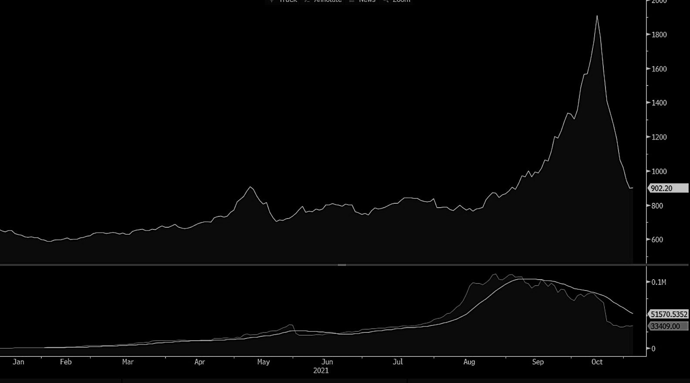
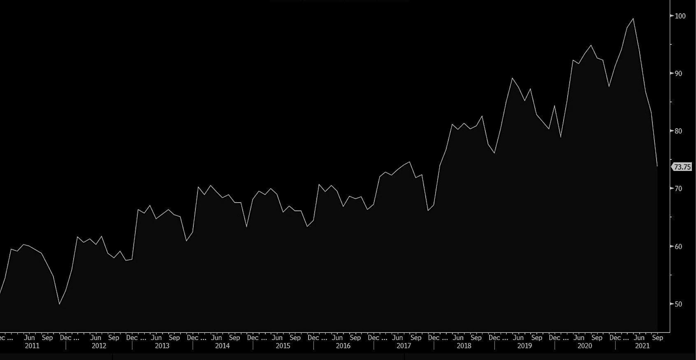
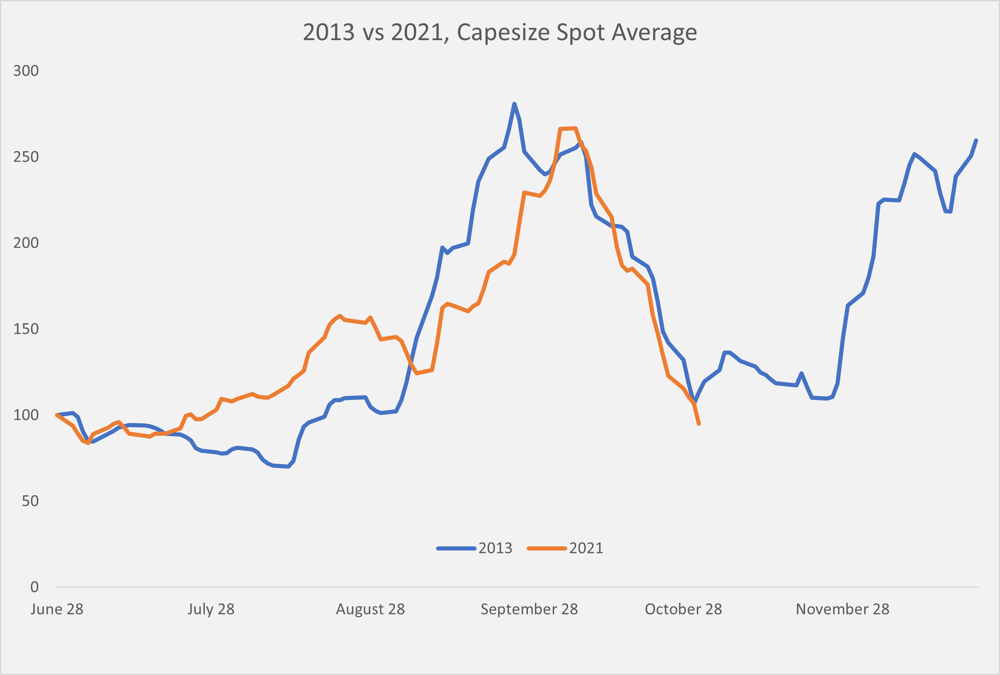

# China: Lights Out. Is that Also the Case for Dry Bulk?

**Date:** November 02, 2021  
**Publisher:** Breakwave Advisors | **Category:** Market Insights  
**Original URL:** [https://www.breakwaveadvisors.com/insights/2021/11/2/china-lights-out-now-what-for-dry-bulk](https://www.breakwaveadvisors.com/insights/2021/11/2/china-lights-out-now-what-for-dry-bulk)  

---

> **Figure 1: Thermal Coal Prices**  
> *Thermal Coal Prices, CNY/ton*  
> [Local Asset](file:///C:/Users/Dell/Github/Shipping/corpus/03-breakwave/insights/2021/assets/2021-11-02_china-lights-out-now-what-for-dry-bulk_img_unsplash-image-7e2pe9wjl9m_06f55af923b4.jpg)

Energy is everything. Without adequate energy supply, life would be massively different. And yet, in our every day lives, a flip of a switch leads to a guaranteed outcome without second thoughts. But what if there was a risk that such an outcome would be trivial? Is such a scenario even imaginable on scale? And what if the second largest economy in the world was faced with such a possible (though not probable) outcome?

During the last few months unprecedented volatility in some key energy markets should have raised a lot of red flags amongst governments as it relates to energy security, and although the western world has done little so far to address the issue, China has not only taken notice, but is aggressively moving to secure adequate power supply ahead of the energy intensive winter.

> **Figure 2: China Monthly Steel Production**  
> *China Monthly Steel Production, million mt*  
> [Local Asset](file:///C:/Users/Dell/Github/Shipping/corpus/03-breakwave/insights/2021/assets/2021-11-02_china-lights-out-now-what-for-dry-bulk_img_coalchina_3215c68af8cd.jpg)

The initial spike in coal prices is a testament to the potential shortage developing of the readily available fuel for electricity production. However, as the biggest consumer of coal, China would not let such a market to determine the main price input to its own economy, (thus the subsequent collapse in coal prices) and the centrally controlled state moved to put a cap on prices, something easily achievable under the powerful NDRC’s guidance.

However, apparently there is more to be done. And the magnitude of the next steps will determine the outcome of so many industries and ultimately the growth rate of the Chinese economy.

We now think that China’s actions as it relates to securing adequate power capacity for the winter will lead to a slowdown in the broader Chinese economy, leading China to miss its annual GDP growth target for 2021.

However, sacrificing growth over the risk of an unimaginable power shortage is not unreasonable, yet it has always been a thin balance for China when it was faced with critical issues. And although it is not easy to determine what the exact scenarios might be, official statements coming from the top of the Chinese government point to a “panicky” situation when it comes to energy supply.

For China to potentially miss its own growth targets something significant must be at play, and both iron ore and steel prices are telling us that indeed the economy is slowing down beyond a reasonable margin.

Unfortunately, that leaves levered industries to such markets exposed. Dry bulk has traditionally relied upon Chinese growth and the subsequent demand for commodities for its own growth. If Chinese steel production weakens, a scenario that a few months ago was not even conceivable, how does that affect related industries?

> **Figure 3: Chinasteel**  
> [Local Asset](file:///C:/Users/Dell/Github/Shipping/corpus/03-breakwave/insights/2021/assets/2021-11-02_china-lights-out-now-what-for-dry-bulk_img_chinasteel_5f15cea1a7ac.jpg)

This time around, to the good fortune of dry bulk owners, the rest of the world remains in a growth mode, which, although not enough by itself to lead to booming times, it is sufficient to provide some cushion while such a temporary slowdown occurs, and hopefully bridge the gap while the situation in China normalizes. On top of that, China will clearly need to import more coal which will offset some of the lost iron ore cargoes.

The ultimate outcome will be decided by an unpredictable factor: Winter weather. The severity of any potential power shortage in China during the winter months combined with the amount of industrial activity that needs to be curtailed in order to balance the electricity market, will determine the length and severity of steel production cuts, and thus iron ore demand deterioration.

So, is there a tradable bottom on dry bulk?

Volatility is extreme, daily moves are currently determined by positioning and cash flow margin requirements and price levels are meaningless in such a momentum driven market. On Capesizes, spot has now dropped for three straight weeks and now sits some 55,000 lower in the process. Historically, following such drawdowns, a knee-jerk reaction has occurred. Long market length has now disappeared and there is little optimism in the air in a technically oversold market. Finally, congestion still remains close to decade highs, thus constraining vessel supply while global liquidity is abundant.

The above are usually signs that the worst is behind us.

Yet, this is a market that has always been for the brave ones, and fundamentally the outlook is not rosy. We continue to lean towards the scenario of stabilization and ultimately an uptick (which now might be even more than that, given the sharp selloff) in Capesize rates later in the month, though clearly developments out of China has somewhat reduced our confidence on such a scenario.

> **Figure 4: 2013vs2021**  
> [Local Asset](file:///C:/Users/Dell/Github/Shipping/corpus/03-breakwave/insights/2021/assets/2021-11-02_china-lights-out-now-what-for-dry-bulk_img_2013vs2021_aca8987b7581.png)

The dry bulk market is structurally set for a long period of tight balances and thus stronger rates, assuming global demand for bulk transportation remains at relatively healthy levels. China is a big part of bulk commodity demand, and thus, should continue to be the main focus when it comes to dry bulk shipping. What is going on is not a fundamental shift, rather a very specific development that at this particular point in time is hurting commodity demand and, as a result, dry bulk shipping.

---

**Tags:** China, Capesize, Coal, Energy  
